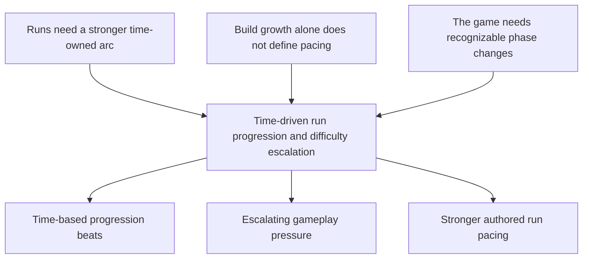

## req_067_define_a_time_driven_run_progression_and_difficulty_escalation_wave - Define a time driven run progression and difficulty escalation wave
> From version: 0.4.0
> Status: Draft
> Understanding: 99%
> Confidence: 98%
> Complexity: Medium
> Theme: Gameplay
> Reminder: Update status/understanding/confidence and references when you edit this doc.

# Needs
- Introduce explicit run progression and difficulty escalation driven by elapsed time.
- Make the run evolve in recognizable steps or phases instead of feeling flat over time.
- Let the game change something every `X` amount of time during a run so pacing becomes more structured and intentional.

# Context
The project now has:
- a first playable build loop
- active/passive/fusion growth
- runtime combat feedback
- clearer shell and HUD surfaces

What it still lacks is a strong `time-owned run arc`.

Right now, the run can progress mechanically through:
- level-ups
- pickups
- chests
- build growth

but that does not yet guarantee a clear time-based escalation curve.

This creates a product gap:
- a run may feel too even from minute to minute
- the game does not yet strongly communicate “the run is entering a new phase”
- difficulty pressure is not yet clearly authored around elapsed survival time
- build growth and encounter pressure are not yet strongly synchronized around pacing beats

This request should define a bounded wave that introduces a time-based progression and difficulty structure for a run.

Recommended posture:
1. Divide the run into clear time-based phases or beats.
2. Trigger changes every `X` time interval or at defined survival thresholds.
3. Keep the first wave readable and authored rather than fully procedural.
4. Make time escalation affect gameplay pressure in a way the player can feel.
5. Keep the wave bounded away from a giant director-style AI system in the first pass.

Examples of what time-based changes could later drive:
- hostile spawn pressure
- hostile stat scaling
- elite/wave composition changes
- encounter density
- reward cadence shifts
- phase messaging or shell signaling

The request should not force all of these at once. It should define the system posture that lets the game become harder and more structured as survival time increases.

# Acceptance criteria
- AC1: The request defines a bounded time-driven run progression and difficulty wave.
- AC2: The request defines the run as evolving through time-based thresholds, phases, or beats.
- AC3: The request defines that something gameplay-relevant can change every `X` amount of survival time or at authored survival milestones.
- AC4: The request defines the first wave as an authored and readable escalation posture rather than a broad adaptive-director system.
- AC5: The request keeps scope bounded and does not immediately widen into a full endless-scaling framework, meta-progression overhaul, or fully dynamic encounter AI system.

# Open questions
- Should the first pass use fixed time intervals, named phases, or both?
  Recommended default: use authored named phases backed by fixed survival thresholds so the pacing is readable.
- What should be allowed to scale first?
  Recommended default: start with spawn pressure and enemy stat pressure before widening to more exotic encounter composition rules.
- Should the player be explicitly informed when a phase changes?
  Recommended default: yes, at least lightly, so the pacing shift is legible.
- Should time escalation be global for every run, or partially stage-specific later?
  Recommended default: global first, stage-specific later.

# Definition of Ready (DoR)
- [x] Problem statement is explicit and player-facing impact is clear.
- [x] Scope boundaries (in/out) are explicit.
- [x] Acceptance criteria are testable.
- [x] Dependencies and known risks are listed.

# Companion docs
- Product brief(s): `prod_016_time_owned_run_arc_and_authored_difficulty_phases`
- Architecture decision(s): `adr_039_structure_the_first_survivor_build_loop_around_separate_active_and_passive_slots`, `adr_047_structure_first_pass_run_difficulty_escalation_as_authored_time_phases`
- Request(s): `req_058_define_a_foundational_survivor_build_system_for_weapons_passives_fusions_and_run_progression`, `req_059_define_a_first_playable_techno_shinobi_build_content_wave`

# Backlog
- `item_252_define_an_authored_time_phase_model_for_run_progression_beats`
- `item_253_define_first_pass_time_driven_pressure_levers_for_spawn_and_enemy_scaling`
- `item_254_define_player_facing_phase_signaling_for_time_driven_run_escalation`
- `item_255_define_targeted_validation_for_time_owned_run_pacing_and_difficulty_escalation`
