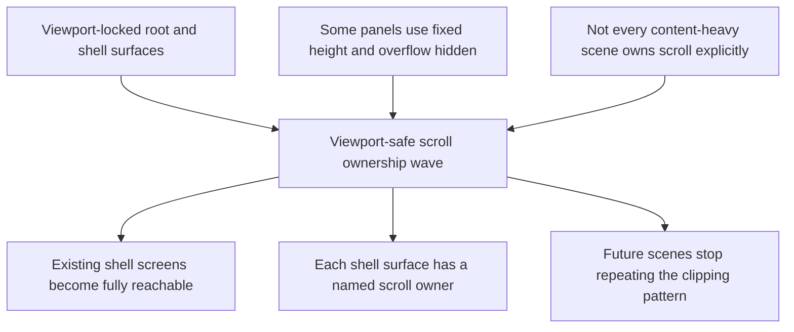

## req_068_define_a_viewport_safe_scroll_ownership_wave_for_shell_surfaces - Define a viewport-safe scroll ownership wave for shell surfaces
> From version: 0.4.1
> Status: Ready
> Understanding: 99%
> Confidence: 98%
> Complexity: Medium
> Theme: UI
> Reminder: Update status/understanding/confidence and references when you edit this doc.

# Needs
- Fix shell panels and screens that currently exceed the visible viewport height or become partially unreachable because their scroll behavior is not owned correctly.
- Establish one clear shell-surface contract so new scenes do not repeat the same clipping and non-scrollable layout failure.
- Make desktop, mobile browser, and non-PWA viewport behavior reliable for shell-owned scenes and runtime auxiliary panels.

# Context
Recent shell waves improved the visual language and added more content-rich surfaces:
- `Settings`
- `Changelogs`
- `Grimoire`
- `Bestiary`
- `Game over`
- runtime pause and auxiliary shell surfaces

The audit shows a recurring structural issue rather than one isolated bug.

Observed posture in the current shell:
- the app root is viewport-locked in [app.css](/Users/alexandreagostini/Documents/emberwake/src/app/styles/app.css#L1) with `height` and `overflow: hidden`
- the shell panel container is also centered as an absolute surface with `overflow: hidden` in [app.css](/Users/alexandreagostini/Documents/emberwake/src/app/styles/app.css#L70)
- some scenes then add their own fixed `height` plus `overflow: hidden`, for example `Changelogs` and `Settings` in [app.css](/Users/alexandreagostini/Documents/emberwake/src/app/styles/app.css#L120)
- only some inner sections explicitly become scroll owners, while newer or more content-dense scenes can still grow beyond the safe visible region

This creates a repeatable failure mode:
- a panel visually exceeds the page height
- the outer shell refuses to scroll
- the scene itself is not the scroll owner
- important content or actions become truncated at the bottom

This is especially fragile on:
- mobile browser mode outside PWA
- surfaces whose content can grow over time, like codex archives, settings, release notes, and outcome analysis
- any future shell scene added by copying an existing panel style without also wiring a safe scroll region

The right fix should be architectural, not purely cosmetic:
- every shell surface needs a viewport-safe size contract
- every content-heavy shell scene needs an explicit scroll owner
- header/footer areas should remain reachable while the content body absorbs overflow
- new scenes should fail review if they reintroduce fixed-height clipping without a safe scroll posture

# Acceptance criteria
- AC1: The request defines a cross-cutting shell-surface correction wave, not a one-off patch for a single screen.
- AC2: The request identifies the current failure mode as a scroll-ownership and viewport-fit problem, not only a styling issue.
- AC3: The request requires every content-heavy shell scene to have an explicit internal scroll owner when content can exceed the visible safe height.
- AC4: The request requires shell panels to fit within the usable viewport on desktop, mobile browser, and non-PWA contexts without clipping primary actions or content.
- AC5: The request defines that shell surfaces should prefer viewport-safe `max-height` or equivalent bounded sizing over rigid fixed heights when content density can vary.
- AC6: The request defines that header/footer chrome and primary actions remain reachable while the scene body absorbs overflow.
- AC7: The request explicitly includes regression review for `Settings`, `Changelogs`, `Grimoire`, `Bestiary`, `Game over`, and other shell-owned auxiliary panels added recently.
- AC8: The request defines a prevention posture for future work:
  - no new shell scene should rely on outer `overflow: hidden` alone
  - no new shell scene should ship without a declared scroll owner if its content can grow
  - implementation and review should use `logics-ui-steering` to keep viewport-safe behavior aligned with the techno-shinobi shell language instead of ad hoc patches

# Open questions
- Should the shell panel remain vertically centered when content becomes tall, or should tall scenes pin closer to the top safe area?
  Recommended default: center only when content comfortably fits; otherwise prefer a viewport-safe anchored posture that preserves reachability.
- Should every shell scene share one generic scrollable body pattern, or can some scenes own specialized inner scrollers?
  Recommended default: use one default shell-body scroll contract, then allow specialized inner scrollers only when clearly justified.
- Should runtime auxiliary panels like the mobile inspection panel be included in the same wave?
  Recommended default: yes, if they are shell-adjacent overlays that can also exceed safe height or trap actions.

# Definition of Ready (DoR)
- [x] Problem statement is explicit and grounded in concrete shell audit findings.
- [x] Scope boundaries (in/out) are explicit.
- [x] Acceptance criteria are testable.
- [x] Prevention posture for future scenes is explicit.

# Companion docs
- Architecture decision(s): `adr_048_adopt_a_viewport_safe_scroll_owner_contract_for_shell_surfaces`
- Request(s): `req_063_define_a_techno_shinobi_runtime_hud_relayout_and_mobile_menu_entry_wave`, `req_064_define_a_grimoire_scene_for_skill_discovery_and_future_unlock_gating`, `req_065_define_a_bestiary_scene_for_discovered_and_defeated_creatures`, `req_066_define_a_game_over_skill_ranking_view_toggle`
- Primary task(s): `task_056_orchestrate_viewport_safe_scroll_ownership_for_shell_surfaces`

# Backlog
- `item_274_define_a_shared_viewport_safe_shell_surface_sizing_contract`
- `item_275_define_a_single_scroll_owner_scene_body_posture_for_variable_height_shell_content`
- `item_276_define_regression_fixes_for_existing_shell_scenes_under_the_viewport_safe_scroll_contract`
- `item_277_define_targeted_validation_for_shell_viewport_fit_scroll_ownership_and_action_reachability`
