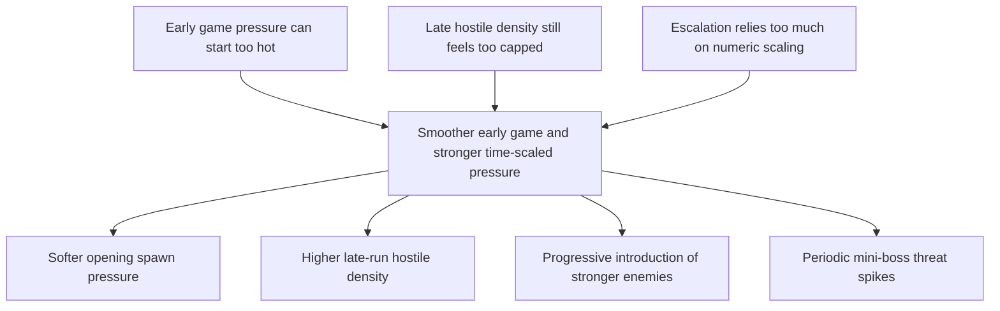

## req_069_define_a_smoother_early_game_and_stronger_time_scaled_enemy_pressure_wave - Define a smoother early game and stronger time-scaled enemy pressure wave
> From version: 0.4.0
> Status: Draft
> Understanding: 96%
> Confidence: 96%
> Complexity: Medium
> Theme: Gameplay
> Reminder: Update status/understanding/confidence and references when you edit this doc.

# Needs
- Normalize the current time-based difficulty curve so the run opens with less immediate pressure, then ramps harder later.
- Remove the feeling that hostile population is capped too tightly once the run is established.
- Introduce stronger enemy presence progressively instead of relying only on stat inflation and cadence changes.
- Introduce authored mini-boss beats so the run gains periodic threat spikes instead of reading only as continuous ambient scaling.

# Context
The first pass of time-driven difficulty already exists:
- authored run phases
- spawn cadence scaling
- local hostile cap bonuses
- hostile stat scaling over time

That gives Emberwake a real survival arc, but the current posture still leaves three product gaps:
- the opening pressure can still feel too eager relative to early build establishment
- the hostile-population ceiling remains too bounded once the run should start feeling crowded and oppressive
- escalation currently leans heavily on more health, more damage, and faster spawns, but not enough on introducing clearly stronger hostile types as time advances
- the run still lacks clear authored threat peaks such as mini-boss appearances that punctuate survival milestones

This request should define a normalized first-pass difficulty posture:
- calmer start
- more room for late-run entity density
- stronger enemy composition over time
- authored mini-boss spikes at predictable survival milestones

Recommended direction:
1. Start with fewer hostile spawns and a gentler early spawn cadence.
2. Let the hostile population envelope open up more aggressively as authored run phases advance.
3. Introduce stronger enemy forms or stronger hostile tiers over time so escalation is not only numeric.
4. Add periodic mini-boss appearances as explicit survival beats, with a first-pass default cadence of one mini-boss every 5 minutes of run time.
5. Keep the escalation authored and legible rather than turning it into a fully adaptive director system.

# Acceptance criteria
- AC1: The request defines a bounded difficulty-normalization wave on top of the existing time-phase model rather than replacing it.
- AC2: The request defines a gentler opening run posture with fewer hostile spawns and a lower early spawn frequency.
- AC3: The request defines that hostile population capacity should scale up more meaningfully over time so late-run field pressure can become denser than it is now.
- AC4: The request defines escalation through enemy composition as well as numeric tuning, with stronger hostile forms or stronger hostile tiers entering later phases.
- AC5: The request defines authored mini-boss beats as part of the run arc, with a first-pass default cadence of one mini-boss every 5 minutes unless later tuning proves another interval better.
- AC6: The request keeps the system authored and phase-driven, not a broad adaptive-director rewrite.
- AC7: The request requires tuning and validation to confirm that:
  - the first minute is more readable and less crowded
  - the late run becomes more oppressive through density and enemy strength
  - mini-boss appearances create legible threat spikes rather than chaotic unreadable overload
  - escalation still feels fair and legible

# Open questions
- Should stronger enemies appear by replacing weaker ones, or by mixing into the existing population?
  Recommended default: mix them in progressively so the field composition evolves without losing continuity.
- Should the late-run density increase come mostly from a higher simultaneous cap or from much faster replenishment?
  Recommended default: both, but bias toward a higher simultaneous cap so the field reads denser rather than only more reactive.
- Should stronger enemies arrive only on explicit phase boundaries or also through gradual weighting inside a phase?
  Recommended default: use phase-gated entry first, then finer weighting later if needed.
- Should mini-bosses arrive exactly every 5 minutes, or should authored phase context be allowed to shift the cadence later?
  Recommended default: start with a strict every-5-minutes cadence for clarity, then relax it only if later pacing work justifies it.

# Definition of Ready (DoR)
- [x] Problem statement is explicit and grounded in the current time-phase posture.
- [x] Scope boundaries (in/out) are explicit.
- [x] Acceptance criteria are testable.
- [x] Escalation direction covers density, cadence, and stronger enemy composition.

# Companion docs
- Architecture decision(s): `adr_047_structure_first_pass_run_difficulty_escalation_as_authored_time_phases`, `adr_049_structure_time_scaled_enemy_pressure_around_authored_population_opening_composition_tiers_and_mini_boss_beats`
- Request(s): `req_067_define_a_time_driven_run_progression_and_difficulty_escalation_wave`

# Backlog
- `item_256_define_a_softer_opening_hostile_spawn_posture_for_the_time_owned_run_arc`
- `item_257_define_a_more_open_late_run_hostile_population_envelope`
- `item_258_define_phase_gated_stronger_enemy_composition_for_run_escalation`
- `item_259_define_authored_mini_boss_beats_for_every_five_minutes_of_survival`
- `item_260_define_targeted_validation_for_the_normalized_difficulty_curve_and_threat_spikes`
