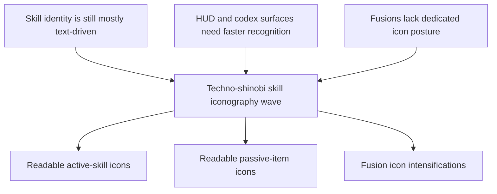

## req_070_define_a_techno_shinobi_iconography_wave_for_active_passive_and_fusion_skills - Define a techno-shinobi iconography wave for active, passive, and fusion skills
> From version: 0.4.0
> Status: Done
> Understanding: 100%
> Confidence: 99%
> Complexity: Medium
> Theme: UI
> Reminder: Update status/understanding/confidence and references when you edit this doc.

# Needs
- Replace text-only or placeholder skill representation with a coherent icon family for active skills, passive items, and fusion states.
- Ensure the icons feel native to Emberwake’s `techno-shinobi` identity rather than generic RPG ability symbols.
- Make icons readable at small HUD and menu sizes while still carrying enough distinction to support build recognition.

# Context
The first playable build loop now exposes:
- active skills
- passive items
- fusion states
- build slots in the runtime HUD
- codex/archive surfaces such as `Grimoire`

Functionally, the build system exists, but its visual language is still incomplete.

Current gap:
- skill identity is still carried mostly by text labels
- HUD slots, codex entries, and future level-up choices do not yet benefit from a stable icon language
- fusion states have gameplay meaning, but no dedicated icon intensification posture yet

This weakens:
- instant recognition during combat
- build readability in HUD chrome
- archive presentation quality in `Grimoire`
- the overall sense that the skill roster is a real authored system

This request should define a bounded first iconography wave for:
- active skills
- passive items
- fusion states

Recommended direction:
1. Build one consistent icon family rather than drawing unrelated one-off symbols.
2. Keep the forms sharp, synthetic, and ritualized in a `techno-shinobi` posture.
3. Optimize for small-size readability first.
4. Treat fusion icons as intensified descendants of their base active/passive relationships, not disconnected illustrations.
5. Use `logics-ui-steering` during implementation so the icon set stays aligned with the existing shell and HUD direction.

# Acceptance criteria
- AC1: The request defines a bounded iconography wave for active skills, passive items, and fusion states rather than a broad full-UI redesign.
- AC2: The request defines one coherent icon family aligned with the game’s `techno-shinobi` identity.
- AC3: The request requires icons to remain readable at small sizes used by the runtime HUD, level-up surfaces, and codex/archive scenes.
- AC4: The request defines that active, passive, and fusion icons must be visually distinguishable by role while still feeling part of the same authored family.
- AC5: The request defines fusion icon posture as an intensification or evolution of the underlying build identity, not a disconnected symbol language.
- AC6: The request requires that implementation and review use `logics-ui-steering` to avoid generic fantasy/cyber ability icon drift.
- AC7: The request includes delivery expectations for real game-facing placements, especially:
  - runtime HUD build slots
  - `Grimoire`
  - future level-up choice surfaces where relevant

# Open questions
- Should the first pass use vector-native UI icons, raster-painted icons, or a hybrid?
  Recommended default: favor vector-native or vector-first assets for clarity, scalability, and consistency at small sizes.
- Should passive icons be quieter than active icons?
  Recommended default: yes, keep passives slightly more restrained so actives remain the most immediate combat read.
- Should fusion icons fully replace base active icons or layer an overlay/badge system?
  Recommended default: prefer a clear intensified derivative first; overlay systems can come later if the UI needs them.

# Definition of Ready (DoR)
- [x] Problem statement is explicit and player-facing value is clear.
- [x] Scope boundaries (in/out) are explicit.
- [x] Acceptance criteria are testable.
- [x] Style guardrails are explicit.

# Companion docs
- Request(s): `req_059_define_a_first_playable_techno_shinobi_build_content_wave`, `req_061_define_a_first_combat_skill_feedback_wave_for_playable_weapons`, `req_063_define_a_techno_shinobi_runtime_hud_relayout_and_mobile_menu_entry_wave`, `req_064_define_a_grimoire_scene_for_skill_discovery_and_future_unlock_gating`
- Architecture decision(s): `adr_050_use_a_shared_vector_first_techno_shinobi_icon_family_for_build_facing_skill_representation`

# Backlog
- `item_261_define_a_shared_techno_shinobi_icon_language_for_build_facing_skill_assets`
- `item_262_define_the_first_active_skill_icon_set_for_the_playable_roster`
- `item_263_define_the_first_passive_item_icon_set_for_the_playable_roster`
- `item_264_define_fusion_icon_intensification_as_a_derivative_of_base_build_identity`
- `item_265_define_icon_asset_delivery_across_hud_grimoire_and_build_choice_surfaces`
