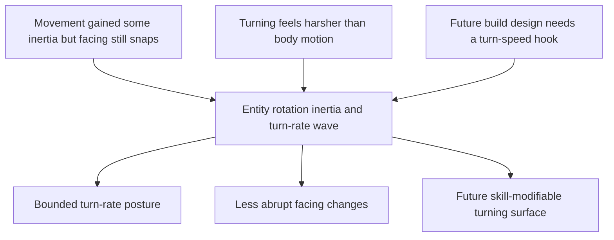

## req_071_define_a_bounded_entity_rotation_inertia_and_turn_rate_wave - Define a bounded entity rotation inertia and turn-rate wave
> From version: 0.4.0
> Status: Draft
> Understanding: 96%
> Confidence: 97%
> Complexity: Medium
> Theme: Gameplay
> Reminder: Update status/understanding/confidence and references when you edit this doc.

# Needs
- Reduce the abruptness of entity facing changes so orientation does not snap instantly to the new movement direction.
- Give entity turning a bounded sense of inertia that matches the desired combat language better than the current immediate orientation lock.
- Establish a turn-rate posture that can later be accelerated or modified by skills, passives, or other authored gameplay systems.

# Context
The project already introduced a first-pass movement inertia correction for harsh player reversals.

That helped movement feel less binary, but orientation is still effectively snapped:
- entity velocity is pseudo-physical and can now retain some drift
- entity facing still resolves directly from the resulting velocity vector
- the visual and gameplay read of turning therefore remains harsher than the movement body itself

This creates a mismatch:
- the body can carry a little movement inertia
- the facing direction still flips too instantly
- future build design has no clear turning-speed surface to hook into

What is needed here is not heavy angular physics.
The project needs a bounded entity-rotation posture:
- responsive enough for action readability
- slow enough to remove instant facing snaps
- explicit enough that later content can accelerate it

Recommended direction:
1. Introduce a bounded turn-rate or angular interpolation rule for entity orientation.
2. Keep the first pass especially focused on the player entity, with hostile reuse only if it remains clear and low-risk.
3. Make the rule deterministic and simulation-owned rather than a renderer-only cosmetic patch.
4. Define the posture so future skills or passives can modify turn responsiveness without reopening the movement architecture.

# Acceptance criteria
- AC1: The request defines a bounded orientation-turning wave rather than a full movement-system or physics rewrite.
- AC2: The request defines that entity facing should no longer snap instantly to new movement direction under normal steering.
- AC3: The request defines a simulation-owned turn-rate or bounded angular interpolation posture rather than a presentation-only fake.
- AC4: The request keeps the first pass compatible with the existing pseudo-physical movement model and deterministic fixed-step runtime.
- AC5: The request explicitly leaves room for future authored modifiers such as skills, passives, or upgrades that can increase turning responsiveness.
- AC6: The request keeps the first pass readable and responsive enough that control clarity is not lost while removing harsh directional snaps.
- AC7: The request defines targeted validation for:
  - sharp left/right reversals
  - ordinary steering arcs
  - the feel mismatch between movement inertia and orientation inertia

# Open questions
- Should the first pass apply only to the player, or to all simulated entities?
  Recommended default: apply to the player first, then extend to hostiles only if it remains readable and low-risk.
- Should turning be capped by a fixed angular speed or by a responsiveness blend toward target heading?
  Recommended default: prefer a bounded angular-speed cap because it is easier to reason about and easier to expose later as a gameplay stat.
- Should idle orientation hold its last meaningful facing, or drift back toward some default?
  Recommended default: hold last meaningful facing.

# Definition of Ready (DoR)
- [x] Problem statement is explicit and grounded in the current runtime feel.
- [x] Scope boundaries (in/out) are explicit.
- [x] Acceptance criteria are testable.
- [x] Future skill/system extensibility is explicit.

# Companion docs
- Architecture decision(s): `adr_033_adopt_deterministic_movement_oriented_pseudo_physics_instead_of_a_full_physics_engine`, `adr_051_resolve_player_orientation_through_a_bounded_simulation_owned_turn_rate`
- Request(s): `req_060_define_a_smoother_movement_inertia_and_mobile_shell_fit_wave`

# Backlog
- `item_266_define_a_simulation_owned_turn_rate_contract_for_player_entity_facing`
- `item_267_define_target_heading_and_last_meaningful_facing_rules_under_rotation_inertia`
- `item_268_define_a_future_modifier_seam_for_authored_turn_responsiveness_changes`
- `item_269_define_targeted_validation_for_player_turning_readability_and_responsiveness`
