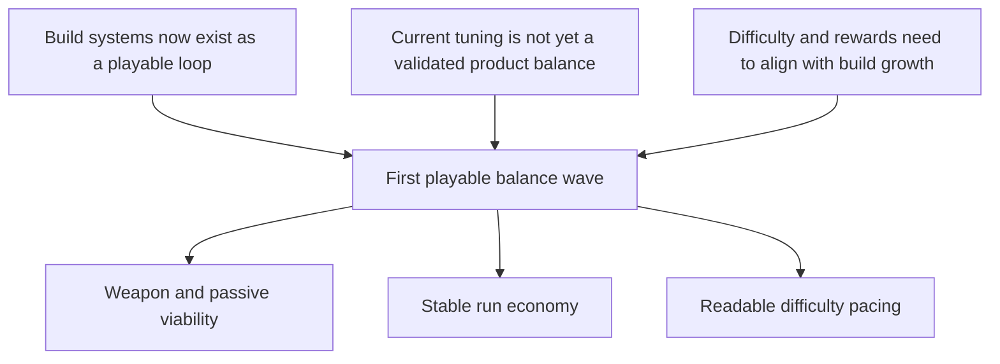

## req_072_define_a_first_playable_balance_wave_for_build_power_run_economy_and_difficulty_pacing - Define a first playable balance wave for build power, run economy, and difficulty pacing
> From version: 0.4.0
> Status: Draft
> Understanding: 96%
> Confidence: 96%
> Complexity: High
> Theme: Gameplay
> Reminder: Update status/understanding/confidence and references when you edit this doc.

# Needs
- Establish a first real balance posture for the playable Emberwake survivor loop instead of relying on mostly structural or placeholder tuning.
- Tune the relationship between build power, run economy, and escalating field pressure so the run feels legible, fair, and progressively more intense.
- Create one balance wave that can validate the first playable loop as a product experience rather than as a collection of individually functional systems.

# Context
The project now has most of the foundational systems needed for a first real survivor-like loop:
- active skills
- passive items
- fusions
- level-up choices
- chest rewards
- time-driven difficulty phases
- runtime HUD and build tracking
- first combat feedback readability

That means the next gap is no longer mostly architecture or UI.
It is balance.

Without a dedicated balance wave, the first playable loop risks reading as:
- weapons that exist but do not feel equally viable
- passives that are technically correct but too weak, too mandatory, or too abstract
- level-up pacing that is either too slow or too explosive
- chests and fusions that arrive too early, too late, or too inconsistently
- enemy pressure that is numerically harsher or softer than the player build curve can support
- mini-boss and stronger-enemy ideas that later land on top of an unstable baseline

This request should define one first playable balance wave that treats the loop as a whole:
- build power
- progression economy
- enemy pressure
- pacing across the run arc

Recommended direction:
1. Balance the first weapon/passive/fusion roster as a family rather than as isolated entries.
2. Tune XP, level-up, chest, and reward pacing so build growth feels intentional.
3. Tune the early/mid/late pressure curve against realistic player power growth.
4. Keep the first pass authored and understandable rather than overfitting around niche edge cases.
5. Treat the outcome as a validated baseline that later content can build on.

# Acceptance criteria
- AC1: The request defines a first cohesive balance wave across build power, run economy, and difficulty pacing rather than isolated micro-tuning.
- AC2: The request defines balance review for the first playable active, passive, and fusion roster so no obvious item dominates or collapses the baseline loop.
- AC3: The request defines a first-pass economy balance for:
  - XP gain
  - level-up cadence
  - chest timing/value
  - gold income where relevant
- AC4: The request defines difficulty pacing balance across early, mid, and late run phases so player power growth and hostile pressure remain legible together.
- AC5: The request defines validation expectations for:
  - time-to-first meaningful build choice
  - slot fill pace
  - time-to-first fusion or fusion-readiness
  - perceived pressure at the first, middle, and later survival windows
- AC6: The request keeps the first balance pass authored, bounded, and explainable instead of widening into an adaptive balancing framework or telemetry-heavy live-ops model.
- AC7: The request produces a baseline suitable for later waves such as:
  - stronger enemy composition
  - mini-boss cadence
  - deeper content expansion

# Open questions
- Should the first balance pass optimize for generosity or scarcity?
  Recommended default: slightly generous early readability, then tighter mid/late pressure.
- Should all first-wave weapons be equally strong, or should some be easier but lower ceiling?
  Recommended default: aim for viable parity, not identical strength or identical skill ceiling.
- Should fusions be tuned as rare payoff moments or as a near-guaranteed late-run baseline?
  Recommended default: strong but not trivial; common enough to teach the system, not so common that every run feels solved.
- Should balance validation rely only on subjective play feel, or also on repeatable scripted scenarios?
  Recommended default: use both, with repeatable runtime scenarios as a sanity floor and manual play feel as the final product read.

# Definition of Ready (DoR)
- [x] Problem statement is explicit and framed as a whole-loop balance issue.
- [x] Scope boundaries (in/out) are explicit.
- [x] Acceptance criteria are testable.
- [x] The wave is clearly positioned as a first authored balance baseline, not final tuning perfection.

# Companion docs
- Request(s): `req_058_define_a_foundational_survivor_build_system_for_weapons_passives_fusions_and_run_progression`, `req_059_define_a_first_playable_techno_shinobi_build_content_wave`, `req_067_define_a_time_driven_run_progression_and_difficulty_escalation_wave`, `req_069_define_a_smoother_early_game_and_stronger_time_scaled_enemy_pressure_wave`
- Architecture decision(s): `adr_036_externalize_retunable_gameplay_and_system_tuning_as_validated_json_contracts`, `adr_047_structure_first_pass_run_difficulty_escalation_as_authored_time_phases`

# Backlog
- `item_270_define_first_pass_parity_targets_for_active_passive_and_fusion_build_power`
- `item_271_define_first_pass_run_economy_targets_for_xp_level_ups_chests_and_gold`
- `item_272_define_pressure_alignment_between_build_growth_and_time_owned_escalation`
- `item_273_define_a_repeatable_balance_validation_matrix_for_the_first_playable_loop`
