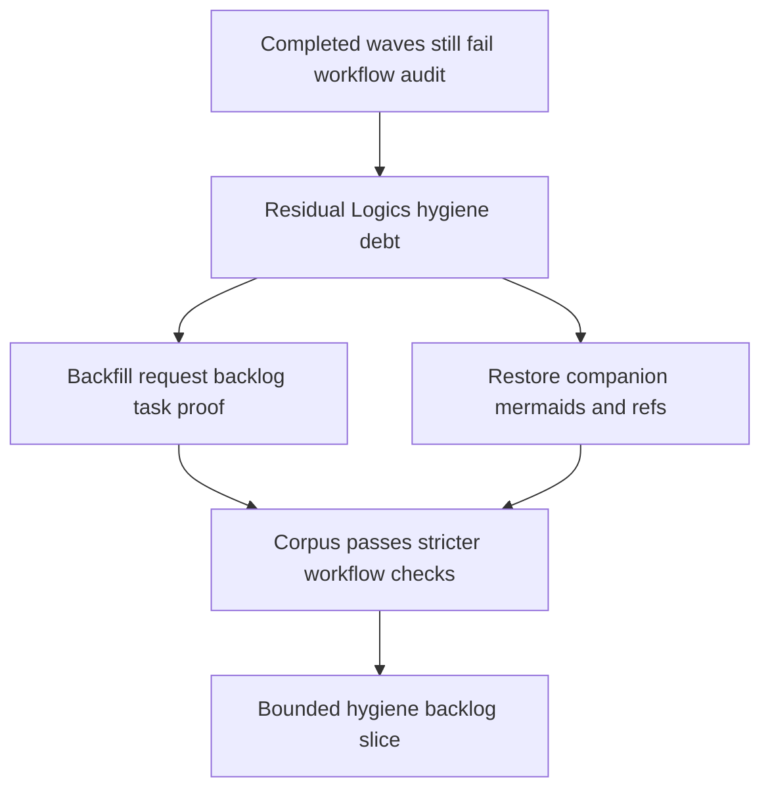

## req_073_consolidate_remaining_logics_traceability_and_companion_doc_hygiene_wave - Consolidate remaining Logics traceability and companion-doc hygiene wave
> From version: 0.5.0
> Schema version: 1.0
> Status: Done
> Understanding: 100%
> Confidence: 99%
> Complexity: High
> Theme: Delivery
> Reminder: Update status/understanding/confidence and references when you edit this doc.

# Needs
- Remove the remaining Logics audit debt that still makes completed delivery chains read as partially untreated.
- Backfill strict workflow traceability so completed request, backlog, and task chains carry explicit `Proof:` coverage where the audit expects it.
- Restore companion-doc hygiene for product and architecture docs that still miss overview mermaids, primary links, or required companion refs.
- Close the remaining workflow-quality gaps without reopening gameplay, runtime, UI, or release-code scope.

# Context
The repository is now ahead of its workflow metadata in several places.

The first consolidation pass already corrected two large classes of drift:
- `req_000` through `req_016` were migrated to schema `1.0` and closed because all linked backlog items were already `Done`
- `req_021` through `req_054` were migrated to schema `1.0` and their `# Backlog` sections now point to the real `item_###` refs instead of free-text placeholders

That means the remaining debt is no longer product ambiguity. It is now clearly a bounded Logics-hygiene wave.

Initial workflow-audit baseline after that consolidation:
- `485` `ac_missing_task_traceability`
- `471` `ac_missing_item_traceability`
- `42` `companion_doc_missing_mermaid`
- `14` `product_brief_required_missing_ref`
- `3` `architecture_decision_required_missing_ref`
- `3` `task_dod_unchecked`
- `2` `companion_doc_missing_primary_link`

Those issues all point to one operational follow-up:
- tighten traceability on completed chains
- restore missing companion structure
- repair the remaining required refs and task-closure hygiene

This request is intentionally bounded:
- in scope: `logics/request`, `logics/backlog`, `logics/tasks`, `logics/product`, and `logics/architecture`
- out of scope: gameplay changes, runtime behavior, UI redesign, or performance/code optimization
- success must be proven through workflow audit and Logics lint, not through feature delivery

Closure outcome:
- `python3 logics/skills/logics.py audit` now returns `Workflow audit: OK`
- `npm run logics:lint` now returns `Logics lint: OK (warnings)`
- the remaining warnings are non-blocking generic Mermaid scaffold warnings on older backlog/task docs and do not fail the workflow gates

# Acceptance criteria
- AC1: The request defines one bounded Logics-hygiene wave focused on workflow traceability and companion-doc completeness rather than reopening product implementation work.
- AC2: The request defines closure of the remaining `ac_missing_item_traceability` and `ac_missing_task_traceability` audit debt as an explicit objective with proof captured through the workflow audit.
- AC3: The request defines closure of the remaining companion-doc structure debt, including missing overview mermaids, missing primary links, and missing required companion refs where mandated.
- AC4: The request defines repair of the remaining required `product` / `architecture` references and unchecked task DoD drift where the workflow rules require them.
- AC5: The request keeps the wave bounded to the Logics corpus and does not widen into gameplay, runtime, or release-code changes.

# Definition of Ready (DoR)
- [x] Problem statement is explicit and user impact is clear.
- [x] Scope boundaries (in/out) are explicit.
- [x] Acceptance criteria are testable.
- [x] Dependencies and known risks are listed.

# Companion docs
- Product brief(s): (none yet)
- Architecture decision(s): (none yet)

# AI Context
- Summary: Consolidate the remaining Logics workflow debt after legacy request closure and backlog ref recovery.
- Keywords: logics, traceability, companion docs, workflow audit, hygiene
- Use when: Use when the remaining work is documentation and workflow coherence, not product implementation.
- Skip when: Skip when the work changes gameplay, runtime behavior, UI, or release code.

# Backlog
- `item_278_consolidate_remaining_logics_traceability_and_companion_doc_hygiene_wave`
