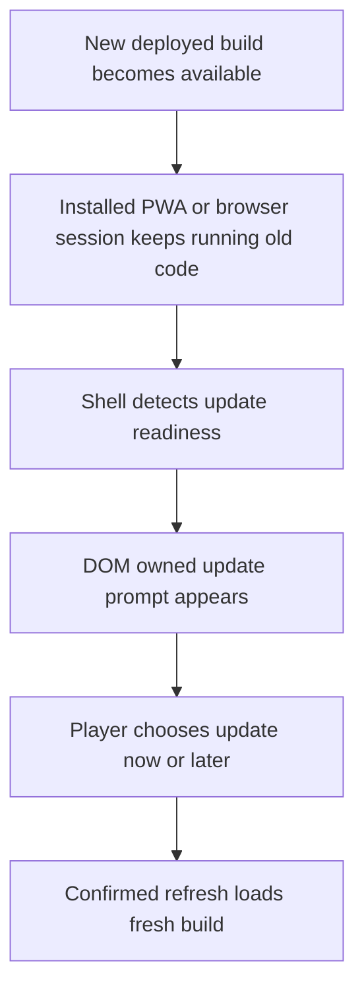

## req_074_define_a_pwa_update_prompt_and_self_refresh_posture_for_deployed_builds - Define a PWA update prompt and self-refresh posture for deployed builds
> From version: 0.5.1
> Schema version: 1.0
> Status: Done
> Understanding: 93%
> Confidence: 90%
> Complexity: Medium
> Theme: UI
> Reminder: Update status/understanding/confidence and references when you edit this doc.

# Needs
- Detect when a newer deployed build is available instead of leaving installed PWA users stuck on an older runtime until they manually close or refresh the app.
- Present a clear in-app update prompt, ideally as a modal, so the user understands that a newer version is ready and can choose when to apply it.
- Keep the update flow compatible with the current shell or DOM overlay posture instead of burying service-worker behavior in invisible background logic.
- Avoid surprise reloads during active play when a safer user-confirmed update path can preserve trust and reduce session disruption.

# Context
The project already ships as a Vite PWA and currently uses `vite-plugin-pwa` with `registerType: "autoUpdate"` in `vite.config.ts`.
That means the app can fetch a fresher service worker in the background, but the product does not yet expose a player-facing update flow that says:
- a new version is available
- the current session is still running old code
- the player can launch the update deliberately

This gap is most visible in installed PWA mode:
- users may keep Emberwake open for long periods
- mobile home-screen launches feel app-like, so silent stale sessions are more confusing than in a normal browser tab
- a deployment can be live while the installed shell still presents older assets and behavior

The requested posture is not just technical service-worker correctness.
It is a product-facing update contract for the shell:
- detect update availability
- surface it in the UI
- let the player trigger the refresh
- keep the flow understandable in both browser and installed PWA contexts

Recommended default:
1. Detect a newly available build from the PWA registration layer.
2. Show a DOM-owned modal or equivalent shell-level blocking prompt when the app is in a safe shell state.
3. In active runtime contexts, prefer a clearly visible defer-until-user-action posture rather than an immediate forced reload.
4. Reload into the fresh version only after explicit user confirmation.

Scope boundaries:
- In: service-worker update detection, shell prompt ownership, update CTA wording, and safe refresh behavior for deployed builds.
- In: browser and installed PWA behavior, including repeatable validation of the update path.
- Out: a full offline-first redesign, save-state migration system, or multi-version compatibility framework.
- Out: backend-driven release channels or live patching without reload.

Relevant repo context:
- `vite.config.ts` already enables the PWA plugin and auto-update registration.
- `req_000_bootstrap_fullscreen_2d_react_pwa_shell` established the installable shell posture.
- `req_011_define_ui_hud_and_overlay_system` and `item_043_define_system_overlay_ownership_and_fullscreen_install_prompt_behavior` already bias system prompts toward DOM-owned overlays rather than Pixi-world rendering.
- `adr_017_lazy_load_pixi_runtime_behind_a_shell_owned_boot_boundary` reinforces shell ownership for boot and system-level transitions.

# Acceptance criteria
- AC1: The request defines a player-facing update posture for deployed builds rather than relying only on background service-worker replacement.
- AC2: The request defines how the app detects that a newer build is ready to activate in both browser and installed PWA contexts.
- AC3: The request defines a shell-owned update prompt, ideally a modal, that clearly communicates:
  - a new version is available
  - the user can trigger the update
  - what will happen when they confirm
- AC4: The request defines a safe activation posture that avoids surprise reloads during active runtime play unless an explicit forced-update case is later justified.
- AC5: The request defines how deferred updates remain discoverable after the user dismisses or postpones the first prompt.
- AC6: The request keeps update affordances in the DOM or shell layer rather than making them a world-space Pixi concern.
- AC7: The request defines validation for the update flow with at least:
  - one browser-tab path
  - one installed PWA path or closest reproducible approximation
  - evidence that the refreshed session serves the new build
- AC8: The request stays compatible with the current static-hosted Vite PWA posture and does not require a backend release-control system.

# Open questions
- Should the modal appear immediately even during an active run, or wait for a safer shell moment?
  Recommended default: show the update as high-priority but user-confirmed, and avoid forced reload during a live run.
- Should dismissal hide the update prompt permanently for the session or leave a persistent retry affordance?
  Recommended default: allow dismissal, but keep a visible update action in shell chrome until the refresh is applied.
- Should the app automatically refresh once the player returns to the main menu after an update is pending?
  Recommended default: no automatic refresh without explicit confirmation; use the main menu as a safe moment to prompt again.
- Should the same copy and flow be used for browser and installed PWA usage?
  Recommended default: same core flow, with slightly stronger wording in installed PWA mode because stale sessions are more common there.

# Definition of Ready (DoR)
- [x] Problem statement is explicit and user impact is clear.
- [x] Scope boundaries (in/out) are explicit.
- [x] Acceptance criteria are testable.
- [x] Dependencies and known risks are listed.

# Companion docs
- Product brief(s): (none yet)
- Architecture decision(s): `adr_017_lazy_load_pixi_runtime_behind_a_shell_owned_boot_boundary`
# AI Context
- Summary: Define a PWA update prompt and self-refresh posture for deployed builds
- Keywords: pwa, update, prompt, and, self-refresh, posture, for, deployed
- Use when: Use when framing scope, context, and acceptance checks for Define a PWA update prompt and self-refresh posture for deployed builds.
- Skip when: Skip when the work targets another feature, repository, or workflow stage.
# Backlog
- `item_279_define_deployed_build_update_detection_for_browser_and_installed_pwa_sessions`
- `item_280_define_a_shell_owned_update_modal_and_explicit_refresh_action_for_new_builds`
- `item_281_define_targeted_validation_for_pwa_update_prompting_and_self_refresh_behavior`
