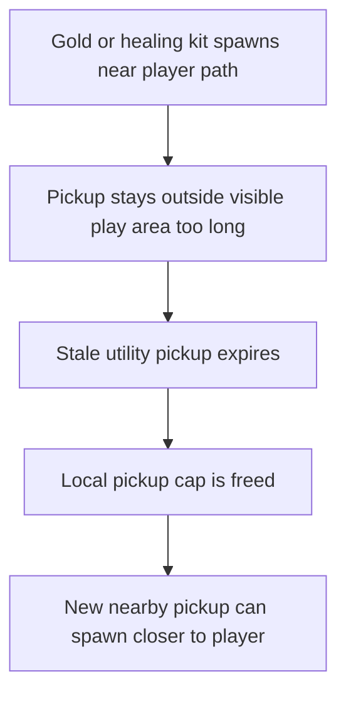

## req_075_define_offscreen_stale_pickup_expiration_for_gold_and_healing_kit_spawns - Define offscreen stale pickup expiration for gold and healing kit spawns
> From version: 0.5.1
> Schema version: 1.0
> Status: Done
> Understanding: 94%
> Confidence: 91%
> Complexity: Medium
> Theme: Gameplay
> Reminder: Update status/understanding/confidence and references when you edit this doc.

# Needs
- Let `gold` and `healing-kit` pickups disappear when they have stayed outside the player's visible play space for too long, instead of letting stale drops block the nearby pickup cap indefinitely.
- Favor renewed pickup availability near the player over preserving long-forgotten offscreen utility drops that no longer contribute to readable run flow.
- Keep the behavior bounded to first-wave utility pickups so progression-critical drops such as crystals are not accidentally removed under the same rule.
- Make the expiration rule deterministic and explainable enough to validate in runtime tests and future tuning JSON.

# Context
The current pickup loop already maintains a bounded nearby population and already removes pickups that drift beyond a hard despawn distance from the player.
That solves the far-away-forever case, but it does not solve the more common gameplay issue:
- a `gold` or `healing-kit` pickup can remain just outside the camera view
- it still counts against the nearby or local pickup population
- no fresh pickup appears closer to the player
- the reward loop feels dry even though stale utility drops still exist in simulation

This is especially visible in long runs or directional movement patterns where the player keeps advancing and does not backtrack through small offscreen leftovers.
The problem is not that pickups exist.
The problem is that stale utility pickups can occupy the local reward budget after they stop being realistically discoverable.

Recommended default posture:
1. Apply this rule only to `gold` and `healing-kit` pickups.
2. Consider a pickup stale when it has remained outside the effective visible play area for long enough, not merely because it exists.
3. Remove stale utility pickups so the local spawn loop can create new opportunities nearer to the player.
4. Keep crystals and other progression-significant pickups out of this first expiration rule unless a later request explicitly widens the scope.

Relevant repo context:
- `req_038_define_a_first_proximity_loot_spawn_wave_with_healing_kits_and_gold` introduced the first nearby utility pickup loop.
- `maintainNearbyPickupPopulation` already enforces a local pickup cap and a distance-based despawn posture.
- `req_052_define_an_externalized_json_gameplay_tuning_contract` already anticipates pickup-side tuning fields, so expiration thresholds should stay compatible with configuration-led tuning later.

Scope boundaries:
- In: stale or offscreen expiration rules for `gold` and `healing-kit`, relation to local pickup cap, and validation of renewed nearby spawn behavior.
- In: visibility-aware or camera-aware expiration posture that remains deterministic enough for tests.
- Out: crystal despawn, hostile despawn, broad world-item persistence systems, or player-inventory mechanics.
- Out: making every offscreen entity ephemeral; this request is only about first-wave utility pickups that can safely recycle.

# Acceptance criteria
- AC1: The request defines a stale utility-pickup expiration posture specifically for `gold` and `healing-kit` rather than for all pickup kinds.
- AC2: The request defines what too long outside view means in a deterministic and implementation-guiding way, such as a bounded invisible duration, visibility-window test, or equivalent reproducible rule.
- AC3: The request defines that stale offscreen utility pickups can be removed even when they have not crossed the broader distance-based despawn threshold.
- AC4: The request defines that pickup expiration frees the bounded nearby pickup population so new spawns can reappear closer to the player.
- AC5: The request explicitly keeps crystals or other progression-critical pickups out of this first expiration rule unless separately justified.
- AC6: The request defines validation for at least:
  - one stale offscreen `gold` case
  - one stale offscreen `healing-kit` case
  - evidence that renewed nearby spawns become possible after expiration
- AC7: The request remains compatible with externalized gameplay tuning so thresholds can later move into JSON without redesigning the behavior.

# AC Traceability
- AC1 -> Backlog coverage: `item_282` scopes the stale-expiration rule to utility pickups. Task coverage: `task_058` lands that rule in the runtime pickup maintenance path. Proof: `games/emberwake/src/runtime/entitySimulationSpawn.ts` expires only `gold` and `healing-kit` pickups.
- AC2 -> Backlog coverage: `item_282` defines a deterministic stale heuristic. Task coverage: `task_058` implements that heuristic directly in the simulation. Proof: `games/emberwake/src/runtime/entitySimulationSpawn.ts` uses an `18s` age plus a bounded distance threshold.
- AC3 -> Backlog coverage: `item_282` covers early expiration before the broad despawn rule. Task coverage: `task_058` places stale cleanup ahead of the generic pickup-distance filter. Proof: the stale utility branch runs before the broader retained-entity distance test.
- AC4 -> Backlog coverage: `item_283` covers cap release and renewed nearby spawns. Task coverage: `task_058` keeps the pickup-loop budget coherent after stale cleanup. Proof: expired utility pickups free the maintained nearby pickup budget so new closer spawns can re-enter the loop.
- AC5 -> Backlog coverage: `item_282` explicitly excludes progression-critical pickups from the stale rule. Task coverage: `task_058` preserves that exclusion in code. Proof: crystals remain outside the stale-expiration branch in `games/emberwake/src/runtime/entitySimulationSpawn.ts`.
- AC6 -> Backlog coverage: `item_284` owns validation for stale utility expiration and renewed nearby spawns. Task coverage: `task_058` executes that validation slice. Proof: `src/game/entities/model/entitySimulation.test.ts` covers stale distant utility expiration and spawn-budget recovery.
- AC7 -> Backlog coverage: `item_282` and `item_284` keep the behavior compatible with later externalization. Task coverage: `task_058` lands a bounded runtime contract instead of a hard-wired redesign. Proof: thresholds live behind a small runtime contract that stays compatible with later tuning externalization.

# Open questions
- Should the rule key off strict camera visibility or a looser proximity-to-visible-zone heuristic?
  Recommended default: use a deterministic visibility-aware heuristic that is cheaper and more stable than per-frame exact camera intersection when possible.
- Should expiration pause while the player is standing still near the pickup even if it is offscreen?
  Recommended default: no special pause unless testing shows the cleanup feels unfair; stale utility clutter is the primary problem to solve.
- Should expired pickups fade out visually first or disappear instantly in the first slice?
  Recommended default: instant removal in the first slice; presentation polish can come later if the behavior feels abrupt.
- Should this apply to pickups created from enemy defeat as well as ambient nearby spawn maintenance?
  Recommended default: yes for `gold` and `healing-kit`, as long as the rule is bounded and does not touch crystals.

# Definition of Ready (DoR)
- [x] Problem statement is explicit and user impact is clear.
- [x] Scope boundaries (in/out) are explicit.
- [x] Acceptance criteria are testable.
- [x] Dependencies and known risks are listed.

# Companion docs
- Product brief(s): (none yet)
- Architecture decision(s): (none yet)
- Request(s): `req_038_define_a_first_proximity_loot_spawn_wave_with_healing_kits_and_gold`, `req_052_define_an_externalized_json_gameplay_tuning_contract`

# AI Context
- Summary: Define offscreen stale pickup expiration for gold and healing kit spawns
- Keywords: offscreen, stale, pickup, expiration, for, gold, and, healing
- Use when: Use when framing scope, context, and acceptance checks for Define offscreen stale pickup expiration for gold and healing kit spawns.
- Skip when: Skip when the work targets another feature, repository, or workflow stage.
# Backlog
- `item_282_define_stale_expiration_rules_for_offscreen_gold_and_healing_kit_pickups`
- `item_283_define_nearby_pickup_cap_release_and_respawn_behavior_after_utility_pickup_expiration`
- `item_284_define_targeted_validation_for_offscreen_utility_pickup_expiration_and_renewed_nearby_spawns`
