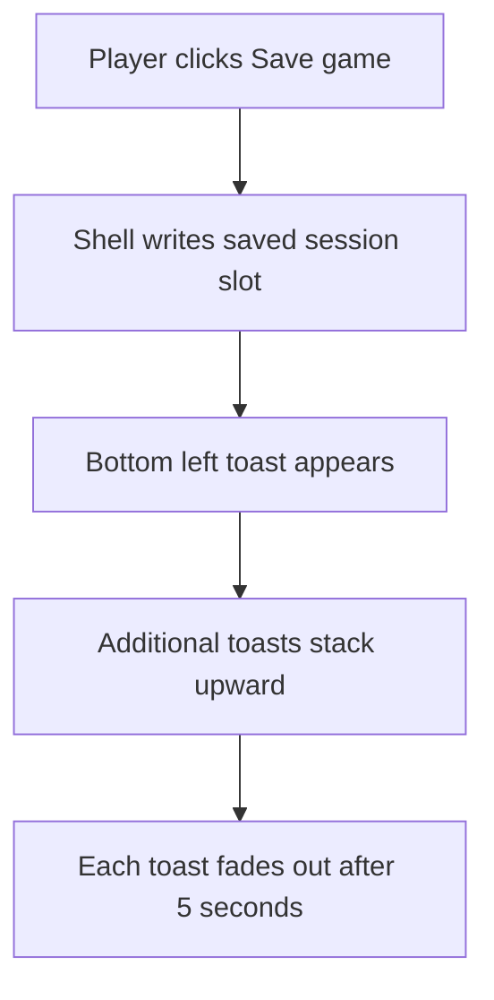

## req_076_define_a_shell_owned_toast_notification_posture_for_save_game_feedback - Define a shell-owned toast notification posture for save game feedback
> From version: 0.5.1
> Schema version: 1.0
> Status: Done
> Understanding: 95%
> Confidence: 92%
> Complexity: Medium
> Theme: UI
> Reminder: Update status/understanding/confidence and references when you edit this doc.

# Needs
- Give the `Save game` action a clear user-facing success signal instead of silently writing the slot with no visible confirmation.
- Introduce a first shell-owned toast notification posture that can display short-lived feedback without interrupting runtime flow.
- Define a toast stack that appears in the bottom-left of the screen, stacks cleanly, and fades out after 5 seconds.
- Keep the first slice tightly scoped around save feedback while leaving room for later reuse by other shell-level success or error messages.

# Context
The save/load flow already exists and `Save game` currently writes the active session into the single local slot from `AppShell`.
From a product standpoint, the action works but does not feel trustworthy enough because it has no visible acknowledgement after the click.

Right now the user can trigger `Save game` and see:
- no toast
- no transient confirmation
- no lightweight success feedback near the shell chrome

That creates avoidable uncertainty:
- did the click register
- was the slot actually updated
- should the user click again
- is save feedback intentionally absent or broken

The requested improvement is not a broad notification center.
It is a first shell-level feedback contract:
1. saving triggers a toast confirmation
2. toasts appear in the bottom-left corner
3. multiple toasts stack cleanly
4. each toast fades out automatically after 5 seconds

Recommended first-slice posture:
- keep toast ownership in the DOM or shell layer, not in Pixi world-space rendering
- start with save feedback as the triggering action
- use lightweight copy such as save success plus optional timestamp or slot wording
- make the stack visually readable but non-blocking during runtime play
- remove expired toasts automatically with a fade-out instead of abrupt disappearance where practical

Scope boundaries:
- In: first toast notification model, placement, stacking, lifetime, fade-out behavior, and wiring to `Save game`
- In: success feedback for the existing save action, with room for future shell-owned reuse
- Out: full notification history, inbox patterns, achievement feeds, or generalized event bus redesign
- Out: gameplay combat popups, world-space notifications, or reopening save-slot logic

Relevant repo context:
- `req_032_define_a_single_slot_save_and_load_flow_for_shell_owned_session_entry` established the shell-owned save action
- `AppShell` currently calls `saveActiveSession(...)` without visible UI feedback
- `req_011_define_ui_hud_and_overlay_system` and related shell ownership ADRs already bias system feedback toward DOM-owned overlays rather than Pixi rendering

# Acceptance criteria
- AC1: The request defines a shell-owned toast notification posture specifically strong enough to support `Save game` confirmation feedback.
- AC2: The request defines that a successful `Save game` action surfaces a visible toast confirmation instead of remaining silent.
- AC3: The request defines the first toast placement in the bottom-left corner of the screen.
- AC4: The request defines that multiple toasts stack cleanly rather than overlap or replace one another unpredictably.
- AC5: The request defines an automatic fade-out dismissal after 5 seconds for each toast.
- AC6: The request keeps toast ownership in the DOM or shell layer rather than introducing world-space Pixi notifications.
- AC7: The request defines a bounded first slice that does not widen into a full notification-center system, while still leaving future shell actions able to reuse the same toast posture later.
- AC8: The request defines validation for:
  - one save-success toast path
  - multiple stacked toast rendering
  - timed disappearance after the 5-second lifetime

# AC Traceability
- AC1 -> Backlog coverage: `item_285` and `item_286` define the shared toast stack and save-feedback slice. Task coverage: `task_058` delivers both inside the shell. Proof: the wave introduced a first shell-owned toast stack plus save feedback integration in `src/app/AppShell.tsx`.
- AC2 -> Backlog coverage: `item_285` keeps toast ownership in the shell layer. Task coverage: `task_058` lands the feature in shell hooks and DOM components. Proof: the toast system lives in DOM-owned shell components and hooks, not Pixi runtime rendering.
- AC3 -> Backlog coverage: `item_285` defines bottom-left anchoring. Task coverage: `task_058` renders the shared stack in shell chrome. Proof: `src/app/components/ShellToastStack.tsx` anchors toast delivery to the bottom-left shell surface.
- AC4 -> Backlog coverage: `item_285` and `item_286` cover stack behavior and lifecycle. Task coverage: `task_058` uses one shared ordered stack. Proof: toast entries stack in insertion order inside the shared shell stack.
- AC5 -> Backlog coverage: `item_286` defines the five-second fade contract. Task coverage: `task_058` implements timeout plus fade styling. Proof: `src/app/hooks/useToastStack.ts` dismisses entries after `5` seconds and CSS fade timing is defined in `src/app/styles/app.css`.
- AC6 -> Backlog coverage: `item_286` covers save-success feedback. Task coverage: `task_058` wires that feedback into the save action. Proof: `handleSaveGame()` now emits an explicit `Game saved.` toast on successful save.
- AC7 -> Backlog coverage: `item_285` and `item_286` keep the slice bounded to first shell feedback. Task coverage: `task_058` closes the work without widening into a notification center. Proof: the implementation remains a bounded shell-feedback slice while leaving the stack reusable.
- AC8 -> Backlog coverage: `item_287` owns toast validation. Task coverage: `task_058` executes the shell validation slice. Proof: `src/app/AppShell.test.tsx` covers save-triggered toast delivery and the shell stack contract.

# Open questions
- Should the first slice include error toasts for save failure, or only success feedback?
  Recommended default: success feedback first, with room to add error states if the implementation naturally exposes them.
- Should new toasts stack upward or downward from the bottom-left anchor?
  Recommended default: anchor the stack bottom-left and grow upward so the newest toast stays closest to the corner anchor.
- Should the toast pause its timeout on hover in the first slice?
  Recommended default: no; keep the first slice simple unless readability testing shows real need.
- Should the save toast include a precise timestamp or just a short success message?
  Recommended default: a short success message is enough for V1; metadata can remain optional.

# Definition of Ready (DoR)
- [x] Problem statement is explicit and user impact is clear.
- [x] Scope boundaries (in/out) are explicit.
- [x] Acceptance criteria are testable.
- [x] Dependencies and known risks are listed.

# Companion docs
- Product brief(s): (none yet)
- Architecture decision(s): `adr_002_separate_react_shell_from_pixi_runtime_ownership`, `adr_016_define_shell_scene_state_and_meta_surface_ownership`
- Request(s): `req_011_define_ui_hud_and_overlay_system`, `req_032_define_a_single_slot_save_and_load_flow_for_shell_owned_session_entry`
# AI Context
- Summary: Define a shell-owned toast notification posture for save game feedback
- Keywords: shell-owned, toast, notification, posture, for, save, game, feedback
- Use when: Use when framing scope, context, and acceptance checks for Define a shell-owned toast notification posture for save game feedback.
- Skip when: Skip when the work targets another feature, repository, or workflow stage.
# Backlog
- `item_285_define_a_shell_owned_toast_stack_and_bottom_left_viewport_anchoring_posture`
- `item_286_define_save_game_feedback_toast_lifecycle_with_stacking_and_five_second_fade_out`
- `item_287_define_targeted_validation_for_shell_toast_delivery_timing_and_stacking_behavior`
