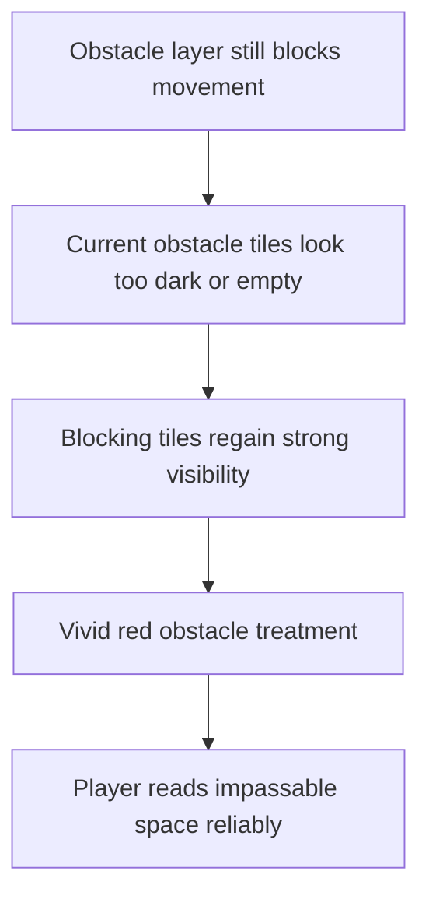

## req_077_define_a_vivid_blocking_obstacle_visibility_posture_for_non_traversable_world_tiles - Define a vivid blocking-obstacle visibility posture for non-traversable world tiles
> From version: 0.5.1
> Schema version: 1.0
> Status: Done
> Understanding: 96%
> Confidence: 93%
> Complexity: Medium
> Theme: UI
> Reminder: Update status/understanding/confidence and references when you edit this doc.

# Needs
- Restore clear visual readability for non-traversable blocking tiles, because their current presentation no longer communicates solidity reliably enough during play.
- Make blocking obstacles stand out explicitly from surrounding terrain instead of blending into dark or empty-looking cells.
- Adopt a vivid red obstacle treatment for this slice so impassable space becomes immediately legible to the player.
- Keep the change bounded to world readability and obstacle visibility rather than reopening obstacle-generation rules or collision behavior.

# Context
The runtime already has a real obstacle layer and those tiles still block movement in gameplay.
The current problem is not collision correctness.
It is visual communication.

Right now, non-traversable blocks have become too hard to read:
- they can look nearly black
- they can read as empty or visually missing
- they no longer stand out strongly enough against the current terrain palettes

That weakens the play experience because the player can no longer infer blocked space confidently from the map itself.
The world then feels visually ambiguous even though the collision layer is still working underneath.

Relevant repo context:
- obstacle rendering flows through `obstacleDefinitions[...].debugColor` in `games/emberwake/src/content/world/worldData.ts`
- chunk debug/world tile colors are resolved in `games/emberwake/src/content/world/chunkDebugData.ts`
- the current `solid` obstacle color is a very dark value (`0x0c0f16`), which matches the observed loss of visibility
- the blocking-world gameplay contract already exists from `req_033_define_a_first_collision_and_blocking_world_wave_for_runtime_gameplay`

Requested visual direction:
1. Blocking tiles should be clearly visible again.
2. They should no longer read as black or empty.
3. The first corrective posture should use vivid red as the blocking color family.
4. The result should preserve immediate contrast against surrounding biome tiles without making the whole map unreadable.

Scope boundaries:
- In: visible treatment for blocking obstacle tiles, contrast/readability posture, and validation that non-traversable tiles are visually unmistakable again.
- In: updating the current obstacle color direction from near-black to vivid red.
- Out: changing obstacle spawn density, movement blocking rules, pathfinding, or broader biome art direction.
- Out: replacing debug-world rendering with final art assets.

# Acceptance criteria
- AC1: The request defines a visibility-fix slice for non-traversable obstacle tiles rather than reopening world-generation or collision semantics.
- AC2: The request defines that blocking obstacles must become clearly readable again during runtime play instead of remaining nearly black or visually absent.
- AC3: The request defines vivid red as the intended first corrective color direction for blocking tiles.
- AC4: The request defines that blocking obstacles must remain visually distinct from surrounding terrain across the current biome/debug palettes.
- AC5: The request keeps the change bounded to obstacle presentation and does not alter the underlying blocking-world contract.
- AC6: The request defines validation strong enough to show that:
  - blocking tiles are visible again
  - they no longer read as empty cells
  - the red treatment remains legible against the world background

# AC Traceability
- AC1 -> Backlog coverage: `item_288` defines the vivid blocker rendering posture. Task coverage: `task_058` applies that posture in the world render data. Proof: blocking obstacle tiles now render with a vivid red debug color in `games/emberwake/src/content/world/worldData.ts`.
- AC2 -> Backlog coverage: `item_288` and `item_289` cover visibility recovery and contrast safeguards. Task coverage: `task_058` updates the active obstacle palette accordingly. Proof: the obstacle contrast posture was updated specifically to avoid black or empty-looking blockers.
- AC3 -> Backlog coverage: `item_288` carries the vivid-red direction. Task coverage: `task_058` lands that exact color shift. Proof: non-traversable tiles now read as bright red instead of dark fill.
- AC4 -> Backlog coverage: `item_289` covers readability against the existing world backdrop. Task coverage: `task_058` keeps the change bounded to contrast/readability. Proof: the new blocker color stays visually distinct against the current world palette.
- AC5 -> Backlog coverage: `item_288` and `item_289` keep scope on rendering and readability. Task coverage: `task_058` preserves collision and world-generation behavior. Proof: no collision or generation rules were changed in this slice.
- AC6 -> Backlog coverage: `item_290` owns blocker-visibility validation. Task coverage: `task_058` executes that validation slice. Proof: runtime validation was included in the wave and browser smoke passed on the updated render posture.

# Open questions
- Should every solid obstacle use one vivid red, or should variants stay slightly different within the same red family?
  Recommended default: keep the first slice simple with one strong red direction, allowing subtle variation only if readability stays high.
- Should the fix stay strictly in the current debug/world render path, or anticipate final authored tile art?
  Recommended default: fix the current render path now; final art can later preserve the same readability principle.
- Should obstacle outlines or glow be added, or is color alone enough for the first pass?
  Recommended default: start with color correction first; only add outlines or glow if red alone still underperforms.

# Definition of Ready (DoR)
- [x] Problem statement is explicit and user impact is clear.
- [x] Scope boundaries (in/out) are explicit.
- [x] Acceptance criteria are testable.
- [x] Dependencies and known risks are listed.

# Companion docs
- Product brief(s): (none yet)
- Architecture decision(s): `adr_032_separate_visual_terrain_blocking_obstacles_and_movement_surface_modifiers`
- Request(s): `req_033_define_a_first_collision_and_blocking_world_wave_for_runtime_gameplay`, `req_034_define_a_first_movement_surface_modifiers_wave_for_runtime_gameplay`
# AI Context
- Summary: Define a vivid blocking-obstacle visibility posture for non-traversable world tiles
- Keywords: vivid, blocking-obstacle, visibility, posture, for, non-traversable, world, tiles
- Use when: Use when framing scope, context, and acceptance checks for Define a vivid blocking-obstacle visibility posture for non-traversable world tiles.
- Skip when: Skip when the work targets another feature, repository, or workflow stage.
# Backlog
- `item_288_define_vivid_red_rendering_for_non_traversable_blocking_obstacle_tiles`
- `item_289_define_contrast_safeguards_for_blocking_obstacle_readability_across_world_backgrounds`
- `item_290_define_targeted_validation_for_blocking_obstacle_visibility_and_map_readability`
