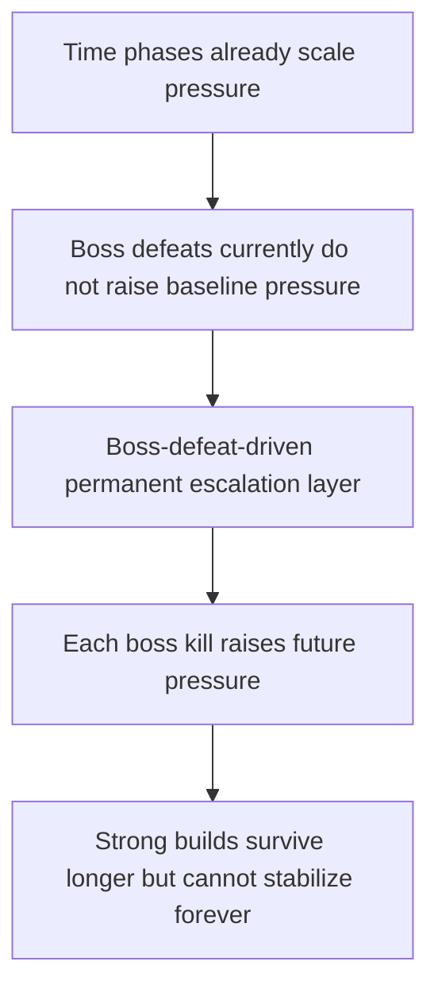

## req_078_define_a_boss_defeat_driven_permanent_difficulty_escalation_layer - Define a boss-defeat-driven permanent difficulty escalation layer
> From version: 0.5.1
> Schema version: 1.0
> Status: Done
> Understanding: 96%
> Confidence: 93%
> Complexity: High
> Theme: Combat
> Reminder: Update status/understanding/confidence and references when you edit this doc.

# Needs
- Add a second permanent difficulty lever that increases when the player defeats a boss, so survival cannot remain indefinitely stable even with a strong build.
- Make boss kills feel like meaningful run milestones that also tighten future pressure instead of acting only as isolated threat spikes.
- Keep the system legible by layering boss-defeat escalation on top of the existing authored time-phase model rather than replacing it.
- Preserve the fantasy that stronger players can delay collapse, while removing the possibility of a truly endless flat equilibrium.

# Context
The current run already becomes harder over time through authored phases:
- hostile max health increases
- hostile contact damage increases
- hostile population limits open up
- spawn cadence accelerates
- mini-boss beats appear every five minutes

That structure gives the run a real survival arc, but it still leaves one systemic gap:
- if the player scales well enough, the run can stabilize for too long around the current phase and mini-boss posture
- boss kills currently punctuate the run, but they do not permanently raise the baseline pressure afterward
- the game therefore lacks a second inevitability lever tied to player mastery over boss encounters

This request should define a bounded escalation layer in which each boss defeat increases the run's difficulty multipliers for the remainder of that run.

Recommended posture:
1. Treat the current authored mini-boss kill as the first boss-defeat trigger, so the system can work with the existing `watchglass-prime` beat.
2. Apply an additional permanent multiplier layer after each boss defeat on top of the existing time-phase and hostile-profile scaling.
3. Let this layer affect the same legible pressure families already used by the run arc, such as hostile health, hostile damage, spawn pressure, or hostile population envelope.
4. Keep the scaling cumulative within a run and do not remove it after the boss beat has passed.
5. Keep the system authored and bounded rather than turning it into an unstructured infinite exponential director.

Design intent:
- the player can become strong enough to survive longer
- boss victories should still matter positively
- but every victory should also move the run closer to an unwinnable end state
- the game should feel delaying-the-inevitable, not trivially endless

# Acceptance criteria
- AC1: The request defines a boss-defeat-driven escalation layer that stacks on top of the existing authored time-phase difficulty model instead of replacing it.
- AC2: The request defines that each boss defeat permanently increases one or more run difficulty multipliers for the remainder of the current run.
- AC3: The request defines the current authored mini-boss beat as a valid first trigger for this system unless later boss types are added.
- AC4: The request keeps the escalation legible by reusing existing pressure families such as hostile health, hostile contact damage, spawn cadence, or hostile population limits rather than introducing unrelated hidden difficulty mechanics.
- AC5: The request explicitly frames the design goal as delaying the inevitable rather than allowing a truly endless equilibrium once repeated bosses have been defeated.
- AC6: The request keeps scope bounded away from a full adaptive-director rewrite, meta-progression system, or broad rebalance of every combat subsystem.
- AC7: The request defines validation strong enough to show that:
  - boss defeats permanently raise future pressure inside the same run
  - the run still feels readable and authored
  - stronger players can extend survival but not flatten the game into a stable endless state

# AC Traceability
- AC1 -> Backlog coverage: `item_291` and `item_292` define cumulative post-boss escalation and boss-defeat plumbing. Task coverage: `task_058` lands both in the hostile-pressure model. Proof: post-boss escalation now stacks on top of authored time phases through `resolveBossDefeatEscalation`.
- AC2 -> Backlog coverage: `item_292` covers boss-defeat trigger plumbing. Task coverage: `task_058` increments boss-defeat state inside the run loop. Proof: defeated mini-bosses increment `runStats.bossDefeats` in `games/emberwake/src/runtime/entitySimulation.ts`.
- AC3 -> Backlog coverage: `item_291` defines the persistent difficulty modifiers. Task coverage: `task_058` applies them to later hostile spawns. Proof: newly spawned hostiles now scale health, contact damage, local cap, and spawn cadence from boss defeats.
- AC4 -> Backlog coverage: `item_291` and `item_292` cover per-boss permanent escalation. Task coverage: `task_058` keeps that escalation active for the remainder of the run. Proof: the escalation is permanent for the run and applies after each boss defeat.
- AC5 -> Backlog coverage: `item_291` keeps the new pressure layer on top of authored phases. Task coverage: `task_058` preserves the time-phase model. Proof: the extra scaling is layered on the existing authored phase multipliers rather than replacing them.
- AC6 -> Backlog coverage: `item_291` frames the curve as delaying, not removing, inevitable collapse. Task coverage: `task_058` implements bounded per-boss steps rather than an open-ended redesign. Proof: the contract increases pressure without changing the core lose-eventuality posture of the run.
- AC7 -> Backlog coverage: `item_293` owns post-boss escalation validation. Task coverage: `task_058` executes that runtime validation slice. Proof: `src/game/entities/model/entitySimulation.test.ts` validates stronger hostile stats after a boss defeat.

# Open questions
- Should the post-boss escalation affect every existing difficulty lever, or only a selected subset?
  Recommended default: start with a selected subset, prioritizing hostile health and spawn pressure so the result is legible without immediately over-spiking contact damage.
- Should every boss kill grant the same escalation step, or should later bosses scale harder than earlier ones?
  Recommended default: start with a fixed per-boss step so the first pass stays readable and easy to tune.
- Should boss-defeat escalation be visible to the player through UI or phase messaging?
  Recommended default: keep the first slice systemic first, then add explicit signaling only if playtests show the change is too opaque.
- Should the system be capped?
  Recommended default: do not hard-cap it in principle, but keep the per-boss step bounded enough that the curve remains playable for a meaningful amount of time.

# Definition of Ready (DoR)
- [x] Problem statement is explicit and player impact is clear.
- [x] Scope boundaries (in/out) are explicit.
- [x] Acceptance criteria are testable.
- [x] Dependencies and known risks are listed.

# Companion docs
- Product brief(s): `prod_016_time_owned_run_arc_and_authored_difficulty_phases`
- Architecture decision(s): `adr_047_structure_first_pass_run_difficulty_escalation_as_authored_time_phases`, `adr_049_structure_time_scaled_enemy_pressure_around_authored_population_opening_composition_tiers_and_mini_boss_beats`
- Request(s): `req_067_define_a_time_driven_run_progression_and_difficulty_escalation_wave`, `req_069_define_a_smoother_early_game_and_stronger_time_scaled_enemy_pressure_wave`
# AI Context
- Summary: Define a boss-defeat-driven permanent difficulty escalation layer
- Keywords: boss-defeat-driven, permanent, difficulty, escalation, layer
- Use when: Use when framing scope, context, and acceptance checks for Define a boss-defeat-driven permanent difficulty escalation layer.
- Skip when: Skip when the work targets another feature, repository, or workflow stage.
# Backlog
- `item_291_define_cumulative_post_boss_difficulty_modifiers_on_top_of_authored_time_phases`
- `item_292_define_boss_defeat_trigger_plumbing_into_permanent_run_pressure_escalation`
- `item_293_define_targeted_validation_for_post_boss_escalation_and_delaying_the_inevitable_pacing`
