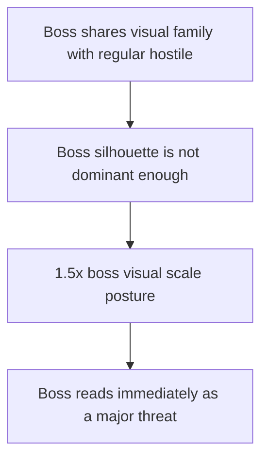

## req_079_define_a_1_5x_boss_visual_scale_posture_for_runtime_hostiles - Define a 1.5x boss visual scale posture for runtime hostiles
> From version: 0.5.1
> Schema version: 1.0
> Status: Done
> Understanding: 96%
> Confidence: 93%
> Complexity: Low
> Theme: Combat
> Reminder: Update status/understanding/confidence and references when you edit this doc.

# Needs
- Make boss entities read immediately as bosses by giving them a much stronger on-screen size difference than standard hostile entities.
- Restore a clear visual hierarchy between regular enemies and boss threats, especially when they share similar base shapes or visual families.
- Adopt a first-pass target of `1.5x` boss scale relative to standard hostile rendering.
- Keep this slice focused on boss presence and readability rather than widening into a full hostile-art rework.

# Context
The runtime already has a first-pass mini-boss profile through `watchglass-prime`.
That entity is somewhat larger than regular hostiles through its footprint radius, but the difference is still not strong enough visually:
- the boss shares the same `debug-watcher` visual family as another hostile
- the current size jump does not always read as a true boss silhouette
- under combat clutter, the boss can fail to establish enough visual dominance

This creates a readability problem.
A boss should be identifiable at a glance before the player parses its exact attacks or health.

This request should define a first-pass boss scale posture where boss entities render at `1.5x` the standard hostile scale.

Scope boundaries:
- In: boss visual scale, on-screen readability, and stronger size hierarchy for boss-class hostiles
- In: using the current mini-boss entity as the first concrete target
- Out: full boss art replacement, boss AI redesign, collision rewrite, or broad hostile roster restyling

Recommended default:
1. Treat the current boss-class hostile as the first target of the size posture.
2. Apply the `1.5x` requirement primarily as a visual readability contract.
3. Preserve gameplay clarity so the larger boss remains readable within combat effects and world obstacles.
4. Avoid silently widening scope into a full rebalance of footprint, contact radius, or pathfinding unless later implementation explicitly proves that necessary.

# Acceptance criteria
- AC1: The request defines a boss scale posture that makes boss-class hostiles render at `1.5x` the standard hostile scale.
- AC2: The request defines the current boss or mini-boss entity as the first concrete target for this visual-size contract.
- AC3: The request frames the change as a readability and threat-hierarchy improvement rather than a full hostile-art overhaul.
- AC4: The request keeps the first slice bounded so visual scaling can be delivered without automatically reopening boss AI, roster expansion, or broad movement/collision redesign.
- AC5: The request defines validation strong enough to show that bosses are visually identifiable faster and more reliably during active combat clutter.

# AC Traceability
- AC1 -> Backlog coverage: `item_294` defines the boss-scale posture. Task coverage: `task_058` lands it in the hostile profile contract. Proof: boss-class hostiles now resolve with `visualScaleMultiplier: 1.5`.
- AC2 -> Backlog coverage: `item_294` explicitly targets boss hostiles. Task coverage: `task_058` applies the scale to the active mini-boss class. Proof: `watchglass-prime` is rendered at `1.5x` the hostile body size.
- AC3 -> Backlog coverage: `item_294` covers runtime readability under the scaled posture. Task coverage: `task_058` applies the same scale to body and bar rendering. Proof: `src/game/entities/render/EntityScene.tsx` applies `visualScale` to the hostile silhouette and bars.
- AC4 -> Backlog coverage: `item_294` keeps the change bounded to boss posture. Task coverage: `task_058` does not introduce arbitrary scaling across unrelated entities. Proof: the wave uses a bounded boss-scale contract rather than broad arbitrary scaling.
- AC5 -> Backlog coverage: `item_295` owns boss-readability validation. Task coverage: `task_058` executes that runtime validation slice. Proof: `src/game/entities/model/entitySimulation.test.ts` validates the boss visual scale contract.

# Open questions
- Should the `1.5x` contract remain strictly visual, or should collision and footprint scale with it?
  Recommended default: keep the first request visual-first and widen gameplay footprint only if implementation evidence shows that the boss still reads too small.
- Should every future boss share the same `1.5x` baseline, or can some later bosses exceed it?
  Recommended default: define `1.5x` as the minimum first-pass boss readability contract, allowing future authored bosses to exceed it.
- Should the size increase be paired with other cues such as outline, tint, or shadow?
  Recommended default: let size do the primary work first; add extra cues later only if readability remains weak.

# Definition of Ready (DoR)
- [x] Problem statement is explicit and player impact is clear.
- [x] Scope boundaries (in/out) are explicit.
- [x] Acceptance criteria are testable.
- [x] Dependencies and known risks are listed.

# Companion docs
- Product brief(s): `prod_003_high_density_top_down_survival_action_direction`, `prod_016_time_owned_run_arc_and_authored_difficulty_phases`
- Architecture decision(s): `adr_049_structure_time_scaled_enemy_pressure_around_authored_population_opening_composition_tiers_and_mini_boss_beats`
- Request(s): `req_069_define_a_smoother_early_game_and_stronger_time_scaled_enemy_pressure_wave`
# AI Context
- Summary: Define a 1.5x boss visual scale posture for runtime hostiles
- Keywords: boss, visual, scale, posture, runtime, hostiles
- Use when: Use when framing scope, context, and acceptance checks for Define a 1.5x boss visual scale posture for runtime hostiles.
- Skip when: Skip when the work targets another feature, repository, or workflow stage.
# Backlog
- `item_294_define_a_1_point_5x_render_scale_contract_for_boss_class_hostile_entities`
- `item_295_define_targeted_validation_for_boss_silhouette_dominance_and_combat_readability`
