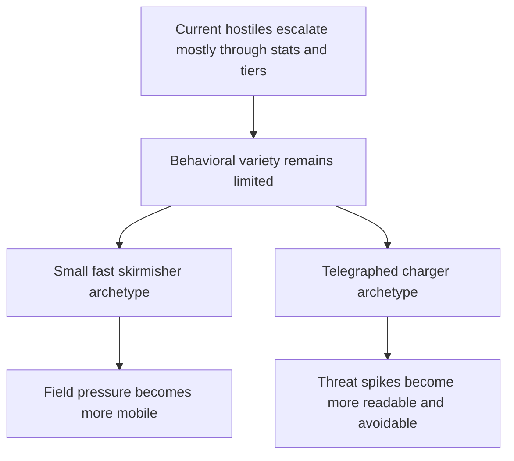

## req_080_define_two_new_hostile_archetypes_for_fast_skirmish_and_telegraphed_charge_pressure - Define two new hostile archetypes for fast skirmish and telegraphed charge pressure
> From version: 0.5.1
> Schema version: 1.0
> Status: Ready
> Understanding: 95%
> Confidence: 92%
> Complexity: Medium
> Theme: Combat
> Reminder: Update status/understanding/confidence and references when you edit this doc.

# Needs
- Add a smaller, faster hostile archetype so the field pressure is not made only of medium-speed enemies with similar body presence.
- Add a telegraphed charger hostile archetype that creates burst threat through readable anticipation and avoidable commitment.
- Increase hostile variety through movement and attack posture differences rather than only through numeric scaling.
- Keep both additions bounded to readable first-pass archetypes that work within the current deterministic runtime combat model.

# Context
The runtime already has:
- a first hostile combat loop
- phase-based enemy pressure
- stronger hostile composition over time
- authored mini-boss beats

What it still lacks is more moment-to-moment behavioral variety inside the hostile roster.

Right now, hostile differentiation is mostly expressed through:
- stat multipliers
- size differences
- composition weights

That gives the run escalation, but it does not yet create enough contrast in how different enemies move and threaten the player.

This request should define a bounded hostile-variety wave with two new enemy archetypes:

1. A `small fast skirmisher`
- approximately `0.5x` the standard hostile size
- approximately `1.5x` the standard hostile movement speed
- a lighter, more evasive-feeling pressure posture through rapid approach and repositioning

2. A `telegraphed charger`
- sometimes stops moving for about `1` second
- visibly trembles during that wind-up
- then charges in the player's direction as a committed burst movement
- the charge should behave like a directional sprint rather than a homing dash
- the attack must be avoidable if the player reacts during or around the telegraph window

Requested posture:
1. Keep both new enemies inside the existing hostile-profile and authored-pressure model.
2. Use the small fast archetype to make the field feel less uniform and to punish passive drifting without simply inflating damage.
3. Use the charger archetype to create readable threat spikes that reward player movement and anticipation.
4. Keep the charger fair by making the anticipation readable and the burst directional rather than perfectly tracking.
5. Avoid widening this first slice into a full animation-state-machine rewrite, ranged-attack expansion, or broad encounter-director overhaul.

Scope boundaries:
- In: two new hostile archetypes, their defining movement or attack posture, and the readability requirements needed to make them fair.
- In: size, speed, pause, tremble, and directional charge contracts strong enough to guide later implementation.
- Out: a full multi-boss roster, ranged enemy families, status-effect enemies, or a broad hostile-faction redesign.

# Acceptance criteria
- AC1: The request defines a bounded hostile-variety wave that introduces two new hostile archetypes without reopening the entire combat or AI stack.
- AC2: The request defines one hostile archetype that is approximately `0.5x` the standard hostile size and approximately `1.5x` the standard hostile movement speed.
- AC3: The request defines the small fast archetype strongly enough that it reads as a distinct mobility-pressure enemy rather than only a recolored stat variant.
- AC4: The request defines one hostile archetype that sometimes stops for about `1` second, visibly trembles during the stop, then performs a directional charge toward the player's last known direction.
- AC5: The request defines the charge as avoidable by player movement and explicitly avoids a perfectly homing burst that would feel unfair.
- AC6: The request keeps both archetypes compatible with the current authored hostile-pressure model rather than requiring a full encounter-director or animation-heavy rewrite.
- AC7: The request defines validation strong enough to show that:
  - the small fast enemy is visibly smaller and meaningfully faster
  - the charger telegraph is readable before the burst starts
  - the charge behaves like a committed sprint in one direction
  - the player can avoid the charge through timing and movement

# Open questions
- Should the small fast archetype also be more fragile, or only smaller and faster?
  Recommended default: keep the first contract centered on size and speed first; fragility can be tuned later if playtests show it survives too long for its threat profile.
- Should the charger lock direction at the start of the wind-up or at the instant the burst begins?
  Recommended default: lock direction late enough to feel responsive, but before the actual burst motion starts so the move remains avoidable.
- Should the tremble be purely visual, or should it also slow or fully stop the entity during wind-up?
  Recommended default: fully stop or nearly stop movement during the telegraph so the tell is legible.
- Should these archetypes appear immediately in the run or only in later pressure phases?
  Recommended default: gate them through authored phase composition so the opening minute does not become too noisy.

# Definition of Ready (DoR)
- [x] Problem statement is explicit and player impact is clear.
- [x] Scope boundaries (in/out) are explicit.
- [x] Acceptance criteria are testable.
- [x] Dependencies and known risks are listed.

# Companion docs
- Product brief(s): `prod_003_high_density_top_down_survival_action_direction`, `prod_016_time_owned_run_arc_and_authored_difficulty_phases`
- Architecture decision(s): `adr_033_adopt_deterministic_movement_oriented_pseudo_physics_instead_of_a_full_physics_engine`, `adr_049_structure_time_scaled_enemy_pressure_around_authored_population_opening_composition_tiers_and_mini_boss_beats`
- Request(s): `req_036_define_a_first_hostile_combat_loop_with_spawns_contact_damage_and_player_cone_attack`, `req_039_define_overhead_health_and_attack_charge_bars_for_runtime_combatants`, `req_069_define_a_smoother_early_game_and_stronger_time_scaled_enemy_pressure_wave`
# AI Context
- Summary: Define two new hostile archetypes for fast skirmish and telegraphed charge pressure
- Keywords: hostile, archetypes, fast, skirmish, telegraphed, charge, pressure
- Use when: Use when framing scope, context, and acceptance checks for Define two new hostile archetypes for fast skirmish and telegraphed charge pressure.
- Skip when: Skip when the work targets another feature, repository, or workflow stage.

# Backlog
- `item_296_define_a_small_fast_skirmisher_hostile_profile_and_authored_phase_entry_posture`
- `item_297_define_a_telegraphed_charger_hostile_profile_with_one_second_wind_up_and_directional_sprint`
- `item_298_define_targeted_validation_for_new_hostile_archetype_readability_fairness_and_avoidance`
