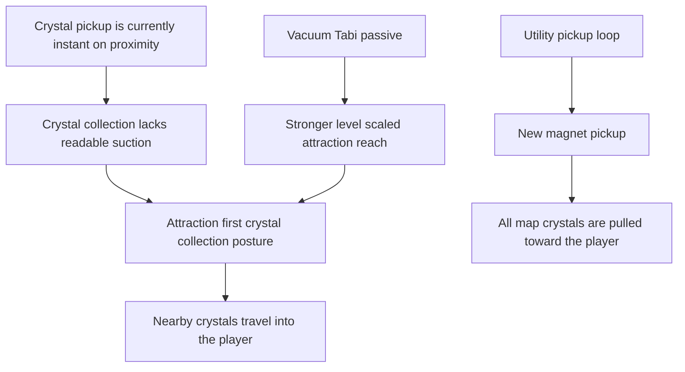

## req_081_define_a_crystal_magnet_pickup_and_attraction_first_xp_crystal_collection_posture - Define a crystal magnet pickup and attraction first XP crystal collection posture
> From version: 0.5.1
> Schema version: 1.0
> Status: Ready
> Understanding: 95%
> Confidence: 92%
> Complexity: Medium
> Theme: Gameplay
> Reminder: Update status/understanding/confidence and references when you edit this doc.

# Needs
- Add a new magnet-style pickup among world utility pickups so the player can trigger a full-map XP crystal vacuum moment.
- Strengthen the existing crystal-attraction passive so pickup reach scales more meaningfully with level instead of feeling too modest.
- Rework XP crystal consumption so crystals are first pulled toward the player before being consumed, instead of disappearing instantly on proximity.
- Unify the attraction-first behavior across normal pickup reach, the stronger passive radius, and the new magnet bonus so crystal collection feels consistent and legible.

# Context
The runtime already has:
- XP crystals dropped by defeated hostiles
- automatic pickup collection on proximity
- `gold` and `healing-kit` utility pickups
- an existing passive, `vacuum-tabi`, that increases pickup radius

But the current crystal-consumption posture is still too abrupt and too weakly expressed:
- crystals are consumed immediately once inside pickup radius
- the player does not get a readable suction or travel animation before XP is granted
- the passive pickup-radius bonus exists, but its effect can feel too subtle across levels
- there is no dramatic utility pickup that clears the map's outstanding crystal field into the player

This leaves a product gap in both feel and readability.
XP crystal collection should feel like the player is drawing reward energy in, not just deleting nearby entities on contact.

This request should define a bounded crystal-collection wave with three linked changes:

1. New `magnet` world pickup
- should join the same general family of utility pickups as `gold` and `healing-kit`
- when collected, it should attract all XP crystals currently on the map toward the player
- it should not instantly grant XP by deleting crystals in place; the crystals should still travel toward the player first

2. Stronger and more level-expressive `vacuum-tabi`
- the passive should pull crystals from farther away than it does now
- the effective attraction reach should scale more strongly by passive level
- higher levels should feel visibly different in collection reach

3. Attraction-first crystal consumption contract
- nearby XP crystals should first move toward the player
- only after reaching the player should they be consumed and grant XP
- this same attraction-first logic should apply to:
  - normal nearby collection
  - the stronger passive-driven collection radius
  - the magnet pickup's full-map pull

Recommended posture:
1. Treat crystal attraction as a visible short travel phase, not an instant pickup deletion.
2. Keep the first slice focused on XP crystals rather than reopening gold or healing-kit collection rules.
3. Let the magnet act as a dramatic one-shot utility reward rather than a passive always-on aura.
4. Keep the attraction readable and performant even when many crystals are being pulled at once.
5. Keep XP gain tied to actual arrival at the player, so all attraction sources share the same consumption rule.

Scope boundaries:
- In: a new magnet pickup, stronger and level-scaled crystal-attraction passive behavior, and a shared attraction-first consumption posture for XP crystals.
- In: visual or motion readability strong enough for the player to perceive crystals being pulled in before they resolve.
- Out: reworking gold or healing-kit collection into the same animated travel system unless later justified.
- Out: full pickup-inventory mechanics, crystal rarity variants, or large loot-table redesign.

# Acceptance criteria
- AC1: The request defines a bounded XP-crystal collection wave that introduces a new magnet pickup plus an attraction-first collection posture.
- AC2: The request defines a new `magnet` pickup that, when collected, attracts all XP crystals currently present on the map toward the player.
- AC3: The request defines that magnet-triggered crystal collection still resolves through crystal travel toward the player rather than instant XP grant at crystal origin points.
- AC4: The request defines that the existing crystal-attraction passive becomes stronger and scales its attraction reach more meaningfully by level.
- AC5: The request defines that normal XP crystal collection no longer resolves as immediate proximity deletion, but instead pulls crystals toward the player before they are consumed.
- AC6: The request defines one shared attraction-first posture for standard nearby collection, passive-extended collection, and magnet-triggered collection.
- AC7: The request keeps scope intentionally bounded to XP crystals and does not automatically widen the same travel-animation contract to `gold` or `healing-kit`.
- AC8: The request defines validation strong enough to show that:
  - nearby crystals visibly move toward the player before XP is granted
  - higher `vacuum-tabi` levels produce clearly stronger attraction reach
  - magnet pickup collection pulls distant crystals from the whole active map space
  - XP is granted on crystal arrival rather than at attraction trigger time

# Open questions
- Should the magnet pickup be rare compared with `gold` and `healing-kit`, or simply another common utility outcome?
  Recommended default: keep it meaningfully rarer so it reads as a special catch-up or payout moment rather than constant noise.
- Should the magnet affect only spawned crystals currently loaded in the active simulation, or literally every crystal in all world storage?
  Recommended default: affect all crystals currently present in the active runtime simulation.
- Should the attraction speed itself scale with `vacuum-tabi`, or only the reach?
  Recommended default: prioritize stronger reach first; only scale travel speed if the longer pull begins to feel sluggish.
- Should crystals become temporarily non-mergeable while being attracted?
  Recommended default: keep the first request focused on readable arrival behavior and only revisit compaction rules if they visibly conflict.

# Definition of Ready (DoR)
- [x] Problem statement is explicit and player impact is clear.
- [x] Scope boundaries (in/out) are explicit.
- [x] Acceptance criteria are testable.
- [x] Dependencies and known risks are listed.

# Companion docs
- Product brief(s): `prod_007_foundational_passive_item_direction_for_emberwake`
- Architecture decision(s): `adr_033_adopt_deterministic_movement_oriented_pseudo_physics_instead_of_a_full_physics_engine`, `adr_038_split_entity_player_rendering_into_stable_geometry_and_transient_combat_overlays`
- Request(s): `req_038_define_a_first_proximity_loot_spawn_wave_with_healing_kits_and_gold`, `req_050_define_a_main_menu_polish_and_first_crystal_xp_progression_wave`, `req_075_define_offscreen_stale_pickup_expiration_for_gold_and_healing_kit_spawns`
# AI Context
- Summary: Define a crystal magnet pickup and attraction first XP crystal collection posture
- Keywords: crystal, magnet, pickup, attraction, xp, collection, posture
- Use when: Use when framing scope, context, and acceptance checks for Define a crystal magnet pickup and attraction first XP crystal collection posture.
- Skip when: Skip when the work targets another feature, repository, or workflow stage.

# Backlog
- `item_299_define_a_magnet_pickup_that_pulls_all_active_xp_crystals_toward_the_player`
- `item_300_define_stronger_level_scaled_vacuum_tabi_crystal_attraction_reach`
- `item_301_define_attraction_first_crystal_travel_and_arrival_based_xp_consumption`
- `item_302_define_targeted_validation_for_magnet_vacuum_and_attraction_based_crystal_collection`
