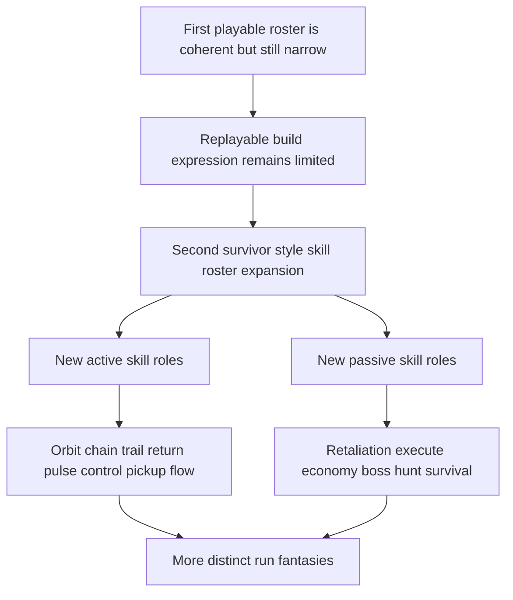

## req_082_define_a_second_survivor_style_skill_roster_expansion_wave_for_combat_control_economy_and_survivability - Define a second survivor style skill roster expansion wave for combat control economy and survivability
> From version: 0.5.1
> Schema version: 1.0
> Status: Done
> Understanding: 98%
> Confidence: 95%
> Complexity: High
> Theme: Combat
> Reminder: Update status/understanding/confidence and references when you edit this doc.
> Progress: 100%
> Related backlog: `item_303_define_a_proximity_and_space_control_active_skill_slice_for_orbiting_blades_and_halo_burst`, `item_304_define_a_ranged_pressure_active_skill_slice_for_chain_lightning_boomerang_arc_and_burning_trail`, `item_305_define_a_control_and_pickup_flow_active_skill_slice_for_frost_nova_and_vacuum_pulse`, `item_306_define_a_defensive_and_execution_passive_skill_slice_for_thorn_mail_execution_sigil_and_emergency_aegis`, `item_307_define_an_economy_and_boss_specialization_passive_skill_slice_for_greed_engine_and_boss_hunter`, `item_308_define_second_wave_build_pool_integration_discovery_and_progression_posture_for_the_new_roster`, `item_309_define_targeted_validation_for_second_wave_survivor_skill_roster_distinctiveness_and_balance_posture`

# Needs
- Expand the current Emberwake build roster with a second curated wave of survivor-style skills so runs can support more distinct build fantasies than the first playable roster alone.
- Add new combat roles that are not limited to straightforward direct damage, including orbit control, chain clear, trail zoning, burst defense, pickup economy, retaliation, and boss-focused pressure.
- Make the build system feel deeper and more replayable by introducing active and passive skills that support different styles of survival instead of only stronger versions of the same loop.
- Keep the wave compatible with the current deterministic runtime, active/passive slot model, and authored fusion posture rather than reopening the entire combat architecture.

# Context
The project already has:
- a first playable curated build roster
- distinct active and passive slot ownership
- first-pass fusion relationships
- run progression through level-up choices
- a stronger hostile roster and time-scaled pressure beats
- initial pickup attraction and economy systems

That means Emberwake can already support one coherent techno-shinobi run, but the current build surface is still narrow compared with the breadth expected from a strong survivor-style game.

Right now, the next meaningful product gain is not only more enemies or more tuning. It is also more player-side expression:
- builds that orbit around proximity control rather than pure frontal pressure
- builds that reward mobility or route ownership
- builds that create survival value through shielding, retaliation, or recovery
- builds that specialize into economy, execution, or boss-killing posture
- builds that materially change how the player experiences crowd management and scaling pressure

This request should define a second curated roster expansion wave centered around the following candidate skills.

Recommended active-skill additions:
1. `Orbiting Blades`
   - a persistent orbital damage skill that owns near-player space
2. `Chain Lightning`
   - a hit that jumps between nearby enemies for reactive crowd cleanup
3. `Burning Trail`
   - a movement-driven damage trail that rewards route shaping
4. `Boomerang Arc`
   - a projectile that travels out and returns, creating a reversible lane of pressure
5. `Halo Burst`
   - a periodic radial pulse that clears breathing room around the player
6. `Frost Nova`
   - a circular slow or freeze burst that adds crowd-control identity rather than only damage
7. `Vacuum Pulse`
   - a periodic attraction skill for nearby XP crystals and pickups that reinforces pickup-flow ownership

Recommended passive-skill additions:
1. `Thorn Mail`
   - retaliation or contact-punish posture for defensive builds
2. `Execution Sigil`
   - low-health payoff or finish pressure to improve cleanup identity
3. `Greed Engine`
   - economy amplification through gold-oriented reward posture
4. `Boss Hunter`
   - boss-focused payoff so large-target pressure can become a real build lane
5. `Emergency Aegis`
   - a bounded survival shield or periodic hit protection layer

Requested posture:
1. Treat this as a curated roster-expansion wave, not an open-ended brainstorm dump.
2. Keep the wave balanced across offensive, control, economy, and survivability roles.
3. Add enough role separation that each new skill changes run posture, not just damage numbers.
4. Keep the new skills compatible with the current active and passive slot model and future fusion expansion.
5. Avoid reopening the runtime into a fully general projectile sandbox, broad status-effect platform, or talent-tree redesign.

Scope includes:
- defining the target second-wave skill roster
- defining the role and build fantasy of each proposed skill
- identifying which additions are active skills and which are passive skills
- defining the compatibility posture with the current build system, progression loop, and future fusion surface
- defining enough validation expectations to later split the wave into coherent backlog slices

Scope excludes:
- implementing every skill in one undifferentiated task
- replacing the first playable roster
- designing a full class system, talent tree, or permanent unlock metagame in the same slice
- reopening the entire combat engine around unrestricted projectiles, status systems, or inventory complexity

# Acceptance criteria
- AC1: The request defines a curated second-wave skill-roster expansion rather than an unbounded list of future ideas.
- AC2: The request defines a concrete active-skill target roster that includes `Orbiting Blades`, `Chain Lightning`, `Burning Trail`, `Boomerang Arc`, `Halo Burst`, `Frost Nova`, and `Vacuum Pulse`.
- AC3: The request defines a concrete passive-skill target roster that includes `Thorn Mail`, `Execution Sigil`, `Greed Engine`, `Boss Hunter`, and `Emergency Aegis`.
- AC4: The request defines each proposed skill strongly enough that its gameplay role is clear, including at least one of the following role families:
  - proximity control
  - crowd clear
  - route zoning
  - crowd control
  - economy
  - survivability
  - boss specialization
- AC5: The request keeps the wave compatible with the existing Emberwake active-slot and passive-slot build model instead of requiring a full roster-system redesign.
- AC6: The request defines the wave as compatible with future fusion follow-up without requiring every new skill to ship with a fusion in the same slice.
- AC7: The request keeps the wave compatible with the current deterministic runtime architecture and explicitly avoids reopening combat into a broad unrestricted projectile or status-system rewrite.
- AC8: The request defines rollout expectations strong enough that the wave can later be split into coherent backlog slices by role or implementation seam rather than one giant delivery item.
- AC9: The request defines validation expectations strong enough to later prove that:
  - each skill reads as a distinct build role
  - the new roster broadens viable run archetypes
  - economy or survivability additions do not crowd out offensive picks by default
  - boss-focused and crowd-focused picks both have a meaningful place in the build ecosystem

# Open questions
- Should all proposed skills land in one release wave or be split into several delivery slices?
  Recommended default: treat the roster as one request-owned target set, then split implementation into coherent backlog slices such as control skills, defensive passives, and economy or boss-specialization passives.
- Should every new active skill immediately have a fusion pairing?
  Recommended default: no; keep the first roster-expansion wave compatible with future fusion mapping without making fusion completeness a blocker.
- Should `Vacuum Pulse` be an active skill, a passive skill, or a hybrid pickup-economy seam?
  Recommended default: frame it as an active or active-like pickup-flow owner first, then refine slot ownership during backlog grooming.
- Should crowd-control skills like `Frost Nova` introduce hard freeze, slow, or both?
  Recommended default: keep the first pass bounded around a readable slow or short freeze posture rather than a broad status-stack system.
- Should `Boss Hunter` be pure boss damage or a broader elite and large-target specialization?
  Recommended default: keep the identity centered on boss payoff first so the lane is unmistakable.
- Should economy passives like `Greed Engine` also accelerate level progression indirectly?
  Recommended default: keep the first identity centered on gold and reward posture unless balancing later proves a mixed economy or XP posture is needed.

# Definition of Ready (DoR)
- [x] Problem statement is explicit and user impact is clear.
- [x] Scope boundaries (in/out) are explicit.
- [x] Acceptance criteria are testable.
- [x] Dependencies and known risks are listed.

# Companion docs
- Product brief(s): `prod_006_foundational_survivor_weapon_roster_for_emberwake`, `prod_007_foundational_passive_item_direction_for_emberwake`, `prod_008_active_passive_fusion_direction_for_emberwake`, `prod_009_level_up_slots_and_run_progression_model_for_emberwake`, `prod_010_first_playable_techno_shinobi_build_content_and_progression_defaults`, `prod_016_time_owned_run_arc_and_authored_difficulty_phases`
- Architecture decision(s): `adr_039_structure_the_first_survivor_build_loop_around_separate_active_and_passive_slots`, `adr_040_use_curated_active_passive_fusions_as_the_foundational_build_payoff_layer`, `adr_041_lock_the_first_playable_survivor_content_wave_to_one_character_and_a_small_curated_techno_shinobi_roster`, `adr_042_separate_weapon_simulation_from_transient_combat_skill_feedback_presentation`
- Request(s): `req_059_define_a_first_playable_techno_shinobi_build_content_wave`, `req_061_define_a_first_combat_skill_feedback_wave_for_playable_weapons`, `req_062_define_a_second_combat_skill_feedback_polish_wave_for_underexpressed_weapons`, `req_081_define_a_crystal_magnet_pickup_and_attraction_first_xp_crystal_collection_posture`
# AI Context
- Summary: Define a second survivor style skill roster expansion wave for combat control economy and survivability
- Keywords: survivor, skills, roster, expansion, active, passive, economy, survivability
- Use when: Use when framing scope, context, and acceptance checks for Define a second survivor style skill roster expansion wave for combat control economy and survivability.
- Skip when: Skip when the work targets another feature, repository, or workflow stage.

# Backlog
- `item_303_define_a_proximity_and_space_control_active_skill_slice_for_orbiting_blades_and_halo_burst`
- `item_304_define_a_ranged_pressure_active_skill_slice_for_chain_lightning_boomerang_arc_and_burning_trail`
- `item_305_define_a_control_and_pickup_flow_active_skill_slice_for_frost_nova_and_vacuum_pulse`
- `item_306_define_a_defensive_and_execution_passive_skill_slice_for_thorn_mail_execution_sigil_and_emergency_aegis`
- `item_307_define_an_economy_and_boss_specialization_passive_skill_slice_for_greed_engine_and_boss_hunter`
- `item_308_define_second_wave_build_pool_integration_discovery_and_progression_posture_for_the_new_roster`
- `item_309_define_targeted_validation_for_second_wave_survivor_skill_roster_distinctiveness_and_balance_posture`
