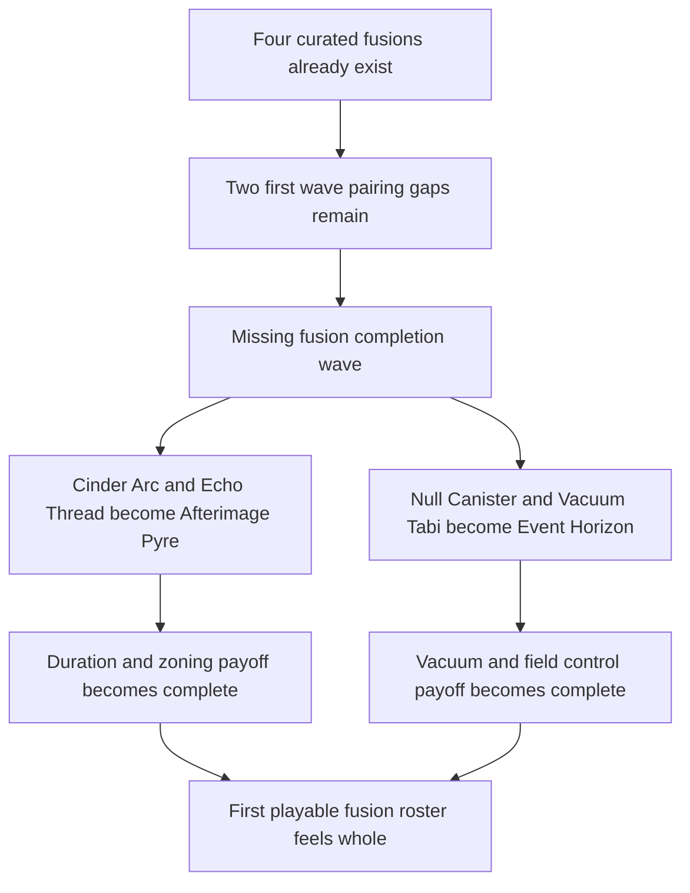

## req_083_define_a_missing_fusion_completion_wave_for_the_remaining_first_playable_active_passive_pairings - Define a missing fusion completion wave for the remaining first playable active passive pairings
> From version: 0.5.1
> Schema version: 1.0
> Status: Done
> Understanding: 98%
> Confidence: 95%
> Complexity: Medium
> Theme: Combat
> Reminder: Update status/understanding/confidence and references when you edit this doc.
> Progress: 100%
> Related backlog: `item_310_define_the_afterimage_pyre_fusion_slice_for_cinder_arc_and_echo_thread`, `item_311_define_the_event_horizon_fusion_slice_for_null_canister_and_vacuum_tabi`, `item_312_define_first_playable_fusion_roster_completion_posture_for_remaining_passive_keys_and_chest_readiness`, `item_313_define_targeted_validation_for_missing_fusion_completion_readability_and_payoff_integration`

# Needs
- Complete the first playable fusion roster so the remaining active and passive skills that currently have no fusion payoff are no longer second-class choices.
- Add bounded curated fusions for the two missing first-pass pairing gaps:
  - `Cinder Arc` with `Echo Thread`
  - `Null Canister` with `Vacuum Tabi`
- Reinforce the build-system promise that curated active-plus-passive pairings create a meaningful payoff layer instead of leaving obvious roster holes.
- Improve build excitement and decision clarity by ensuring the remaining first-wave combat and economy skills can also culminate in a named fusion state.

# Context
The current first playable build roster already contains:
- `6` active weapons
- `6` passive items
- a bounded active-slot and passive-slot model
- chest-driven fusion resolution
- `4` curated fusions

That means the fusion layer is already real, but it is incomplete at the roster level.

The current curated fusions cover:
- `Ash Lash` + `Overclock Seal` -> `Redline Ribbon`
- `Guided Senbon` + `Duplex Relay` -> `Choir of Pins`
- `Shade Kunai` + `Hardlight Sheath` -> `Blackfile Volley`
- `Orbit Sutra` + `Wideband Coil` -> `Temple Circuit`

What remains uncovered are the two most obvious holes in the first playable roster:
- `Cinder Arc` currently has no fusion payoff
- `Null Canister` currently has no fusion payoff
- `Echo Thread` currently opens no fusion path
- `Vacuum Tabi` currently opens no fusion path

That weakens the first-pass build ecosystem because some picks still read as structurally incomplete:
- `Cinder Arc` is a valid weapon, but it does not graduate into a named fusion payoff
- `Null Canister` is a valid weapon, but it does not graduate into a named fusion payoff
- `Echo Thread` and `Vacuum Tabi` have utility value, but they do not currently participate in the headline fusion fantasy

This request should define a bounded fusion-completion wave that closes those gaps with two additional curated fusions.

Recommended target fusions:
1. `Cinder Arc` + `Echo Thread` -> `Afterimage Pyre`
   - intended posture: a lobbed impact that leaves stronger lingering pressure, afterburn, or delayed secondary payoff
   - intended fantasy: duration-oriented explosive zoning rather than only a one-shot impact
2. `Null Canister` + `Vacuum Tabi` -> `Event Horizon`
   - intended posture: a hush field that gains stronger attraction or inward collapse identity before or during its damage payoff
   - intended fantasy: pickup-flow and field-control logic converging into a singularity-like area owner

Requested posture:
1. Treat this as a roster-completion wave, not a full fusion redesign.
2. Keep the additions inside the current curated fusion system with one passive key per active weapon.
3. Make each new fusion feel like a meaningful evolution of its base active plus passive pairing, not only a numeric buff.
4. Preserve the first playable techno-shinobi naming posture and role readability.
5. Avoid widening the slice into full fusion coverage for future skills that do not yet exist.

Scope includes:
- defining two new curated fusions for the remaining uncovered first-pass active and passive pairings
- defining the intended role and payoff identity of `Afterimage Pyre` and `Event Horizon`
- defining the roster-completion expectation that the remaining first-wave passive keys now open a fusion path
- defining validation expectations for readability, payoff identity, and build-loop integration

Scope excludes:
- adding new active weapons or passive items in the same slice
- redesigning the fusion algorithm
- introducing multi-passive or branching fusion recipes
- committing future second-wave skills to fusion pairings in this request

# Acceptance criteria
- AC1: The request defines a bounded fusion-completion wave for the remaining uncovered first playable active and passive pairings rather than a broad fusion-system redesign.
- AC2: The request defines a new curated fusion pairing for `Cinder Arc` and `Echo Thread`, with `Afterimage Pyre` as the target fusion identity.
- AC3: The request defines a new curated fusion pairing for `Null Canister` and `Vacuum Tabi`, with `Event Horizon` as the target fusion identity.
- AC4: The request defines each new fusion strongly enough that it reads as an evolution of both of its source skills, not only as a generic damage increase.
- AC5: The request keeps both additions compatible with the current one-active plus one-passive curated fusion model and chest-driven fusion resolution posture.
- AC6: The request defines the wave as a completion pass for the first playable roster, such that the remaining uncovered first-wave passives now open a fusion path.
- AC7: The request keeps the slice bounded to the current first playable roster and does not widen into second-wave skill fusion planning.
- AC8: The request defines validation expectations strong enough to later prove that:
  - `Afterimage Pyre` is readable as a duration or lingering-pressure evolution of `Cinder Arc` and `Echo Thread`
  - `Event Horizon` is readable as a vacuum or collapse evolution of `Null Canister` and `Vacuum Tabi`
  - the two added fusions make the first playable roster feel more structurally complete
  - the new fusions integrate into existing fusion readiness and chest payoff rules without special-case redesign

# Open questions
- Should the missing fusion wave only complete the two uncovered pairings, or should some already-covered pairings be reconsidered too?
  Recommended default: only complete the two uncovered pairings; do not reopen the existing four first-pass fusions in the same slice.
- Should `Afterimage Pyre` emphasize lingering fire, delayed re-ignition, or both?
  Recommended default: prioritize lingering fire or afterburn first so the `Echo Thread` duration identity is unmistakable.
- Should `Event Horizon` attract enemies, pickups, crystals, or some combination of them?
  Recommended default: keep the identity centered on bounded field-control and pickup-flow synergy, then decide the exact attraction ownership during backlog grooming.
- Should the fusion names be treated as fixed now?
  Recommended default: use `Afterimage Pyre` and `Event Horizon` as the request-owned targets unless implementation or UI review uncovers a stronger techno-shinobi naming candidate.

# Definition of Ready (DoR)
- [x] Problem statement is explicit and user impact is clear.
- [x] Scope boundaries (in/out) are explicit.
- [x] Acceptance criteria are testable.
- [x] Dependencies and known risks are listed.

# Companion docs
- Product brief(s): `prod_006_foundational_survivor_weapon_roster_for_emberwake`, `prod_007_foundational_passive_item_direction_for_emberwake`, `prod_008_active_passive_fusion_direction_for_emberwake`, `prod_010_first_playable_techno_shinobi_build_content_and_progression_defaults`
- Architecture decision(s): `adr_039_structure_the_first_survivor_build_loop_around_separate_active_and_passive_slots`, `adr_040_use_curated_active_passive_fusions_as_the_foundational_build_payoff_layer`, `adr_041_lock_the_first_playable_survivor_content_wave_to_one_character_and_a_small_curated_techno_shinobi_roster`
- Request(s): `req_058_define_a_foundational_survivor_build_system_for_weapons_passives_fusions_and_run_progression`, `req_059_define_a_first_playable_techno_shinobi_build_content_wave`, `req_081_define_a_crystal_magnet_pickup_and_attraction_first_xp_crystal_collection_posture`
# AI Context
- Summary: Define a missing fusion completion wave for the remaining first playable active passive pairings
- Keywords: fusion, completion, first playable, cinder arc, echo thread, null canister, vacuum tabi
- Use when: Use when framing scope, context, and acceptance checks for Define a missing fusion completion wave for the remaining first playable active passive pairings.
- Skip when: Skip when the work targets another feature, repository, or workflow stage.

# Backlog
- `item_310_define_the_afterimage_pyre_fusion_slice_for_cinder_arc_and_echo_thread`
- `item_311_define_the_event_horizon_fusion_slice_for_null_canister_and_vacuum_tabi`
- `item_312_define_first_playable_fusion_roster_completion_posture_for_remaining_passive_keys_and_chest_readiness`
- `item_313_define_targeted_validation_for_missing_fusion_completion_readability_and_payoff_integration`
