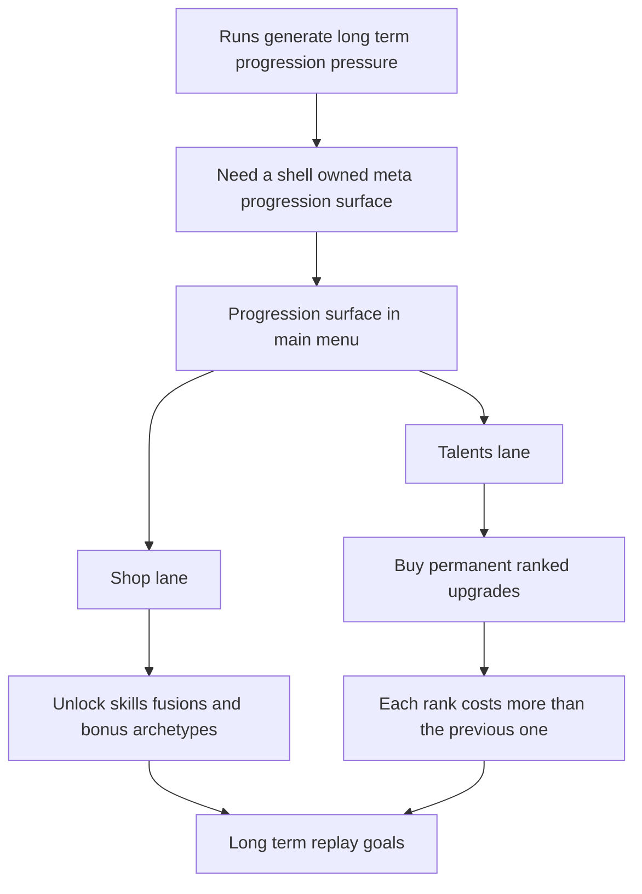

## req_084_define_a_shell_owned_talent_growth_and_unlock_shop_progression_surface - Define a shell owned talent growth and unlock shop progression surface
> From version: 0.5.1
> Schema version: 1.0
> Status: Draft
> Understanding: 97%
> Confidence: 94%
> Complexity: High
> Theme: Meta progression
> Reminder: Update status/understanding/confidence and references when you edit this doc.

# Needs
- Add a shell-owned meta-progression surface so runs feed into a longer-term progression loop instead of ending only in immediate run loss or success.
- Turn persistent currency into meaningful long-term value through two clearly separated lanes:
  - `Shop` for unlockable content
  - `Talents` for permanent account or profile bonuses
- Define a first bounded roster of permanent talent upgrades that improve survivability, economy, pickup flow, and mobility without overwhelming the player.
- Define a first bounded unlock shop that can progressively open new skills, new fusions, and new pickup or bonus archetypes into the run pool.
- Require escalating talent costs per rank so each next permanent upgrade tier is more expensive than the previous one and late progression has real weight.

# Context
The project already has:
- a shell-owned main menu and menu-entry posture
- a save and local persistence direction
- a first playable build roster, fusion layer, and run economy
- shell-owned surfaces for changelogs, grimoire, and bestiary
- gold, pickups, and post-run outcomes that can support a longer-term progression loop

That means Emberwake is now ready for a bounded meta-progression layer, but it should not jump straight into an oversized RPG talent tree.

The stronger first move is a curated shell-owned progression surface reachable from the main menu, with two clearly separated responsibilities:

1. `Shop`
- unlock new skills into the future run pool
- unlock new fusions into the future run pool
- unlock new pickup or bonus archetypes into the future run pool

2. `Talents`
- permanent ranked upgrades such as:
  - `+Max HP`
  - `+Pickup Radius`
  - `+Gold Gain`
  - `+XP Gain`
  - `+Move Speed`
  - a late-game `Revive` or `Shield` lane

This split is important because it prevents the meta-progression UX from becoming muddy:
- `Shop` is about opening content availability
- `Talents` is about strengthening persistent account-level posture

The first wave should stay intentionally bounded:
- one shell-owned progression surface in the menu flow
- one persistent currency posture
- one small set of permanent talents
- one small set of unlockable content entries
- one explicit pricing model where talent ranks cost more and more at each step

Recommended posture:
1. Keep the progression surface shell-owned, not runtime-canvas-owned.
2. Treat persistent progression as local-profile data compatible with the existing local save direction.
3. Separate `Shop` and `Talents` visually and mechanically.
4. Keep the first talent set small, readable, and capped.
5. Make talent rank pricing progressively more expensive rather than flat.
6. Keep powerful survivability effects such as `Revive` or `Shield` late, expensive, and clearly gated.
7. Keep this wave focused on menu-owned progression framing, unlock policy, and cost posture rather than a giant content explosion.

Scope includes:
- defining a shell-owned menu-accessible progression surface
- defining the first `Shop` lane for unlockable skills, fusions, and pickup archetypes
- defining the first `Talents` lane for permanent ranked bonuses
- defining a progressively increasing cost posture for talent ranks
- defining persistence expectations for owned unlocks, purchased ranks, and remaining currency
- defining enough validation expectations to later implement the screen, data model, and purchase flow

Scope excludes:
- designing a massive branching RPG tree with dozens of nodes in the first slice
- introducing backend accounts, cloud sync, or live-service economy
- mixing cosmetics, monetization, and gameplay progression in the same first wave
- implementing every future skill unlock in this request
- replacing the current in-run build progression loop

# Acceptance criteria
- AC1: The request defines a bounded shell-owned meta-progression surface reachable from the menu flow rather than a broad full-game progression redesign.
- AC2: The request defines two clearly separated progression lanes:
  - `Shop` for unlockable content
  - `Talents` for permanent ranked bonuses
- AC3: The request defines the first `Shop` lane strongly enough that it can unlock at least:
  - new skills into the run pool
  - new fusions into the run pool
  - new pickup or bonus archetypes into the run pool
- AC4: The request defines the first `Talents` lane strongly enough that it includes at least:
  - `+Max HP`
  - `+Pickup Radius`
  - `+Gold Gain`
  - `+XP Gain`
  - `+Move Speed`
  - a late expensive `Revive` or `Shield` lane
- AC5: The request defines that talent upgrades are rank-based and that each next rank costs more than the previous one rather than using a flat price per level.
- AC6: The request defines the first wave as locally persisted progression data compatible with the existing frontend-only save strategy.
- AC7: The request keeps the progression surface shell-owned and does not reopen ownership around Pixi runtime UI for this feature.
- AC8: The request keeps the first wave bounded, with a small curated set of talents and unlockables rather than an oversized branching tree.
- AC9: The request defines validation expectations strong enough to later prove that:
  - purchases persist correctly
  - locked content is not available before unlock
  - purchased content becomes available after unlock
  - talent costs escalate correctly by rank
  - powerful survivability talents remain late and expensive enough not to trivialize the early meta loop

# Open questions
- Should the first persistent currency be the existing run gold, or a separate long-term currency derived from run performance?
  Recommended default: start from the existing gold economy only if it does not destabilize run-to-meta balance; otherwise introduce a clearly separated persistent currency during backlog grooming.
- Should the `Shop` unlock individual skills and fusions one by one, or by bundles?
  Recommended default: start with small curated unlock entries so progression remains readable and testable.
- Should talents be presented as a literal tree with branches, or as a structured panel with ranked upgrade cards?
  Recommended default: start with a structured shell panel rather than a large visual tree, unless a tree materially improves readability.
- Should `Revive` and `Shield` both exist in the first wave, or should only one late survivability lane ship first?
  Recommended default: ship only one late survivability lane first so the meta curve stays easier to tune.
- How aggressive should the talent price curve be?
  Recommended default: costs should rise enough that later ranks feel materially more expensive, not just symbolically higher.

# Definition of Ready (DoR)
- [x] Problem statement is explicit and user impact is clear.
- [x] Scope boundaries (in/out) are explicit.
- [x] Acceptance criteria are testable.
- [x] Dependencies and known risks are listed.

# Companion docs
- Product brief(s): `prod_009_level_up_slots_and_run_progression_model_for_emberwake`, `prod_010_first_playable_techno_shinobi_build_content_and_progression_defaults`, `prod_013_techno_shinobi_runtime_hud_and_menu_entry_direction`, `prod_015_post_run_outcome_analysis_direction_for_skill_performance`
- Architecture decision(s): `adr_016_define_shell_scene_state_and_meta_surface_ownership`, `adr_022_keep_product_meta_flow_shell_owned_while_runtime_state_remains_game_preserved`, `adr_045_model_grimoire_and_bestiary_as_shell_owned_discovery_gated_archive_scenes`
- Request(s): `req_009_define_local_persistence_and_save_strategy`, `req_032_define_a_single_slot_save_and_load_flow_for_shell_owned_session_entry`, `req_050_define_a_main_menu_polish_and_first_crystal_xp_progression_wave`, `req_082_define_a_second_survivor_style_skill_roster_expansion_wave_for_combat_control_economy_and_survivability`, `req_083_define_a_missing_fusion_completion_wave_for_the_remaining_first_playable_active_passive_pairings`
# AI Context
- Summary: Define a shell owned meta-progression surface with a first unlock shop lane and a first ranked talent lane.
- Keywords: shell, meta progression, shop, talents, unlocks, persistent, escalating costs, menu
- Use when: Use when framing scope, context, and acceptance checks for Define a shell owned talent growth and unlock shop progression surface.
- Skip when: Skip when the work targets another feature, repository, or workflow stage.

# Backlog
- `item_314_define_a_shell_owned_menu_entry_and_scene_posture_for_the_talent_growth_and_unlock_shop_surface`
- `item_315_define_a_first_unlock_shop_catalog_for_skills_fusions_and_bonus_archetype_access`
- `item_316_define_a_first_ranked_talent_roster_with_escalating_cost_tiers_and_late_survivability_gating`
- `item_317_define_purchase_application_and_owned_progression_integration_across_the_shell_and_runtime`
- `item_318_define_targeted_validation_for_shell_progression_purchases_persistence_and_escalating_talent_costs`
