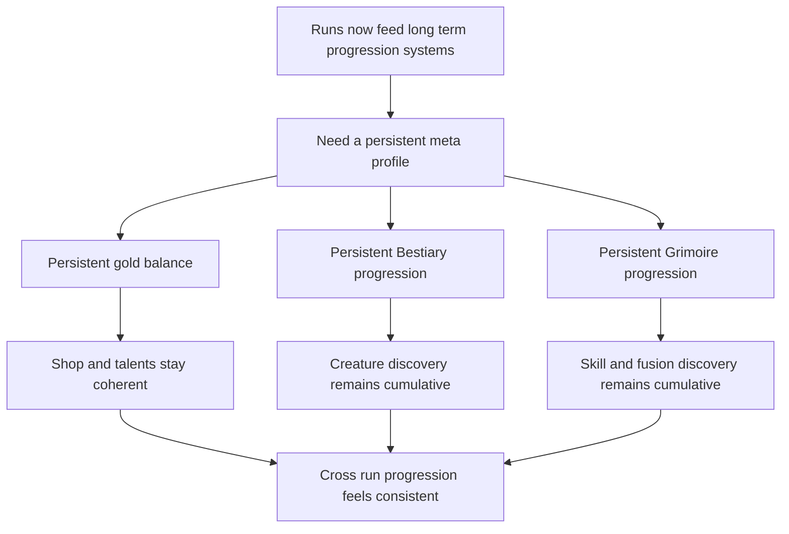

## req_085_define_a_persistent_meta_profile_contract_for_gold_bestiary_and_grimoire_progression_across_runs - Define a persistent meta profile contract for gold bestiary and grimoire progression across runs
> From version: 0.5.2
> Schema version: 1.0
> Status: Done
> Understanding: 100%
> Confidence: 97%
> Complexity: Medium
> Theme: Meta progression
> Reminder: Update status/understanding/confidence and references when you edit this doc.

# Needs
- Define a coherent persistent meta-profile contract so the player keeps meaningful long-term progression between runs instead of restarting several meta surfaces from zero.
- Persist the long-term currency posture across runs, including the player's owned `gold` balance if gold is used as the first persistent economy for shop and talents.
- Persist `Bestiary` discovery and defeat progression across runs so creature knowledge remains cumulative.
- Persist `Grimoire` discovery progression across runs so skill and fusion archive knowledge remains cumulative.
- Prevent a split-brain progression model where the shop and talents remember long-term progression but codex surfaces or currency do not.

# Context
The project now has several features that are beginning to imply a persistent account or profile layer:
- shell-owned `Grimoire` and `Bestiary` archive surfaces
- a first local persistence direction
- a first save and load posture
- a shop and talent meta-progression direction
- gold and archive discovery data that already read like long-term value

That means Emberwake is crossing a boundary:
- it is no longer enough to persist only one run slot
- the project also needs a player-facing meta profile that survives across runs

Without that explicit contract, progression quickly becomes incoherent:
- the player could buy talents, but lose archive discovery state
- the player could unlock archive entries, but lose accumulated currency
- `Bestiary` and `Grimoire` could behave like temporary run summaries instead of long-term codex memory

This request should therefore define a shared persistent meta-profile posture that survives across runs and stays aligned with the shell-owned archive and progression surfaces.

Recommended persistent meta-profile ownership:
1. `Gold`
- persist the player's long-term gold balance or equivalent persistent economy balance across runs
- make gold continuity explicit if gold is the currency spent in shop or talents
2. `Bestiary`
- persist creature discovery state
- persist creature defeat milestones or counts at the profile level where appropriate
3. `Grimoire`
- persist discovered active skills, passive items, and fusions at the profile level
- preserve archive visibility between runs once discovery has happened

Recommended posture:
1. Treat this as profile-level progression data, distinct from one active run save slot.
2. Keep ownership shell- and profile-facing, not tied to a single run snapshot.
3. Keep the data frontend-local and compatible with the current static and PWA architecture.
4. Keep `Bestiary` and `Grimoire` cumulative across runs once discovered, unless a later explicit reset feature is introduced.
5. Make the currency persistence rule explicit now, so the later shop and talent work does not depend on ambiguous gold semantics.

Scope includes:
- defining the persistent meta-profile boundary for gold, bestiary progression, and grimoire progression
- clarifying the distinction between run save data and profile progression data
- defining cumulative archive-discovery expectations across runs
- defining persistence expectations for the long-term currency posture
- defining validation expectations strong enough to later implement local profile storage and profile-aware shell surfaces

Scope excludes:
- implementing the full shop or talent screen
- introducing cloud sync, accounts, or cross-device progression
- defining every possible future meta-profile field outside the bounded first scope
- designing a player-facing reset or prestige feature in this slice

# Acceptance criteria
- AC1: The request defines a shared persistent meta-profile contract for cross-run progression rather than leaving gold, grimoire, and bestiary persistence implicit.
- AC2: The request defines that the player's long-term gold balance, or equivalent persistent economy value, is preserved across runs when used by meta-progression systems.
- AC3: The request defines that `Bestiary` discovery progression is cumulative across runs rather than tied only to the current run.
- AC4: The request defines that `Grimoire` discovery progression is cumulative across runs rather than tied only to the current run.
- AC5: The request clearly distinguishes persistent meta-profile data from the existing active run save-slot data.
- AC6: The request keeps the persistence model compatible with the current frontend-only and PWA-local storage posture.
- AC7: The request keeps `Bestiary` and `Grimoire` shell-owned as archive surfaces while making their underlying discovery state profile-persistent.
- AC8: The request defines validation expectations strong enough to later prove that:
  - gold persists across reloads and run restarts
  - bestiary entries discovered in one run remain discovered in later runs
  - grimoire entries discovered in one run remain discovered in later runs
  - run reset or defeat does not wipe the meta profile unintentionally

# Open questions
- Should the first persistent economy use the current gold balance directly, or a renamed meta currency derived from gold?
  Recommended default: keep the contract open enough for either option, but require that the first meta economy value be explicitly persistent across runs.
- Should `Bestiary` persist raw defeat counts or only discovery plus best milestone summaries?
  Recommended default: persist at least discovery and meaningful defeat progression, while exact count granularity can be refined during backlog grooming.
- Should `Grimoire` persist only discovered entries, or also richer stats such as highest level reached or most-used build pieces?
  Recommended default: persist discovery first; richer profile stats can remain a later slice.
- Should players be able to reset the meta profile manually in the first wave?
  Recommended default: no reset UI in the first slice unless testing or debugging explicitly requires it.

# Definition of Ready (DoR)
- [x] Problem statement is explicit and user impact is clear.
- [x] Scope boundaries (in/out) are explicit.
- [x] Acceptance criteria are testable.
- [x] Dependencies and known risks are listed.

# Companion docs
- Product brief(s): `prod_014_shell_codex_archive_direction_for_grimoire_and_bestiary`, `prod_015_post_run_outcome_analysis_direction_for_skill_performance`
- Architecture decision(s): `adr_016_define_shell_scene_state_and_meta_surface_ownership`, `adr_022_keep_product_meta_flow_shell_owned_while_runtime_state_remains_game_preserved`, `adr_045_model_grimoire_and_bestiary_as_shell_owned_discovery_gated_archive_scenes`
- Request(s): `req_009_define_local_persistence_and_save_strategy`, `req_064_define_a_grimoire_scene_for_skill_discovery_and_future_unlock_gating`, `req_065_define_a_bestiary_scene_for_discovered_and_defeated_creatures`, `req_084_define_a_shell_owned_talent_growth_and_unlock_shop_progression_surface`
# AI Context
- Summary: Define a persistent cross-run meta-profile contract for gold, bestiary progression, and grimoire progression.
- Keywords: meta profile, persistent, gold, bestiary, grimoire, cross run, archive, progression
- Use when: Use when framing scope, context, and acceptance checks for Define a persistent meta profile contract for gold bestiary and grimoire progression across runs.
- Skip when: Skip when the work targets another feature, repository, or workflow stage.

# Backlog
- `item_319_define_a_shared_local_meta_profile_boundary_distinct_from_active_run_save_data`
- `item_320_define_persistent_cross_run_gold_balance_ownership_for_meta_progression_economy`
- `item_321_define_persistent_grimoire_discovery_progression_across_runs`
- `item_322_define_persistent_bestiary_discovery_and_defeat_progression_across_runs`
- `item_323_define_targeted_validation_for_cross_run_meta_profile_persistence_of_gold_grimoire_and_bestiary_data`

# Closure
- Landed through `task_059_orchestrate_second_wave_skills_fusion_completion_meta_progression_hourglass_pickup_and_game_over_damage_share_polish`.
- Proof:
  - `npm run typecheck`
  - `npm run test -- src/app/components/AppMetaScenePanel.test.tsx src/app/AppShell.test.tsx src/app/hooks/useAppScene.test.tsx src/shared/lib/metaProfileStorage.test.ts`
