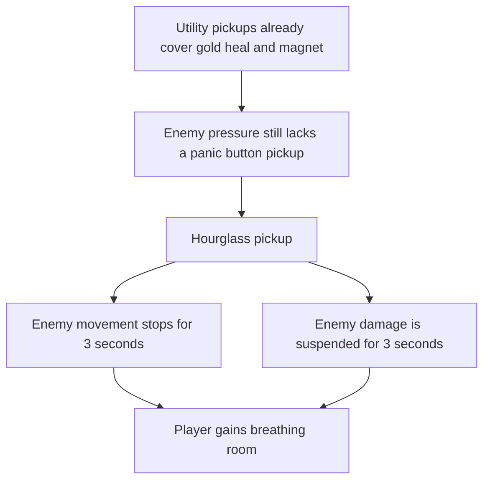

## req_086_define_a_time_stop_hourglass_pickup_for_bounded_enemy_pressure_suspension - Define a time stop hourglass pickup for bounded enemy pressure suspension
> From version: 0.5.1
> Schema version: 1.0
> Status: Draft
> Understanding: 96%
> Confidence: 93%
> Complexity: Medium
> Theme: Gameplay
> Reminder: Update status/understanding/confidence and references when you edit this doc.

# Needs
- Add a new world utility pickup in the same family as `gold`, `healing-kit`, and `magnet`, but centered on emergency control of enemy pressure rather than economy or healing.
- Introduce an `hourglass` pickup that stops enemy time for `3` seconds so the player gets a short but dramatic breathing window.
- Define that time stop suspends hostile movement and hostile ability to deal damage during the effect window.
- Keep the effect bounded and readable so it feels like a tactical rescue or momentum-reset pickup, not a broad simulation rewrite.

# Context
The runtime already has:
- utility pickups such as `gold`, `healing-kit`, and `magnet`
- escalating hostile pressure through time phases and boss beats
- deterministic hostile simulation and contact-damage contracts
- a growing pickup ecosystem that now supports dramatic one-shot utility moments

That means Emberwake can benefit from one more high-impact utility pickup, but it should fill a distinct role.

The current utility pickups already cover:
- economy through `gold`
- recovery through `healing-kit`
- reward collection acceleration through `magnet`

What is still missing is a bounded `panic button` style pickup that creates temporary safety by interrupting hostile pressure itself.

This request should define a new `hourglass` pickup with the following target posture:

1. Pickup identity
- it belongs to the same utility-pickup family as `gold`, `healing-kit`, and `magnet`
- it reads as a rare high-impact world bonus rather than a permanent passive effect

2. Time-stop effect
- on collection, hostile movement stops for `3` seconds
- during the same window, hostiles cannot deal damage
- the effect should apply to enemy threat posture, not to the player's own control or pickup flow

3. Bounded simulation posture
- the effect should not be framed as a total global pause of the whole game
- the player should still be able to move, collect pickups, and act during the stopped-time window
- the request should stay focused on suspending enemy pressure rather than redesigning every time-based subsystem in the simulation

Recommended posture:
1. Treat the pickup as a rare utility reward with strong readability and immediate tactical value.
2. Treat `3` seconds as a bounded first-pass duration, long enough to matter but short enough to remain fair and non-abusive.
3. Suspend hostile movement and hostile damage output together so the player gets a true breathing window.
4. Keep the first request focused on enemies, not a universal stop-the-world mechanic that pauses everything.
5. Keep the effect deterministic enough to validate in runtime tests and later tuning configuration.

Scope includes:
- a new `hourglass` utility pickup
- a `3s` enemy-pressure suspension window on collection
- suspension of hostile movement and hostile damage capability during the effect
- validation expectations strong enough to later implement the pickup, runtime state, and expiry behavior

Scope excludes:
- pausing the player, XP crystals, pickups, or the entire shell/runtime stack
- a broad rewrite of all timers, cooldowns, or global simulation clocks
- stacking, chaining, or indefinite freeze-lock systems unless later explicitly requested
- VFX-heavy presentation polish beyond the bounded contract needed to make the effect readable

# Acceptance criteria
- AC1: The request defines a bounded new utility pickup wave introducing an `hourglass` pickup for enemy-pressure suspension rather than a broad stop-the-world system redesign.
- AC2: The request defines that collecting the `hourglass` suspends enemy movement for `3` seconds.
- AC3: The request defines that collecting the `hourglass` also suspends enemy ability to deal damage for the same `3` second window.
- AC4: The request defines the effect as bounded to hostile pressure and explicitly avoids turning it into a full global pause of player control, pickups, or the entire simulation.
- AC5: The request defines the `hourglass` as part of the utility-pickup family alongside `gold`, `healing-kit`, and `magnet`.
- AC6: The request defines the pickup as a high-impact but bounded utility reward, compatible with future tuning around rarity and spawn behavior.
- AC7: The request defines validation expectations strong enough to later prove that:
  - hostile movement is halted during the effect window
  - hostile contact damage or equivalent threat is disabled during the effect window
  - the effect expires cleanly after `3` seconds
  - the player remains able to move and interact during the stopped-time window

# Open questions
- Should the `hourglass` be rarer than `gold`, `healing-kit`, and `magnet`?
  Recommended default: yes; keep it meaningfully rarer because it acts as a strong tactical reset rather than a routine reward.
- Should hostile spawn timers continue to advance during the stop window, or should the whole hostile-pressure layer pause?
  Recommended default: keep the first posture centered on suspended enemy pressure behavior, then refine exact spawn-timer ownership during backlog grooming.
- Should bosses also be frozen by the same effect?
  Recommended default: yes for the first pass, unless playtests show that boss interruption trivializes too many beats.
- Should the effect refresh, extend, or stack if another `hourglass` is collected during an active stop?
  Recommended default: keep the first slice non-stacking and bounded unless later tuning explicitly widens that behavior.

# Definition of Ready (DoR)
- [x] Problem statement is explicit and user impact is clear.
- [x] Scope boundaries (in/out) are explicit.
- [x] Acceptance criteria are testable.
- [x] Dependencies and known risks are listed.

# Companion docs
- Product brief(s): `prod_016_time_owned_run_arc_and_authored_difficulty_phases`
- Architecture decision(s): `adr_033_adopt_deterministic_movement_oriented_pseudo_physics_instead_of_a_full_physics_engine`
- Request(s): `req_038_define_a_first_proximity_loot_spawn_wave_with_healing_kits_and_gold`, `req_075_define_offscreen_stale_pickup_expiration_for_gold_and_healing_kit_spawns`, `req_081_define_a_crystal_magnet_pickup_and_attraction_first_xp_crystal_collection_posture`
# AI Context
- Summary: Define a time stop hourglass pickup for bounded enemy pressure suspension.
- Keywords: hourglass, time stop, pickup, enemy pressure, freeze, utility, gameplay
- Use when: Use when framing scope, context, and acceptance checks for Define a time stop hourglass pickup for bounded enemy pressure suspension.
- Skip when: Skip when the work targets another feature, repository, or workflow stage.

# Backlog
- `item_324_define_a_rare_hourglass_utility_pickup_posture_inside_the_nearby_reward_loop`
- `item_325_define_a_bounded_runtime_time_stop_contract_that_suspends_enemy_movement_and_damage_for_three_seconds`
- `item_326_define_enemy_pressure_expiry_rarity_and_non_stacking_safeguards_for_the_hourglass_effect`
- `item_327_define_targeted_validation_for_hourglass_pickup_suspension_timing_and_player_breathing_room_behavior`
