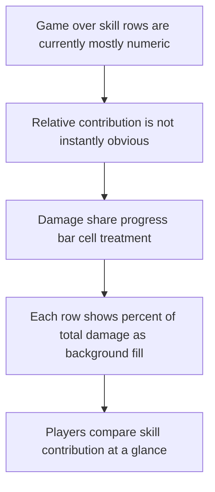

## req_087_define_damage_share_progress_bar_cells_for_game_over_skill_ranking_rows - Define damage share progress bar cells for game over skill ranking rows
> From version: 0.5.2
> Schema version: 1.0
> Status: Done
> Understanding: 100%
> Confidence: 97%
> Complexity: Low
> Theme: UI
> Reminder: Update status/understanding/confidence and references when you edit this doc.

# Needs
- Improve the readability of the `game over` skill-ranking list so players can compare skill contribution at a glance instead of reading only raw numbers.
- Represent each skill's share of total damage with a progress-bar style background directly inside the corresponding ranking row or damage cell.
- Keep the post-run analysis compact and legible while making relative contribution more immediately understandable.
- Preserve the current sorted-by-damage ordering while strengthening visual comparison between rows.

# Context
The project already has a `game over` skill-ranking view that lists skills by damage contribution.
That gives the player useful information, but the current read is still mostly numeric:
- players can see the order
- players can see total damage values
- but the relative gap between skills is not instantly obvious

For post-run analysis, a row-level comparison affordance is more valuable than more text.
A background fill tied to damage share would make the ranking feel more analytical without turning it into a full dashboard.

This request should therefore define a bounded UI polish wave for the existing game-over skill list:
- keep the ranked rows
- keep damage as the sorting metric
- add a background progress treatment per row or cell
- make that fill represent the percentage of total run damage attributed to the skill

Recommended posture:
1. Treat the progress fill as a background layer inside the row or damage cell, not as a separate chart widget.
2. Keep the row content readable on top of the fill.
3. Use percent-of-total-damage as the progress metric, not raw row rank alone.
4. Preserve the compact techno-shinobi shell aesthetic rather than introducing a heavy analytics-table look.
5. Keep the wave bounded to the `game over` skill-ranking view.

Scope includes:
- defining a per-row or per-cell progress background in the game-over skill list
- defining that the fill represents each skill's percentage of total run damage
- defining readability expectations for text over the filled background
- defining validation expectations for correct percentage rendering and visual hierarchy

Scope excludes:
- adding new ranking metrics
- redesigning the overall game-over flow
- widening the same progress-bar treatment to every stats surface in the shell
- building a full charting or analytics system

# Acceptance criteria
- AC1: The request defines a bounded UI polish wave for the existing `game over` skill-ranking rows rather than a broad outcome-analysis redesign.
- AC2: The request defines that each skill row, or its damage cell, includes a background progress-bar treatment.
- AC3: The request defines that the fill amount represents the skill's percentage share of total run damage.
- AC4: The request preserves the existing sorted-by-damage ranking posture rather than replacing it with a different ordering model.
- AC5: The request defines readability constraints so row text and numbers remain legible over the filled background.
- AC6: The request keeps the treatment scoped to the `game over` skill-ranking surface and does not widen it into a general charting system.
- AC7: The request defines validation expectations strong enough to later prove that:
  - fill widths correspond to the correct damage percentages
  - rows remain readable
  - the highest-damage skill reads as the strongest visual bar
  - zero or very low contribution rows still render safely without breaking layout

# Open questions
- Should the progress background fill the whole row or only the damage column?
  Recommended default: start with the damage cell or the ranking content cell so the comparison is strong without overpowering the whole row.
- Should the percent value also be printed numerically, or should the bar alone carry the meaning?
  Recommended default: keep the numeric damage value and optionally the percentage label; the bar should reinforce comparison, not replace numbers entirely.
- Should the fill be normalized to the top skill or to total damage share?
  Recommended default: use percent of total damage, since that is the clearest post-run contribution metric.
- Should the same treatment appear on victory later?
  Recommended default: keep the first slice bounded to `game over`.

# Definition of Ready (DoR)
- [x] Problem statement is explicit and user impact is clear.
- [x] Scope boundaries (in/out) are explicit.
- [x] Acceptance criteria are testable.
- [x] Dependencies and known risks are listed.

# Companion docs
- Product brief(s): `prod_015_post_run_outcome_analysis_direction_for_skill_performance`
- Architecture decision(s): `adr_046_expose_post_run_skill_performance_summaries_as_shell_consumable_outcome_data`
- Request(s): `req_066_define_a_game_over_skill_ranking_view_toggle`
# AI Context
- Summary: Define a progress-bar background treatment for game-over skill ranking rows based on damage share.
- Keywords: game over, skill ranking, damage share, progress bar, outcome analysis, UI
- Use when: Use when framing scope, context, and acceptance checks for Define damage share progress bar cells for game over skill ranking rows.
- Skip when: Skip when the work targets another feature, repository, or workflow stage.

# Backlog
- `item_328_define_a_damage_share_percentage_contract_for_game_over_skill_ranking_rows`
- `item_329_define_a_background_progress_bar_presentation_posture_for_game_over_skill_ranking_cells`
- `item_330_define_targeted_validation_for_damage_share_fill_correctness_readability_and_low_value_row_safety`

# Closure
- Landed through `task_059_orchestrate_second_wave_skills_fusion_completion_meta_progression_hourglass_pickup_and_game_over_damage_share_polish`.
- Proof:
  - `npm run typecheck`
  - `npm run test -- src/app/components/AppMetaScenePanel.test.tsx src/app/AppShell.test.tsx src/app/hooks/useAppScene.test.tsx src/shared/lib/metaProfileStorage.test.ts src/game/entities/model/entitySimulation.test.ts games/emberwake/src/runtime/entitySimulationIntent.test.ts games/emberwake/src/systems/gameplaySystems.test.ts`
