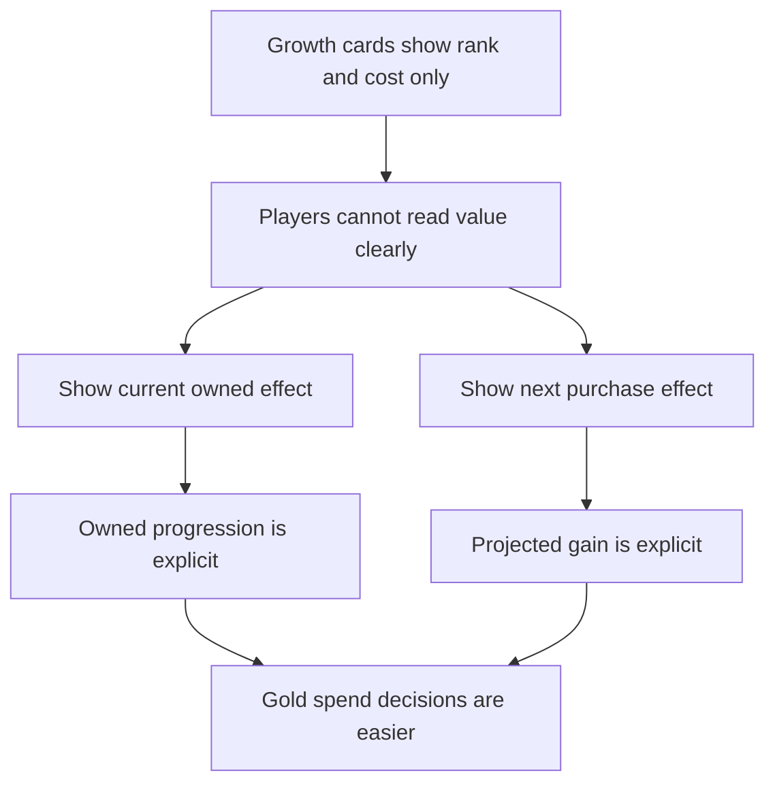

## req_088_define_current_and_projected_gain_visibility_on_the_growth_screen - Define current and projected gain visibility on the growth screen
> From version: 0.6.0
> Schema version: 1.0
> Status: Done
> Understanding: 100%
> Confidence: 97%
> Complexity: Low
> Theme: Meta progression
> Reminder: Update status/understanding/confidence and references when you edit this doc.

# Needs
- Show the permanent effect already owned on the `Growth` screen instead of exposing only rank and price.
- Show the projected benefit of the next purchase before the player spends gold.
- Expose owned completion as a percentage where the lane has a bounded denominator, so progression is readable at a glance.
- Keep this slice presentation-only and aligned with the existing meta-progression rules.

# Context
The current `Growth` scene already covers core purchase flow, but it does not explain the value of a purchase clearly enough:
- the `Shop` lane shows a raw ownership count such as `1/3 owned`
- the `Talents` lane shows `Rank X/Y` and the next gold cost

That leaves a player-facing gap:
- the player cannot immediately see how much permanent bonus is already active from previously purchased ranks
- the player cannot immediately see what the next purchase will add
- the player can compare prices, but not the value gained for the price

This is primarily a readability problem, not a new progression-system problem. The underlying meta-progression model already exposes enough structure to support clearer presentation:
- `gold gain` scales by 12 percent per rank
- `xp gain` scales by 10 percent per rank
- `move speed` scales by 6 percent per rank
- `pickup radius` scales by 8 percent per rank
- `max health` and `shield` use fixed-value gains rather than percentages and should keep honest unit-based labels

Recommended posture:
1. Keep `Shop` and `Talents` in the same shell-owned `Growth` scene.
2. Add current owned value and next purchase value to talent cards.
3. For percentage-based talents, show both the currently owned bonus and the next projected gain in percentage terms.
4. For fixed-value talents, keep explicit units such as health or shield charges instead of inventing percentages.
5. Keep all displayed values derived from the same rules already used by the runtime modifiers so UI numbers do not drift away from gameplay reality.

Scope includes:
- defining owned-progress percentage visibility for bounded growth summaries, at minimum where catalog ownership has a clear denominator
- defining current owned effect visibility on talent cards
- defining projected next-purchase effect visibility on talent cards
- defining presentation rules for percentage-based and fixed-value talents
- defining validation expectations strong enough to later implement and verify the updated display

Scope excludes:
- changing talent prices, rank caps, unlock costs, or persistence rules
- rebalancing the meta-progression economy
- redesigning the full `Growth` scene layout beyond the information needed for clearer purchase decisions
- adding a new progression lane or changing the `Shop` versus `Talents` split

# Acceptance criteria
- AC1: The request defines that the `Growth` screen shows the current owned effect for each talent rather than only the current rank and next price.
- AC2: The request defines that percentage-based talents show the currently owned bonus and the next projected gain in percentage terms before purchase.
- AC3: The request defines that fixed-value talents such as health or shield gains keep honest unit-based presentation rather than fabricated percentages.
- AC4: The request defines that bounded ownership summaries expose owned progress as a percentage where a clear denominator exists, at minimum for `Shop` ownership.
- AC5: The request defines that displayed owned and projected values are derived from the same meta-progression rules currently used to apply runtime modifiers.
- AC6: The request keeps the slice presentation-only and does not change costs, rank caps, unlock ownership rules, or persistence behavior.
- AC7: The request defines validation expectations strong enough to later prove that:
  - current owned values match the active talent ranks
  - projected next values match the next purchasable rank
  - capped talents do not show misleading projected-gain copy
  - owned percentages stay aligned with actual purchased ownership counts after a purchase

# Open questions
- Should the next line show only the incremental gain, or the incremental gain plus the projected total after purchase?
  Recommended default: show both when space allows, because the player needs both the immediate delta and the resulting total.
- Should `Shop` progress display percentage in addition to the current raw ownership count?
  Recommended default: keep the raw count and add percentage so the player gets both precision and quick readability.
- Should `Max Health` use raw numeric gain or explicit `HP` wording?
  Recommended default: use explicit unit wording such as `+12 HP` so fixed-value talents stay readable next to percentage-based talents.

# Definition of Ready (DoR)
- [x] Problem statement is explicit and user impact is clear.
- [x] Scope boundaries (in/out) are explicit.
- [x] Acceptance criteria are testable.
- [x] Dependencies and known risks are listed.

# Companion docs
- Product brief(s): (none yet)
- Architecture decision(s): (none yet)
- Request(s): `req_084_define_a_shell_owned_talent_growth_and_unlock_shop_progression_surface`, `req_085_define_a_persistent_meta_profile_contract_for_gold_bestiary_and_grimoire_progression_across_runs`

# AI Context
- Summary: Define clearer owned bonus and next purchase gain visibility on the shell-owned Growth screen.
- Keywords: growth, talents, owned bonus, projected gain, percentage, shop progress, meta progression
- Use when: Use when framing scope, context, and acceptance checks for clearer owned and projected progression visibility on the Growth screen.
- Skip when: Skip when the work targets another feature, repository, or workflow stage.

# References
- `logics/skills/logics-ui-steering/SKILL.md`

# Backlog
- `item_333_define_owned_and_projected_talent_effect_visibility_on_the_growth_screen`
- `item_334_define_targeted_validation_for_growth_owned_and_projected_gain_visibility`
