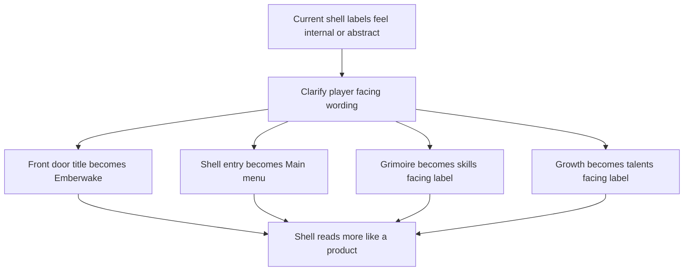

## req_089_define_clearer_player_facing_shell_labels_for_the_main_menu_skills_and_talents_surfaces - Define clearer player-facing shell labels for the main menu skills and talents surfaces
> From version: 0.6.0
> Schema version: 1.0
> Status: Done
> Understanding: 100%
> Confidence: 97%
> Complexity: Low
> Theme: UI
> Reminder: Update status/understanding/confidence and references when you edit this doc.

# Needs
- Replace shell-facing wording that still reads like internal UI labels with clearer player-facing labels.
- Rename the main shell title from `Main menu` to `Emberwake`.
- Rename the eyebrow or scene-family label from `Shell entry` to `Main menu`.
- Rename `Grimoire` to a more immediately readable skills-facing term, with `Skills` as the default direction.
- Rename `Growth` to a more immediately readable talents-facing term, with `Talents` as the default direction.

# Context
The shell currently uses several labels that are technically coherent but not equally strong from a player-facing naming standpoint:
- the main shell title reads `Main menu`
- the eyebrow above that title reads `Shell entry`
- the skill archive surface is labeled `Grimoire`
- the meta-progression surface is labeled `Growth`

That naming posture exposes internal structure more than player meaning:
- `Shell entry` sounds like framework language rather than product language
- `Main menu` is descriptive, but weak as the primary title of the front door
- `Grimoire` fits the project tone, but is less immediately legible than a direct skills label
- `Growth` is broad and abstract, while the current screen is specifically about permanent talents and unlock progression

This request is therefore about naming clarity, not system redesign. The goal is to make the shell read more like a finished game surface:
- the front door title should foreground the product name
- the eyebrow should describe the screen role in plain language
- archive and progression entries should communicate their player value immediately

Requested default label direction:
1. `Main menu` title becomes `Emberwake`
2. `Shell entry` becomes `Main menu`
3. `Grimoire` becomes `Skills`, or another close skills-facing label if final wording is refined later
4. `Growth` becomes `Talents`, or another close talents-facing label if final wording is refined later

Recommended posture:
1. Keep the scope limited to visible player-facing copy in the shell UI.
2. Do not rename internal scene IDs, routes, component names, or persistence keys unless a later technical slice explicitly requires it.
3. Keep the wording consistent across panel headers, menu entries, buttons, labels, and tests that intentionally assert visible copy.
4. Preserve the current information architecture: this is a wording alignment slice, not a navigation or feature-scope change.

Scope includes:
- defining the player-facing title change from `Main menu` to `Emberwake`
- defining the player-facing eyebrow change from `Shell entry` to `Main menu`
- defining a clearer player-facing replacement for `Grimoire`
- defining a clearer player-facing replacement for `Growth`
- defining validation expectations strong enough to later verify copy consistency across the shell surfaces that expose these labels

Scope excludes:
- changing scene ownership, navigation flow, or menu hierarchy
- renaming internal scene identifiers such as `main-menu`, `grimoire`, or `growth`
- redesigning the archive or progression feature set
- rewriting unrelated shell copy outside the named labels in this request

# Acceptance criteria
- AC1: The request defines the main shell title label as `Emberwake` instead of `Main menu`.
- AC2: The request defines the shell eyebrow or equivalent supporting label as `Main menu` instead of `Shell entry`.
- AC3: The request defines that the player-facing label currently shown as `Grimoire` is replaced by a clearer skills-facing label, with `Skills` as the recommended default.
- AC4: The request defines that the player-facing label currently shown as `Growth` is replaced by a clearer talents-facing label, with `Talents` as the recommended default.
- AC5: The request keeps the change bounded to visible shell copy and does not require renaming internal scene identifiers, component names, or persistence contracts.
- AC6: The request defines validation expectations strong enough to later prove that the updated labels are applied consistently across the main shell header, menu entries, action buttons, and scene titles where those surfaces currently expose the old wording.

# Open questions
- Should the final player-facing replacement be exactly `Skills`, or a slightly more stylized label such as `Techniques`?
  Recommended default: use `Skills` first, because the main goal of this slice is immediate readability.
- Should the final player-facing replacement be exactly `Talents`, or a nearby label such as `Upgrades`?
  Recommended default: use `Talents`, because it matches the current function of permanent ranked bonuses more closely than `Growth`.
- Should the product title be only `Emberwake`, or `EMBERWAKE` in full uppercase wherever it acts as the main title?
  Recommended default: keep the visual casing aligned with the current design system, but the wording should resolve to the product name `Emberwake`.

# Definition of Ready (DoR)
- [x] Problem statement is explicit and user impact is clear.
- [x] Scope boundaries (in/out) are explicit.
- [x] Acceptance criteria are testable.
- [x] Dependencies and known risks are listed.

# Companion docs
- Product brief(s): (none yet)
- Architecture decision(s): (none yet)
- Request(s): `req_030_define_a_shell_owned_main_menu_and_new_game_entry_flow`, `req_050_define_a_main_menu_polish_and_first_crystal_xp_progression_wave`, `req_064_define_a_grimoire_scene_for_skill_discovery_and_future_unlock_gating`, `req_084_define_a_shell_owned_talent_growth_and_unlock_shop_progression_surface`

# AI Context
- Summary: Define clearer player-facing shell wording for the front-door title, main-menu eyebrow, skills archive label, and talents progression label.
- Keywords: emberwake, main menu, shell entry, grimoire, growth, skills, talents, copy
- Use when: Use when framing scope, context, and acceptance checks for a bounded shell-label renaming wave.
- Skip when: Skip when the work targets another feature, repository, or workflow stage.

# Backlog
- `item_335_define_player_facing_shell_label_replacements_for_the_main_menu_skills_and_talents_surfaces`
- `item_336_define_targeted_validation_for_player_facing_shell_label_consistency_across_shell_surfaces`
