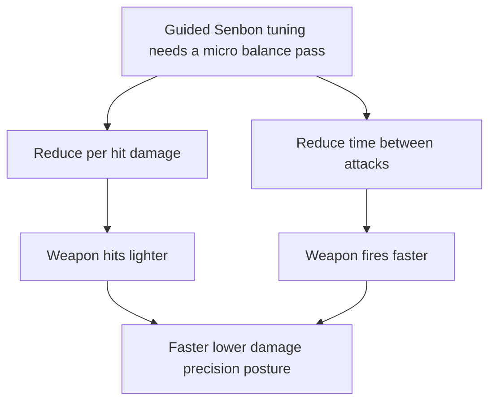

## req_090_define_a_targeted_guided_senbon_balance_adjustment_for_lower_damage_and_faster_cadence - Define a targeted guided senbon balance adjustment for lower damage and faster cadence
> From version: 0.6.0
> Schema version: 1.0
> Status: Done
> Understanding: 100%
> Confidence: 97%
> Complexity: Low
> Theme: Gameplay
> Reminder: Update status/understanding/confidence and references when you edit this doc.

# Needs
- Reduce `Guided Senbon` base damage by 25 percent.
- Reduce the time between `Guided Senbon` attacks by 25 percent so the skill fires more often.
- Keep the change tightly scoped to one targeted balance adjustment rather than reopening a broad first-wave weapon rebalance.

# Context
`Guided Senbon` is one of the first-wave active weapons and currently reads as an auto-targeted precision burst. The authored tuning surface in the runtime build system currently sets:
- base damage to `15`
- base cooldown to `24` ticks

The requested change is intentionally narrow:
- lower the damage output per attack by 25 percent
- lower the time between attacks by 25 percent

This is a micro-balance posture, not a systemic redesign. The goal is to shift `Guided Senbon` toward a faster but lighter-hit identity without widening the scope into:
- cross-roster parity retuning
- projectile-system redesign
- feedback or VFX redesign
- economy or progression rebalance

Why this bounded change is useful:
- it preserves the weapon role as an auto-targeted precision tool
- it changes feel through cadence as well as raw per-hit power
- it avoids touching unrelated weapons or the overall balance framework

Recommended posture:
1. Keep the request limited to `Guided Senbon`.
2. Apply the two requested adjustments together so the feel change is evaluated as one coherent tuning move.
3. Preserve the current weapon role, range, and target-count posture unless later validation proves another issue.
4. Keep the implementation aligned with the shared authored tuning surface rather than introducing local runtime literals elsewhere.

Scope includes:
- defining a 25 percent reduction to `Guided Senbon` base damage
- defining a 25 percent reduction to the time between `Guided Senbon` attacks
- defining validation expectations strong enough to later confirm the weapon now hits lighter and fires faster

Scope excludes:
- rebalancing other first-wave weapons
- changing `Guided Senbon` target count, range, unlock posture, or feedback presentation
- widening the slice into a broader first-wave balance pass
- redesigning the authored tuning system itself

# Acceptance criteria
- AC1: The request defines a 25 percent reduction to `Guided Senbon` base damage relative to its current authored baseline.
- AC2: The request defines a 25 percent reduction to the time between `Guided Senbon` attacks relative to its current authored baseline.
- AC3: The request keeps the slice bounded to `Guided Senbon` and does not widen into a roster-wide rebalance.
- AC4: The request keeps the role of `Guided Senbon` as a faster precision auto-target weapon rather than changing its core function.
- AC5: The request defines validation expectations strong enough to later prove that:
  - the weapon deals less damage per attack than before
  - the weapon attacks more frequently than before
  - the authored tuning source and runtime behavior stay aligned after the change

# Open questions
- Should the damage reduction preserve an exact fractional result if the authored value becomes non-integer, or should it round to a nearby authored integer?
  Recommended default: preserve the 25 percent intent first; if the tuning surface remains integer-first in practice, choose the nearest documented authored value during implementation.
- Should the cadence reduction be measured against cooldown ticks specifically?
  Recommended default: yes; use the existing base cooldown posture as the direct authored source for the faster attack rate.

# Definition of Ready (DoR)
- [x] Problem statement is explicit and user impact is clear.
- [x] Scope boundaries (in/out) are explicit.
- [x] Acceptance criteria are testable.
- [x] Dependencies and known risks are listed.

# Companion docs
- Product brief(s): (none yet)
- Architecture decision(s): (none yet)
- Request(s): `req_052_define_an_externalized_json_gameplay_tuning_contract`, `req_072_define_a_first_playable_balance_wave_for_build_power_run_economy_and_difficulty_pacing`, `req_082_define_a_second_survivor_style_skill_roster_expansion_wave_for_combat_control_economy_and_survivability`

# AI Context
- Summary: Define a narrow Guided Senbon tuning change that reduces damage per hit and shortens time between attacks.
- Keywords: guided senbon, balance, damage, cooldown, cadence, tuning, gameplay
- Use when: Use when framing scope, context, and acceptance checks for a bounded Guided Senbon micro-balance change.
- Skip when: Skip when the work targets another feature, repository, or workflow stage.

# Backlog
- `item_337_define_guided_senbon_damage_and_cadence_tuning_adjustment`
- `item_338_define_targeted_validation_for_guided_senbon_lower_damage_and_faster_cadence`
