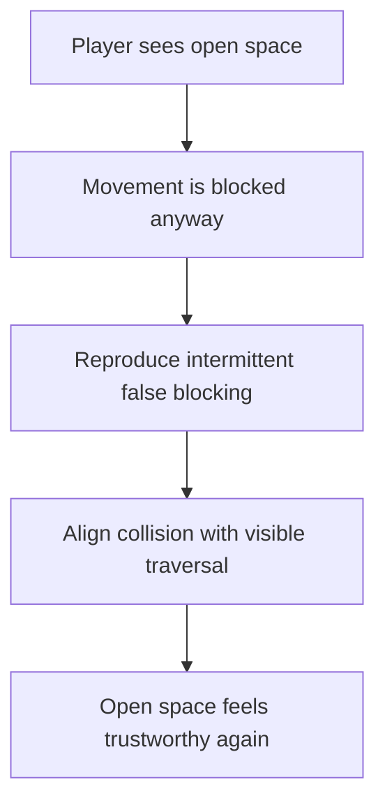

## req_091_define_a_fix_for_intermittent_invisible_wall_blocking_during_player_traversal - Define a fix for intermittent invisible wall blocking during player traversal
> From version: 0.6.0
> Schema version: 1.0
> Status: Done
> Understanding: 100%
> Confidence: 96%
> Complexity: Medium
> Theme: Gameplay
> Reminder: Update status/understanding/confidence and references when you edit this doc.

# Needs
- Fix the intermittent cases where the player appears to hit an invisible wall during traversal.
- Capture the player-facing symptom explicitly: the player is moving normally, then gets blocked by something that is not visible and does not look like a blocker.
- Restore trust that visibly open space is traversable unless a blocking obstacle is actually present.
- Keep the work bounded to traversal and collision correctness rather than reopening broad world-generation or physics scope.

# Context
The runtime already has a real blocking-world and collision posture:
- obstacle tiles can block movement
- player movement resolves against blocking world space
- earlier work already improved obstacle visibility so blocked tiles are easier to read

The reported symptom is different from a pure readability issue:
- sometimes the player appears to stop against empty-looking space
- the blockage feels intermittent rather than consistently tied to one obvious visible wall
- there is no visible red blocking tile, no obvious obstacle, and no clear “do not pass” signal at the blocked point
- the area often looks visually normal and non-blocking right before movement stops
- this makes traversal feel unreliable even if the world technically has a valid obstacle system underneath

That means the likely problem is not just color or presentation. The mismatch may instead come from one or more of these areas:
- collision queries and rendered traversable space drifting out of alignment
- player footprint or separation posture blocking more space than the player can visually infer
- intermittent false positives near obstacle edges, chunk boundaries, or diagonal movement
- movement-resolution rules that can zero one axis or both in a way that feels like an invisible wall

This request should therefore frame the issue as a traversal correctness bug:
- visible open space should not behave as blocked space
- terrain that looks normal and non-blocking should not suddenly behave like a solid wall
- legitimate blocking obstacles must still block correctly
- the fix should begin with reproduction and isolation rather than blind retuning

Recommended posture:
1. Reproduce the intermittent invisible-wall case with a bounded scenario or set of scenarios.
2. Compare visible traversable space against the obstacle and collision checks that actually gate movement.
3. Fix the smallest collision or traversal mismatch that explains the symptom.
4. Add regression validation around the movement patterns most likely to trigger false blocking.

Scope includes:
- defining the intermittent invisible-wall symptom as a player-traversal bug
- defining the symptom in player-facing terms: movement stops on space that looks normal, open, and non-blocking
- defining reproduction and diagnosis expectations for the false-blocking case
- defining a corrective posture so visible open space no longer blocks movement unexpectedly
- defining validation expectations strong enough to later prove the bug is fixed without removing intended obstacle blocking

Scope excludes:
- pure obstacle recoloring or presentation-only work
- broad obstacle-density retuning
- a full physics-engine rewrite
- unrelated hostile pathfinding or world-generation redesign unless root-cause isolation proves they are directly responsible

# Acceptance criteria
- AC1: The request defines the intermittent invisible-wall symptom as a traversal and collision correctness bug, not only as an obstacle-visibility issue.
- AC2: The request defines the need to reproduce and isolate the false-blocking case before or alongside the corrective implementation.
- AC3: The request defines that visibly open space, including terrain that appears visually normal and non-blocking, must not block player movement unless backed by actual blocking-world or collision semantics.
- AC4: The request defines that intended non-traversable obstacles must continue to block movement correctly after the fix.
- AC5: The request keeps the slice bounded to traversal and collision correctness and does not widen automatically into a full physics, pathfinding, or world-generation redesign.
- AC6: The request defines validation expectations strong enough to later prove that:
  - the intermittent false-blocking case is no longer reproducible in the captured scenarios
  - movement no longer stops on terrain that shows no red blocker or equivalent blocking signal
  - diagonal and edge-adjacent traversal remain reliable
  - legitimate blocking obstacles still stop movement where intended

# Open questions
- Is the symptom most strongly tied to obstacle edges, chunk boundaries, or diagonal traversal?
  Recommended default: capture at least one deterministic reproduction path before deciding which subsystem to change.
- Is the root cause more likely to be obstacle sampling, player footprint, or movement resolution?
  Recommended default: fix the smallest mismatch proven by reproduction evidence rather than retuning several systems at once.
- Do static collider-separation rules contribute to the invisible-wall feel in some cases?
  Recommended default: include them in diagnosis if reproduction suggests the player is being displaced or blocked without a visible world obstacle.

# Definition of Ready (DoR)
- [x] Problem statement is explicit and user impact is clear.
- [x] Scope boundaries (in/out) are explicit.
- [x] Acceptance criteria are testable.
- [x] Dependencies and known risks are listed.

# Companion docs
- Product brief(s): (none yet)
- Architecture decision(s): `adr_032_separate_visual_terrain_blocking_obstacles_and_movement_surface_modifiers`, `adr_033_adopt_deterministic_movement_oriented_pseudo_physics_instead_of_a_full_physics_engine`, `adr_035_resolve_entity_collisions_as_lightweight_deterministic_separation`
- Request(s): `req_033_define_a_first_collision_and_blocking_world_wave_for_runtime_gameplay`, `req_077_define_a_vivid_blocking_obstacle_visibility_posture_for_non_traversable_world_tiles`
# AI Context
- Summary: Define a bounded fix for intermittent false blocking where the player appears to hit invisible walls during traversal.
- Keywords: invisible wall, traversal, collision, obstacle, blocking, player movement, false positive
- Use when: Use when framing scope, context, and acceptance checks for an intermittent player-traversal blocking bug.
- Skip when: Skip when the work targets another feature, repository, or workflow stage.

# Backlog
- `item_331_define_deterministic_reproduction_and_collision_alignment_for_intermittent_invisible_wall_blocking_during_player_traversal`
- `item_332_define_targeted_validation_for_intermittent_invisible_wall_blocking_fixes`

# Closure
- Landed through `task_060_orchestrate_intermittent_invisible_wall_blocking_traversal_fix`.
- Root cause: hidden bootstrap support entities were still injected as static colliders and spawn blockers even though they were not part of the rendered simulation state.
- Proof:
  - `games/emberwake/src/runtime/entitySimulation.ts`
  - `src/game/entities/model/entitySimulation.test.ts`
  - `npm run test -- src/game/entities/model/entitySimulation.test.ts`
  - `npm run test -- games/emberwake/src/runtime/pseudoPhysics.test.ts games/emberwake/src/runtime/entitySimulationIntent.test.ts src/game/world/model/worldGeneration.test.ts`
  - `npm run typecheck`
