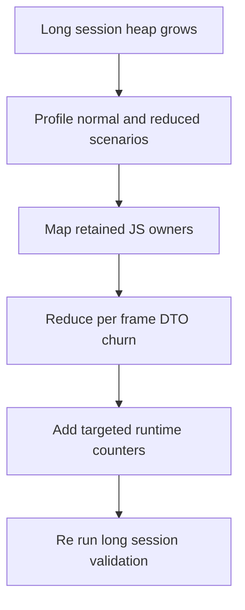

## req_092_define_a_js_heap_retention_investigation_and_reduction_wave_for_long_runtime_profiling_sessions - Define a JS heap retention investigation and reduction wave for long runtime profiling sessions
> From version: 0.6.0
> Schema version: 1.0
> Status: Ready
> Understanding: 100%
> Confidence: 96%
> Complexity: High
> Theme: Runtime
> Reminder: Update status/understanding/confidence and references when you edit this doc.

# Needs
- Define a bounded investigation and reduction wave for the remaining JS heap growth seen during long runtime profiling sessions.
- Separate true long-lived JS retention from native renderer leakage, browser tooling noise, and short-lived allocation churn.
- Turn the current profiling signal into an actionable delivery slice with clear experiments, instrumentation, and reduction targets.
- Reduce avoidable per-frame object churn in the runtime view layer where it is likely contributing to retained JS object growth across long sessions.

# Context
The long-session profiling posture is now strong enough to expose a remaining memory signal:
- the pendulum profiling harness no longer stalls after the midpoint heap snapshot
- a 120s left-right-pendulum run now completes with stable runtime tick progression and no long stall sequence
- the same run still shows meaningful JS heap growth from about 12.7 MB to about 111.6 MB
- runtime entity and pickup counts stay relatively modest during that run, which means raw gameplay population alone does not explain the full heap increase

The quick heap read points away from a dominant native or renderer-only leak:
- the largest growth buckets are generic JS shapes such as heap number, Object, Array, and object elements
- the remaining named buckets are minified bundle constructors rather than clear native buffers or one obvious external resource
- this makes the current signal look more like retained JS application state or repeated render-side DTO churn than a single renderer-owned blob

That means the next wave should not jump straight to a renderer rewrite or a broad gameplay retune. It should instead:
1. isolate whether the growth is primarily simulation-side, shell-side, or render-side
2. map the most suspicious retained constructor families back to meaningful code ownership
3. reduce repeated per-frame object recreation where the runtime UI currently reshapes entity data aggressively
4. add enough targeted instrumentation to correlate heap growth with concrete live collections and caches
5. keep the validation posture grounded in the same long-session profiling scenarios already used to expose the issue

Likely areas to investigate first:
- runtime A/B profiling slices such as normal spawn pressure versus no-spawn traversal baselines
- render-side entity shaping and selection decoration in `src/game/entities/hooks/useEntityWorld.ts`
- transient combat and feedback DTOs flowing through the runtime surface and combat overlay layers
- shell and runtime telemetry structures that may stay bounded but should still be proven bounded
- source-map or readable-build attribution for currently minified heap constructor names

Scope includes:
- defining a profiling matrix to isolate simulation, shell, and render contributions to heap growth
- defining the need to attribute minified heap constructors to real code ownership before broad optimization
- defining a reduction wave focused on JS retention and repeated per-frame object churn
- defining targeted runtime instrumentation so retained collections, cache sizes, and live overlay counts can be correlated with heap growth
- defining validation around long-session profiling so the result is measured rather than anecdotal

Scope excludes:
- a speculative renderer-engine rewrite without evidence
- broad gameplay balance or progression changes
- world-generation or collision redesign unless profiling evidence points there directly
- a requirement to eliminate all allocation churn rather than meaningfully reduce retained growth
- native memory tuning work unless future evidence contradicts the current JS-heavy signal

# Acceptance criteria
- AC1: The request defines a reproducible long-session profiling baseline for the remaining memory signal, including the expectation that the pendulum scenario can be rerun and compared across waves.
- AC2: The request defines an isolation posture using bounded A/B profiling slices such as normal spawn pressure versus no-spawn traversal so the work can distinguish simulation retention from shell or render retention.
- AC3: The request defines that minified retained constructor families from heap snapshots must be attributed to meaningful code ownership through source maps, readable profiling builds, or another bounded attribution method before broad optimization decisions are made.
- AC4: The request defines a targeted reduction wave for repeated per-frame JS object churn in the runtime view layer, especially where visible entities or overlay DTOs are reshaped or cloned every frame.
- AC5: The request defines targeted instrumentation expectations so heap growth can be correlated with concrete live counts or cache sizes rather than only with total used heap.
- AC6: The request defines success as both:
  - preserving stable long-session runtime execution without the old profiler stall signal
  - reducing or clearly explaining the remaining JS heap growth with evidence grounded in rerun profiling artifacts
- AC7: The request keeps the slice bounded to JS retention investigation and reduction rather than widening automatically into native renderer, gameplay-balance, or world-generation redesign work.

# Open questions
- What heap posture is acceptable for a 120s runtime session once the main JS retention suspects are addressed?
  Recommended default: require a materially lower end-of-run heap and a clearer plateau or oscillation story rather than demanding zero growth.
- Is the highest-value first fix the entity-view shaping churn or one of the combat-feedback overlay flows?
  Recommended default: start where object recreation frequency is highest and ownership is easiest to prove.
- Should constructor attribution be done through production sourcemaps or a less minified profiling build?
  Recommended default: choose the fastest bounded method that turns the current minified buckets into actionable ownership.

# Definition of Ready (DoR)
- [x] Problem statement is explicit and user impact is clear.
- [x] Scope boundaries (in/out) are explicit.
- [x] Acceptance criteria are testable.
- [x] Dependencies and known risks are listed.

# Companion docs
- Product brief(s): (none yet)
- Architecture decision(s): (none yet)
- Request(s): (none yet)

# AI Context
- Summary: Define a bounded investigation and reduction wave for remaining JS heap growth during long runtime profiling sessions.
- Keywords: heap, memory, retention, profiling, runtime, render, js, allocation, churn
- Use when: Use when framing scope, context, and acceptance checks for a JS memory-retention investigation on long Emberwake runtime sessions.
- Skip when: Skip when the work targets another feature, repository, or workflow stage.

# Backlog
- `item_339_define_long_session_runtime_profiling_isolation_and_retained_js_owner_attribution_for_heap_growth`
- `item_340_define_targeted_runtime_view_and_overlay_churn_reduction_for_long_session_js_heap_retention`
- `item_341_define_instrumentation_and_validation_for_long_session_js_heap_retention_reduction`
