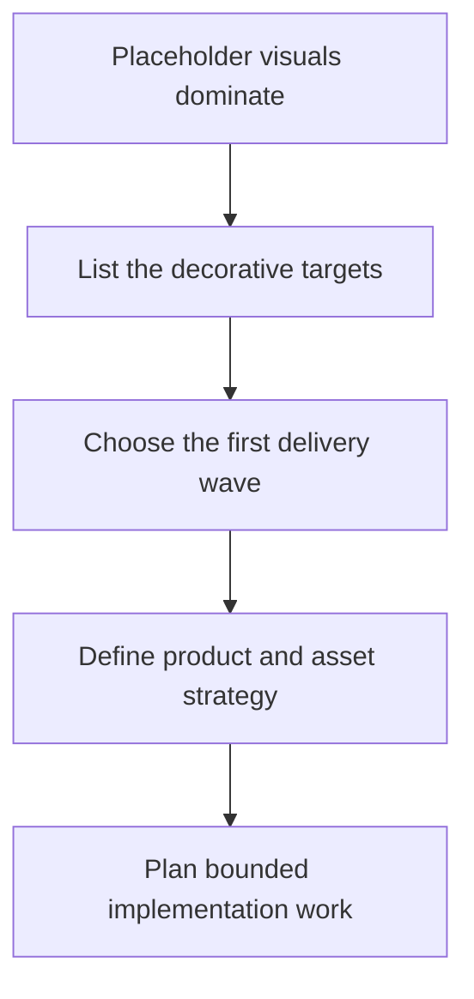

## req_093_define_a_first_graphical_asset_integration_strategy_for_runtime_and_shell_surfaces - Define a first graphical asset integration strategy for runtime and shell surfaces
> From version: 0.6.1
> Schema version: 1.0
> Status: Done
> Understanding: 99%
> Confidence: 96%
> Complexity: High
> Theme: UI
> Reminder: Update status/understanding/confidence and references when you edit this doc.

# Needs
- Define how Emberwake should start replacing debug-first visuals with authored graphical assets across both the runtime and shell surfaces.
- Prioritize gameplay readability before broad ambiance so the first wave improves recognition of the player, hostiles, pickups, projectiles, and blocking world elements.
- Establish one bounded direction for asset ownership, loading, fallback behavior, and delivery waves so future visual work does not fragment into ad hoc imports and inconsistent styles.
- Turn the current placeholder-ready asset catalog into a practical first delivery plan that can ship incrementally without breaking the performance posture reached in `0.6.1`.

# Context
Emberwake already has the beginnings of an asset pipeline:
- `src/assets/README.md` defines a source, placeholder, and runtime split
- `src/assets/assetCatalog.ts` exposes typed ids for `entities`, `map`, and `overlays`
- `src/shared/config/assetPipeline.ts` already defines naming, sizing, bundling, and lazy-loading intent

But the playable app is still mostly rendered through debug-first visuals:
- `src/game/entities/render/EntityScene.tsx` draws entities, pickups, and selection states through Pixi `Graphics`
- `src/game/world/render/WorldScene.tsx` draws terrain and chunk debug overlays procedurally
- `src/app/components/SkillIcon.tsx` hand-authors build-facing icons inline as SVG path data
- the shell scenes currently rely more on layout and typography than on a broader asset language

That means the repo is at a useful transition point:
1. there is already a typed place to anchor asset ownership
2. there is not yet a clear product or architecture direction for scaling authored visuals
3. the next step should stay bounded to strategy, priorities, and integration posture rather than jumping straight into a full art production pass

The request should therefore define:
- which elements should be decorated first
- how those elements should be grouped into coherent delivery waves
- how runtime, map, overlay, and shell-facing assets should be owned and resolved
- whether the common production workflow can be reduced to dropping correctly named files into agreed folders
- how the repo should preserve placeholder and procedural fallbacks while authored assets are introduced gradually

Scope includes:
- defining the first complete inventory of gameplay-critical and shell-facing decorative targets
- defining the priority order for runtime readability, system identity, and ambiance waves
- defining the product direction for how authored visuals should improve moment-to-moment readability and shell identity
- defining the architecture direction for asset ids, surface ownership, loading, fallbacks, and budget safety
- defining a default drop-in asset workflow where listed asset ids resolve automatically from predictable file names and locations
- defining the first delivery plan that can be executed without requiring a total runtime render rewrite

Scope excludes:
- producing the final art pack itself
- replacing every existing placeholder in a single wave
- introducing a full skeletal or high-frame animation pipeline immediately
- rewriting all procedural render paths when some should remain procedural for telegraphs, diagnostics, or cheap overlays
- broad art-direction exploration detached from gameplay readability and shipping constraints

# Acceptance criteria
- AC1: The request defines a prioritized inventory of decorative targets across runtime readability, shell identity, and ambiance surfaces rather than treating visual work as one undifferentiated art pass.
- AC2: The request defines a first delivery wave centered on gameplay readability, including at minimum player, hostile, pickup, projectile or hit-feedback, and critical obstacle or terrain readability targets.
- AC3: The request defines that asset integration must stay content-driven through owned asset identifiers and shared resolution rules rather than ad hoc per-component imports.
- AC4: The request defines a default drop-in workflow in which most assets can be integrated by depositing correctly named files into predictable domain folders, with manifests or sidecar metadata reserved for exceptional cases.
- AC5: The request defines explicit fallback and loading expectations so authored assets can be introduced gradually without breaking the current placeholder-capable runtime.
- AC6: The request defines that the first strategy wave must protect shell startup, runtime activation, and long-session stability rather than regressing performance for visual polish.
- AC7: The request links both a product framing document and an architecture decision before implementation goes deep enough to harden a poor visual pipeline.
- AC8: The request stays bounded to strategy and delivery planning rather than pretending that all required graphical assets will be authored and integrated in one release.

# Definition of Ready (DoR)
- [x] Problem statement is explicit and user impact is clear.
- [x] Scope boundaries (in/out) are explicit.
- [x] Acceptance criteria are testable.
- [x] Dependencies and known risks are listed.

# Companion docs
- Product brief(s): `prod_017_graphical_asset_direction_for_runtime_readability_and_shell_identity`
- Architecture decision(s): `adr_052_adopt_a_content_driven_graphical_asset_pipeline_for_runtime_and_shell_surfaces`

# AI Context
- Summary: Define the first bounded Emberwake strategy for introducing authored graphical assets across runtime and shell surfaces without losing the current performance and fallback posture.
- Keywords: assets, art pipeline, runtime, shell, readability, asset ids, fallback, loading, pixi, ui
- Use when: Use when framing scope, context, and acceptance checks for the first Emberwake graphical asset integration wave.
- Skip when: Skip when the work targets another feature, repository, or workflow stage.

# Backlog
- `item_342_define_a_first_graphical_asset_integration_strategy_for_runtime_and_shell_surfaces`
