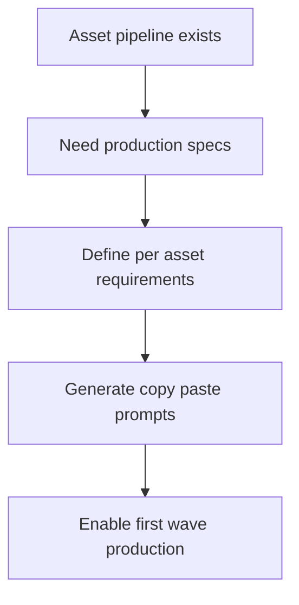

## req_094_define_asset_production_specifications_and_prompt_packs_for_the_first_graphical_wave - Define asset production specifications and prompt packs for the first graphical wave
> From version: 0.6.1
> Schema version: 1.0
> Status: Done
> Understanding: 99%
> Confidence: 97%
> Complexity: Medium
> Theme: UI
> Reminder: Update status/understanding/confidence and references when you edit this doc.

# Needs
- Define the production specification needed to actually create the first graphical wave assets after the architectural pipeline is in place.
- Ensure each first-wave asset has a concrete production brief that tells the operator what to generate, in which format, at which size, with or without transparency, and with which composition constraints.
- Generate copy-paste prompt packs aligned with Emberwake's techno-shinobi style so asset production can start without re-deriving the style language for every image.
- Reduce asset-production ambiguity enough that the team can move from `assetId` lists to usable source files without repeated back-and-forth on art direction or file requirements.

# Context
- `req_093`, `item_342`, and `task_065` already define the strategic and architectural direction for the graphical asset pipeline.
- The repository now has a clear drop-in contract:
  - `assetId`-driven ownership
  - predictable domain folders
  - file stem equals `assetId`
  - runtime to placeholder to code fallback behavior
- That solves the integration side, but it does not yet solve the production side.
- Before an operator can generate or commission assets, they still need a per-asset production specification that answers:
  - target surface
  - role in gameplay or shell
  - source format and transparency expectations
  - recommended source resolution
  - style and composition constraints
  - elements to avoid
  - copy-paste prompts to feed into an image generator or handoff workflow
- Without that layer, the team risks generating assets that:
  - do not match the game's style
  - have the wrong framing or transparency
  - are too detailed or not readable at runtime scale
  - require later rework before they can be dropped into the pipeline
- This request is intentionally about production guidance and promptability, not about replacing the existing architecture work.

Scope includes:
- defining a first-wave asset production spec template
- defining the mandatory fields for each asset production entry
- defining a first-wave style guide strong enough to keep prompts coherent
- generating copy-paste prompt packs for the first-wave asset list
- keeping the output aligned with the drop-in asset pipeline already defined

Scope excludes:
- generating every final asset automatically inside this request
- choosing one specific external image model as the only supported path
- replacing the existing asset pipeline ADR or product brief
- widening into a second or third art wave before the first production pack is clearly specified

# Acceptance criteria
- AC1: The request defines a first-wave asset production spec format that can be repeated asset by asset, rather than leaving production requirements in free-form notes.
- AC2: The request defines the minimum required fields for each asset production entry, including at least:
- `assetId`
- target surface and role
- format and transparency expectation
- recommended source size
- composition or framing guidance
- style guidance
- constraints or avoid-list
- destination runtime file path
- AC3: The request defines a first-wave style guide strong enough to keep prompts visually coherent with Emberwake's techno-shinobi direction and readability goals.
- AC4: The request defines that each first-wave asset should receive a copy-paste prompt pack that an operator can use directly in external generation workflows.
- AC5: The request keeps the prompt pack compatible with the existing drop-in asset pipeline by preserving naming, transparency, and file-contract expectations.
- AC6: The request stays bounded to first-wave production guidance and does not expand automatically into all future asset waves.

# Dependencies and risks
- Dependency: the first-wave asset list and pipeline conventions from `req_093`, `item_342`, `task_065`, `prod_017`, and `adr_052` remain the source of truth for what should be produced and how files should be deposited.
- Dependency: the style guide must stay readable and actionable for human operators, not only for AI image generation.
- Risk: prompts that are too vague will create inconsistent output.
- Risk: prompts that are too model-specific will age poorly and become less reusable.
- Risk: production specs that omit technical constraints such as transparency or size will still produce unusable assets even if the art style is good.

# AC Traceability
- AC1 -> production spec format. Proof: the request explicitly requires a reusable first-wave asset sheet format.
- AC2 -> required fields. Proof: the request explicitly lists the minimum per-asset production fields.
- AC3 -> style coherence. Proof: the request explicitly requires an Emberwake-aligned style guide.
- AC4 -> copy-paste prompts. Proof: the request explicitly requires prompt packs usable by operators.
- AC5 -> pipeline compatibility. Proof: the request explicitly ties production guidance back to the drop-in asset contract.
- AC6 -> bounded first wave. Proof: the request explicitly limits scope to first-wave production guidance.

# Definition of Ready (DoR)
- [x] Problem statement is explicit and user impact is clear.
- [x] Scope boundaries (in/out) are explicit.
- [x] Acceptance criteria are testable.
- [x] Dependencies and known risks are listed.

# Companion docs
- Product brief(s): `prod_017_graphical_asset_direction_for_runtime_readability_and_shell_identity`
- Architecture decision(s): `adr_052_adopt_a_content_driven_graphical_asset_pipeline_for_runtime_and_shell_surfaces`

# AI Context
- Summary: Define the production-specification layer for first-wave Emberwake assets, including technical constraints and copy-paste prompts aligned with the game's style and pipeline.
- Keywords: asset production, prompt pack, style guide, transparency, resolution, runtime readability, graphical wave
- Use when: Use when framing the document set that should let operators produce first-wave assets with minimal ambiguity.
- Skip when: Skip when the work targets another feature, repository, or workflow stage.

# References
- `logics/request/req_093_define_a_first_graphical_asset_integration_strategy_for_runtime_and_shell_surfaces.md`
- `logics/backlog/item_342_define_a_first_graphical_asset_integration_strategy_for_runtime_and_shell_surfaces.md`
- `logics/tasks/task_065_orchestrate_the_first_graphical_asset_integration_strategy_and_delivery_plan.md`
- `logics/product/prod_017_graphical_asset_direction_for_runtime_readability_and_shell_identity.md`
- `logics/architecture/adr_052_adopt_a_content_driven_graphical_asset_pipeline_for_runtime_and_shell_surfaces.md`
- `src/assets/README.md`
- `src/shared/config/assetPipeline.ts`

# Backlog
- `item_343_define_asset_production_specifications_and_prompt_packs_for_the_first_graphical_wave`
