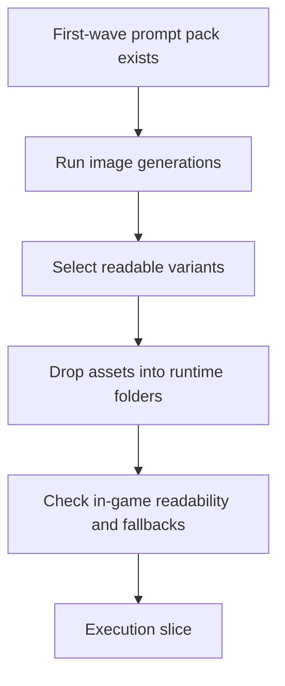

## req_095_process_first_wave_image_generation_prompts_and_integrate_generated_assets_into_the_game - Process first-wave image-generation prompts and integrate generated assets into the game
> From version: 0.6.1
> Schema version: 1.0
> Status: Done
> Understanding: 100%
> Confidence: 99%
> Complexity: High
> Theme: UI
> Reminder: Update status/understanding/confidence and references when you edit this doc.

# Needs
- Process the first-wave image-generation prompts into actual bitmap assets so Emberwake can move from specification-only art guidance to real in-game authored visuals.
- Use the existing first-wave production pack as the source of truth for what must be generated, with enough batching and operator support that the team does not have to hand-run every prompt ad hoc forever.
- Integrate the generated assets into the runtime surfaces covered by the existing drop-in asset contract, so the game actually displays the produced visuals instead of staying on placeholders.
- Keep the rollout readable and safe: generated assets should improve player, hostile, pickup, terrain, and codex creature recognition without regressing startup, runtime budgets, or fallback behavior.

# Context
The repository now has the prerequisite layers for this delivery wave:
- `req_093`, `item_342`, and `task_065` defined and implemented the graphical asset pipeline direction plus a first runtime and shell integration wave.
- `req_094`, `item_343`, `task_066`, and `spec_001` defined the production sheet template, the style guide, and the copy-paste prompts for the first graphical wave.
- A local image-generation workflow is now proven reachable through the OpenAI Images CLI wrapper when `OPENAI_API_KEY` is available.

That means the next gap is no longer strategic. It is operational:
- prompts exist
- destination asset ids exist
- runtime resolution exists
- but the first-wave assets still need to be generated systematically, curated, deposited into the right runtime folders, and reviewed in the actual game

This request should cover the full operator loop for the first production wave:
1. read the existing prompt pack from `spec_001`
2. run the prompts through a repeatable image-generation workflow
3. curate or iterate outputs when readability is weak
4. convert/export the selected outputs into the expected runtime delivery format
5. drop them into the correct asset folders
6. verify the assets actually improve in-game readability

Scope includes:
- defining the batch or semi-batch process used to execute the first-wave prompts
- defining where generated scratch outputs and promoted final outputs should live in the repo
- defining how operators select the winning variant when several generations exist for the same `assetId`
- integrating approved first-wave generated assets into the runtime domains already covered by `spec_001`
- validating that the game resolves and displays the new assets correctly
- documenting follow-up needs when a generated output is aesthetically strong but gameplay-weak

Scope excludes:
- redesigning the existing asset pipeline contract
- replacing the first-wave prompt pack with a different style system
- requiring one single image model forever
- pretending all generated assets will be final-quality on the first pass
- widening automatically into later visual waves before the first generated wave is reviewed in-game

# Acceptance criteria
- AC1: The request defines a repeatable process for executing the first-wave image prompts into actual candidate image files rather than leaving prompt execution entirely manual and undocumented.
- AC2: The request defines where generated scratch outputs and approved final assets should live, including a distinction between iteration outputs and assets promoted into `src/assets/.../runtime/`.
- AC3: The request defines how the existing first-wave prompt pack in `spec_001` is used as the input contract for generation, including how operators handle retries or multiple variants for one `assetId`.
- AC4: The request defines the integration path for approved generated assets into the existing drop-in runtime contract so `assetId` resolution continues to work without ad hoc code imports.
- AC5: The request defines validation expectations inside the actual game, including checks for silhouette readability, category recognition, directionality when relevant, and preservation of useful fallback overlays.
- AC6: The request defines a bounded first-wave delivery target centered on the already-listed player, hostile, pickup, and terrain assets rather than widening into an unlimited art-production backlog.
- AC7: The request keeps the delivery compatible with the current performance posture and explicitly requires preserving placeholder or procedural fallback behavior when a generated asset is not yet good enough.

# Dependencies and risks
- Dependency: `spec_001_define_first_wave_asset_production_pack` remains the source of truth for prompt text, asset ids, and output constraints unless a later document explicitly supersedes it.
- Dependency: the runtime asset pipeline from `task_065` and `adr_052` remains the resolution and fallback contract for generated assets.
- Dependency: the local generation workflow requires a valid `OPENAI_API_KEY` plus the image-generation wrapper environment to stay functional.
- Risk: some generated images may look attractive in isolation but fail gameplay readability once scaled into combat.
- Risk: transparent PNG outputs may still require cleanup or post-processing if the model introduces soft glows, loose silhouettes, or off-center compositions.
- Risk: running the entire prompt pack blindly could create cost and review noise if the process does not explicitly define variant curation and promotion rules.

# AC Traceability
- AC1 -> generation workflow. Proof: the request explicitly requires a repeatable prompt-execution process.
- AC2 -> output ownership. Proof: the request explicitly requires separate scratch and promoted-asset locations.
- AC3 -> prompt-pack reuse. Proof: the request explicitly ties generation back to `spec_001`.
- AC4 -> runtime integration. Proof: the request explicitly preserves the `assetId` drop-in contract.
- AC5 -> in-game review. Proof: the request explicitly requires gameplay and shell readability validation.
- AC6 -> bounded scope. Proof: the request explicitly limits delivery to the first-wave roster.
- AC7 -> fallback and perf posture. Proof: the request explicitly keeps current fallback and performance guardrails in scope.

# Definition of Ready (DoR)
- [x] Problem statement is explicit and user impact is clear.
- [x] Scope boundaries (in/out) are explicit.
- [x] Acceptance criteria are testable.
- [x] Dependencies and known risks are listed.

# Companion docs
- Product brief(s): `prod_017_graphical_asset_direction_for_runtime_readability_and_shell_identity`
- Architecture decision(s): `adr_052_adopt_a_content_driven_graphical_asset_pipeline_for_runtime_and_shell_surfaces`

# AI Context
- Summary: Execute the first-wave image prompt pack into real generated assets, curate the outputs, and integrate approved files into Emberwake's existing graphical asset pipeline.
- Keywords: image generation, prompt batch, asset promotion, runtime integration, readability validation, png
- Use when: Use when framing scope, context, and acceptance checks for Process first-wave image-generation prompts and integrate generated assets into the game.
- Skip when: Skip when the work targets another feature, repository, or workflow stage.

# References
- `logics/request/req_093_define_a_first_graphical_asset_integration_strategy_for_runtime_and_shell_surfaces.md`
- `logics/request/req_094_define_asset_production_specifications_and_prompt_packs_for_the_first_graphical_wave.md`
- `logics/backlog/item_342_define_a_first_graphical_asset_integration_strategy_for_runtime_and_shell_surfaces.md`
- `logics/backlog/item_343_define_asset_production_specifications_and_prompt_packs_for_the_first_graphical_wave.md`
- `logics/tasks/task_065_orchestrate_the_first_graphical_asset_integration_strategy_and_delivery_plan.md`
- `logics/tasks/task_066_orchestrate_first_wave_asset_production_specifications_and_prompt_packs.md`
- `logics/specs/spec_001_define_first_wave_asset_production_pack.md`
- `src/assets/README.md`
- `src/assets/assetCatalog.ts`
- `src/assets/assetResolver.ts`
- `output/imagegen/`

# Backlog
- `item_344_define_a_repeatable_first_wave_image_generation_and_asset_promotion_workflow`
- `item_345_define_first_wave_generated_asset_integration_and_in_game_readability_validation`

# Outcome
- The first-wave prompt pack was executed into a repeatable generation workflow backed by `scripts/assets/generateFirstWaveAssets.mjs`, `scripts/assets/promoteFirstWaveAssets.mjs`, and `scripts/assets/buildFirstWaveGallery.mjs`.
- Scratch candidates, reviewable variants, and curated selections now live under `output/imagegen/first-wave/`, with `selection.json` preserving the promoted winner per `assetId`.
- Approved first-wave assets were promoted into the runtime contract under `src/assets/.../runtime/` as `.png` and `.webp` files without introducing ad hoc imports.
- The actual game now renders the promoted player, hostile, pickup, and terrain assets, and the wave was revalidated against lint, typecheck, test, performance, smoke, and Logics lint gates.
