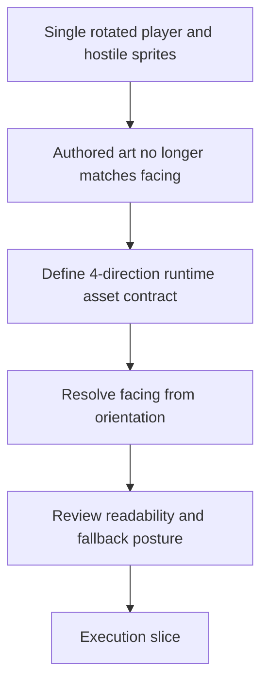

## req_096_define_cardinal_directional_runtime_assets_for_player_and_hostile_entities - Define cardinal directional runtime assets for player and hostile entities
> From version: 0.6.1
> Schema version: 1.0
> Status: Ready
> Understanding: 98%
> Confidence: 94%
> Complexity: High
> Theme: UI
> Reminder: Update status/understanding/confidence and references when you edit this doc.

# Needs
- Replace the current "single sprite plus runtime rotation" posture for the player and hostile entities with explicit cardinal-direction assets so the rendered facing makes visual sense.
- Preserve the recent first-wave asset gains while making living entities look authored from the front, back, left, and right instead of like one frozen illustration being spun around the map.
- Extend the graphical asset pipeline, production specs, and runtime resolution rules so directional variants remain drop-in, traceable, and compatible with the existing `assetId` workflow.
- Keep gameplay readability first: directional assets should improve facing clarity without regressing silhouette recognition, fallback behavior, startup posture, or runtime budgets.
- Keep the wave deliberately bounded: solve four-direction presentation for living entities first, without silently widening into a full animation or eight-direction sprite system.
- Keep room for reviewed exceptions when a family is visually rotation-safe, for example the current `needle` hostile whose single authored face still reads correctly under runtime rotation.

# Context
`task_067` successfully generated and promoted the first-wave runtime assets into the game. The current result is materially better than the placeholder-only state, but it also exposed a limit in the first-wave entity treatment:
- player and hostile entities currently behave like one authored bitmap that is rotated at runtime
- this worked acceptably for abstract placeholder shapes
- it becomes visually wrong for asymmetrical illustrated characters and monsters because the art is no longer authored for the facing being displayed

This request exists to frame the next quality step for living entities:
1. define how player and hostile runtime assets can exist in four cardinal facings
2. define how those variants are named and resolved inside the existing drop-in asset contract
3. define that `right` is the default authored facing for living entities, then define how runtime entity rendering chooses the correct facing from simulation orientation
4. define how prompt packs and production specs must evolve so image generation produces directional sets rather than one isolated sprite
5. define how readability and fallback acceptance are reviewed once directional variants replace pure rotation
6. define when a hostile family can intentionally remain on a single rotation-safe asset instead of receiving the full four-facing set

Scope includes:
- defining a cardinal-direction contract for player and hostile runtime assets
- defining the asset-id or file-layout convention for `right`, `left`, `up`, and `down` variants, with at least one concrete example such as `entity.player.primary.runtime.right` or an equivalent deterministic stem rule
- defining the runtime selection rule that maps entity orientation into the correct facing asset
- defining how first-wave production specs and prompt generation should evolve for directional entity sets
- validating that directional entity assets improve facing credibility while preserving gameplay readability
- defining when controlled reuse is acceptable, such as allowing `left` to mirror `right` for bounded families if the review explicitly accepts that compromise
- defining when a reviewed exception is acceptable, such as keeping `entity.hostile.needle.runtime` on a single authored face because its elongated silhouette remains credible under rotation

Scope excludes:
- requiring full frame-by-frame animation for movement or attacks
- widening the change to pickups, terrain, codex banners, or other non-living surfaces
- replacing the current asset-generation workflow for all domains
- demanding eight-direction or analog-angle authored sprites in this wave
- removing existing useful overlays unless the directional assets make them unnecessary

# Acceptance criteria
- AC1: The request defines a cardinal-direction runtime-asset contract for the player and the hostile families that benefit from authored facings, explicitly covering `right`, `left`, `up`, and `down`.
- AC2: The request defines how directional variants fit into the existing drop-in asset workflow, including naming, folder rules, and traceability back to the base entity asset identity, for example a base runtime identity extended with explicit facing variants.
- AC3: The request defines `right` as the default authored facing for living entities and defines how runtime entity rendering should choose a facing asset from simulation orientation instead of rotating a single illustrated sprite arbitrarily, including a bounded quadrant rule or equivalent deterministic mapping.
- AC4: The request defines how existing prompt packs and production specifications should expand from one living-entity image to a four-facing set without breaking the current generation and promotion workflow.
- AC5: The request defines readability validation expectations for directional entities, including whether the chosen facing reads correctly in combat and whether the player and major hostile families remain easy to distinguish.
- AC6: The request preserves bounded scope by targeting the player and hostile entities first, without widening into a full animation system or non-living asset families.
- AC7: The request preserves the current fallback and performance posture, including what should happen when one or more directional variants are missing or not yet good enough.
- AC8: The request defines whether limited directional reuse is acceptable for some entities, such as a reviewed horizontal mirror for `left`, while still treating `up` and `down` as distinct authored facings unless a later decision says otherwise.
- AC9: The request defines whether some hostile families may deliberately stay on a single rotation-safe asset, with `needle` treated as the reference example for that exception.
- AC10: The request defines a provisional family roster that distinguishes which living entities are expected to receive four authored facings first and which reviewed exceptions may remain single-face for now.

# Dependencies and risks
- Dependency: `task_067` remains the baseline wave that proved the image-generation, promotion, and drop-in runtime workflow.
- Dependency: `adr_052_adopt_a_content_driven_graphical_asset_pipeline_for_runtime_and_shell_surfaces` remains the pipeline and fallback contract unless this request later introduces a bounded extension.
- Dependency: player orientation continues to be simulation-owned through the posture defined in `adr_051_resolve_player_orientation_through_a_bounded_simulation_owned_turn_rate`.
- Dependency: the prompt/spec workflow from `req_094`, `task_066`, and `spec_001` remains the upstream source for generation constraints until a directional supplement is defined.
- Risk: a four-facing set multiplies generation, review, and curation cost for every living entity family.
- Risk: inconsistent art between `up`, `down`, `left`, and `right` variants could make entities flicker stylistically even if the runtime contract works.
- Risk: quadrant snapping could read poorly near angle thresholds if the runtime selection rule is not defined carefully.
- Risk: partial directional coverage could create mixed-quality states if fallback behavior for missing facings is not explicit.
- Risk: over-scoping the wave into eight directions or animation too early would increase asset cost sharply before the four-direction baseline is proven valuable.
- Risk: if exceptions are not named explicitly, the project could drift into ad hoc per-entity special cases instead of keeping a clear rule for which families deserve four authored facings and which do not.
- Risk: if the orientation-to-facing rule is left underspecified, entities could snap to the wrong facing near diagonals and make the new art look less credible than the current rotation model.

# AC Traceability
- AC1 -> directional asset contract. Proof: explicit four-facing coverage for the player and the hostile families that need it.
- AC2 -> drop-in pipeline compatibility. Proof: naming and folder rules remain aligned with the existing asset workflow.
- AC3 -> runtime facing resolution. Proof: orientation-to-facing selection replaces arbitrary full-sprite rotation.
- AC4 -> prompt/spec evolution. Proof: production docs expand to directional sets.
- AC5 -> readability validation. Proof: in-game facing and category recognition checks are defined.
- AC6 -> bounded scope. Proof: request explicitly targets player and hostile entities only.
- AC7 -> fallback and performance posture. Proof: request explicitly keeps missing-variant handling and runtime guardrails in scope.
- AC8 -> bounded reuse rule. Proof: request explicitly states when mirroring or similar controlled reuse is acceptable.
- AC9 -> reviewed single-face exception. Proof: request explicitly allows bounded rotation-safe exceptions such as `needle`.
- AC10 -> provisional roster. Proof: request explicitly distinguishes four-facing targets from reviewed exceptions.

# Definition of Ready (DoR)
- [x] Problem statement is explicit and user impact is clear.
- [x] Scope boundaries (in/out) are explicit.
- [x] Acceptance criteria are testable.
- [x] Dependencies and known risks are listed.

# Clarifications
- Default naming direction should be explicit in the next slice. A suitable target shape would be `entity.<family>.<name>.runtime.right|left|up|down`, or an equally deterministic equivalent that still keeps the base entity identity traceable.
- Default facing-resolution rule should be explicit in the next slice. A suitable baseline would map orientation into four quadrants centered on `right`, `up`, `left`, and `down`, with stable threshold boundaries to avoid noisy flipping near diagonals.
- Default fallback posture should be explicit in the next slice. A suitable bounded rule would be:
  - prefer the exact directional asset
  - then allow reviewed directional reuse such as mirrored `left` from `right`
  - then fall back to the current single-face rotation model when the family is explicitly marked as rotation-safe
  - never silently treat missing `up` and `down` as acceptable for families that were supposed to ship with four true facings
- Provisional first directional roster should be explicit in the next slice. A reasonable starting roster would be:
  - four-facing target: `entity.player.primary.runtime`
  - four-facing target: `entity.hostile.anchor.runtime`
  - four-facing target: `entity.hostile.drifter.runtime`
  - four-facing target: `entity.hostile.rammer.runtime`
  - four-facing target: `entity.hostile.sentinel.runtime`
  - likely four-facing target: `entity.hostile.watcher.runtime`
  - reviewed single-face exception candidate: `entity.hostile.needle.runtime`

# Companion docs
- Product brief(s): `prod_017_graphical_asset_direction_for_runtime_readability_and_shell_identity`
- Architecture decision(s): `adr_051_resolve_player_orientation_through_a_bounded_simulation_owned_turn_rate`, `adr_052_adopt_a_content_driven_graphical_asset_pipeline_for_runtime_and_shell_surfaces`

# AI Context
- Summary: Replace rotated single-sprite living entities with a four-direction runtime asset contract for the player and hostile families.
- Keywords: directional sprites, cardinal facing, player art, hostile art, orientation, runtime asset contract, four directions, left mirror, needle exception, bounded scope
- Use when: Use when framing the next graphical asset wave for directional player and hostile entity presentation.
- Skip when: Skip when the work targets non-living assets, generic prompt execution, or a full animation system.

# References
- `logics/request/req_093_define_a_first_graphical_asset_integration_strategy_for_runtime_and_shell_surfaces.md`
- `logics/request/req_094_define_asset_production_specifications_and_prompt_packs_for_the_first_graphical_wave.md`
- `logics/request/req_095_process_first_wave_image_generation_prompts_and_integrate_generated_assets_into_the_game.md`
- `logics/tasks/task_066_orchestrate_first_wave_asset_production_specifications_and_prompt_packs.md`
- `logics/tasks/task_067_orchestrate_first_wave_generated_asset_processing_promotion_and_in_game_integration.md`
- `logics/specs/spec_001_define_first_wave_asset_production_pack.md`
- `logics/product/prod_017_graphical_asset_direction_for_runtime_readability_and_shell_identity.md`
- `logics/architecture/adr_051_resolve_player_orientation_through_a_bounded_simulation_owned_turn_rate.md`
- `logics/architecture/adr_052_adopt_a_content_driven_graphical_asset_pipeline_for_runtime_and_shell_surfaces.md`
- `src/assets/README.md`
- `src/assets/assetResolver.ts`
- `src/game/entities/render/EntityScene.tsx`
- `src/game/entities/model/entityContract.ts`

# Backlog
- `item_346_define_directional_entity_asset_contract_and_runtime_facing_resolution`
- `item_347_define_directional_entity_production_pack_and_generation_workflow`
- `item_349_define_validation_and_tuning_for_directional_entities_and_dark_on_dark_readability`
