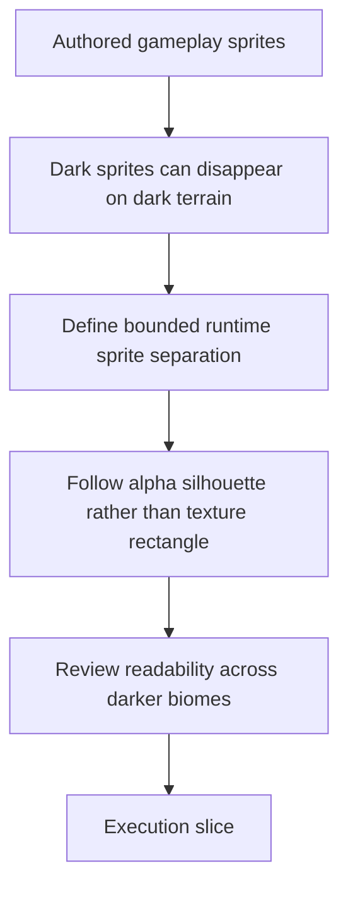

## req_097_define_a_runtime_sprite_separation_posture_for_dark_on_dark_asset_readability - Define a runtime sprite-separation posture for dark-on-dark asset readability
> From version: 0.6.1+task068
> Schema version: 1.0
> Status: Done
> Understanding: 100%
> Confidence: 99%
> Complexity: Medium
> Theme: UI
> Reminder: Update status/understanding/confidence and references when you edit this doc.

# Needs
- Fix the visual readability problem introduced by authored gameplay assets that can disappear against dark terrain or low-contrast biome backgrounds.
- Define a bounded runtime separation strategy for important gameplay sprites so player, hostiles, and pickups remain readable without requiring every source asset or biome to be repainted immediately.
- Make it explicit that this readability aid also covers collectible and reward surfaces such as XP crystals, gold, healing kits, magnets, hourglasses, and cache pickups.
- Prefer silhouette-aware separation, such as an outline or rim treatment derived from the sprite alpha, rather than rectangular backplates that would simply reveal the image bounds.
- Keep the solution compatible with the current graphical asset pipeline, first-wave generated assets, and performance posture.

# Context
The first generated-asset wave materially improved Emberwake's visual identity, but it also exposed a new readability regression:
- some promoted runtime sprites are dark
- some biomes and terrain textures are also dark
- the result can reduce the separation between gameplay-critical objects and the world behind them

This is not only a prompt-quality problem. It is also a runtime presentation problem. Even strong assets can lose legibility if the game does not provide enough bounded contrast support at gameplay scale.

This request exists to frame a dedicated readability response:
1. define what kinds of runtime sprite-separation treatments are acceptable
2. define which gameplay surfaces need that help first
3. define whether alpha-aware outline, rim, glow, underlay, or other bounded techniques should be preferred
4. define how transparency is handled so the treatment follows the sprite silhouette rather than its rectangular texture bounds
5. define how pickup and reward items stay readable under the same posture, including small collectible surfaces such as crystals and gold
6. define how this posture coexists with future asset-generation improvements instead of becoming a permanent excuse for muddy art

Scope includes:
- defining a bounded readability posture for runtime sprite separation on dark or low-contrast backgrounds
- defining acceptable first-line techniques such as alpha-aware outline, rim light, or subtle under-glow
- defining which gameplay-critical surfaces should be prioritized first
- defining how small collectible or reward items such as `entity.pickup.crystal.runtime`, `entity.pickup.gold.runtime`, `entity.pickup.healing-kit.runtime`, `entity.pickup.magnet.runtime`, `entity.pickup.hourglass.runtime`, and `entity.pickup.cache.runtime` should participate in the same visibility posture
- defining how transparency and alpha thresholds affect the separation treatment
- defining whether category-specific treatment is required so player, hostiles, and pickups do not all receive the exact same separation read
- defining bounded intensity rules so the treatment stays readable without turning into large cheap halos
- defining validation expectations for visibility across the current darker biome set
- defining the delivery posture as runtime-first, with prompt or source-asset tuning treated as a later complement instead of a prerequisite

Scope excludes:
- redesigning the overall biome palette or replacing the current terrain wave
- forcing every asset prompt to be regenerated before any runtime readability improvement can ship
- introducing giant halos, rectangular backplates, or heavy effects that turn readability aids into noise
- widening into a full post-processing stack or cinematic lighting system
- replacing asset-production guidance; this wave should complement it

# Acceptance criteria
- AC1: The request defines a bounded runtime readability posture for gameplay sprites that can disappear on dark or low-contrast backgrounds.
- AC2: The request defines which separation techniques are acceptable first-line candidates, such as alpha-aware outline, rim light, subtle under-glow, or other silhouette-following treatments.
- AC3: The request explicitly requires the separation treatment to respect sprite transparency and silhouette shape rather than drawing a simple rectangle around the texture bounds.
- AC4: The request defines which gameplay surfaces should be prioritized first, with player, hostiles, and critical pickups such as crystals, gold, healing kits, magnets, hourglasses, and caches treated ahead of decorative or shell-only surfaces.
- AC5: The request defines how the separation posture should be validated in the actual game across darker biome conditions and high-motion runtime scenes.
- AC6: The request keeps scope bounded by avoiding a full biome redesign, full post-processing pipeline, or large ambient glow system.
- AC7: The request preserves compatibility with the current asset pipeline and future prompt/spec improvements, so runtime separation remains a readability aid rather than a replacement for good asset production.
- AC8: The request defines whether separation should vary by category, for example through different contour color, intensity, or treatment rules for player, hostiles, and pickups.
- AC9: The request defines bounded intensity or thickness rules so the readability aid cannot drift into oversized halos or noisy screen clutter.
- AC10: The request defines the rollout posture as runtime-first, with source-asset or prompt adjustments treated as follow-up complements rather than blockers for the first readability fix.

# Dependencies and risks
- Dependency: `task_067` remains the baseline generated-asset wave whose output exposed the dark-on-dark readability problem.
- Dependency: `prod_017_graphical_asset_direction_for_runtime_readability_and_shell_identity` remains the product posture that says readability comes before pure ambiance polish.
- Dependency: `adr_052_adopt_a_content_driven_graphical_asset_pipeline_for_runtime_and_shell_surfaces` remains the runtime asset ownership and fallback contract.
- Dependency: promoted assets continue to rely on transparent raster files, so any silhouette-aware treatment depends on reasonable alpha quality.
- Risk: an outline or glow treatment can look cheap or noisy if it is too thick, too bright, or applied indiscriminately to every surface.
- Risk: soft or messy alpha edges in generated PNGs could produce fuzzy or unstable outlines if the runtime rule does not define threshold behavior.
- Risk: treating this only as a runtime problem could mask source-asset issues that should still be improved in future prompt and production waves.
- Risk: some terrain or world surfaces may still need moderation later if they stay too visually competitive even after bounded sprite separation is added.
- Risk: if category differentiation is ignored, player, hostiles, and pickups may all gain contrast but still collapse into a less informative shared glow language.

# AC Traceability
- AC1 -> readability posture. Proof: request explicitly targets dark-on-dark sprite separation.
- AC2 -> acceptable techniques. Proof: request explicitly calls out outline, rim, glow, or equivalent bounded methods.
- AC3 -> alpha-aware behavior. Proof: request explicitly rejects rectangle-bound separation and requires silhouette-following treatment.
- AC4 -> prioritized surfaces. Proof: request explicitly targets player, hostiles, and critical pickups first.
- AC5 -> in-game validation. Proof: request explicitly requires darker-biome runtime review.
- AC6 -> bounded scope. Proof: request explicitly excludes broad rendering or biome redesign work.
- AC7 -> pipeline compatibility. Proof: request explicitly keeps the current asset pipeline and future prompt improvements in scope.
- AC8 -> category differentiation. Proof: request explicitly asks whether player, hostile, and pickup treatments should vary.
- AC9 -> bounded intensity. Proof: request explicitly requires rules that prevent oversized halos or noisy clutter.
- AC10 -> runtime-first rollout. Proof: request explicitly treats prompt or source-asset tuning as follow-up rather than first blocker.

# Definition of Ready (DoR)
- [x] Problem statement is explicit and user impact is clear.
- [x] Scope boundaries (in/out) are explicit.
- [x] Acceptance criteria are testable.
- [x] Dependencies and known risks are listed.

# Clarifications
- Priority order should be explicit in the next slice. A suitable baseline would be:
  - highest priority: `entity.player.primary.runtime`
  - next priority: hostile families that can blend into darker terrain
  - next priority: high-value or frequently collected pickups, especially `entity.pickup.crystal.runtime` and `entity.pickup.gold.runtime`
  - then remaining utility pickups such as `healing-kit`, `magnet`, `hourglass`, and `cache`
- Category differentiation should be explicit in the next slice. A suitable baseline would allow:
  - player: the cleanest and most reliable contour treatment
  - hostiles: a warm or danger-biased contour family
  - pickups: a brighter but smaller treatment that helps recognition without looking like enemy aggro FX
- Intensity rules should be explicit in the next slice. A suitable baseline would prefer:
  - thin silhouette-following outline or rim first
  - subtle under-glow only when outline alone is not enough
  - no large bloom cloud, no rectangle backplate, and no treatment that materially increases screen noise during dense scenes
- Rollout posture should be explicit in the next slice. A suitable baseline would be:
  - runtime-first fix for current generated assets
  - then later prompt or source-asset refinements if some sprites still remain too dark or muddy after bounded separation is in place

# Companion docs
- Product brief(s): `prod_017_graphical_asset_direction_for_runtime_readability_and_shell_identity`
- Architecture decision(s): `adr_052_adopt_a_content_driven_graphical_asset_pipeline_for_runtime_and_shell_surfaces`

# AI Context
- Summary: Define a bounded runtime sprite-separation strategy so gameplay assets remain visible on dark terrain without relying on rectangular backplates.
- Keywords: outline, rim light, alpha, transparency, readability, dark background, sprite separation, halo
- Use when: Use when framing a gameplay-readability wave for authored sprites that blend into dark biomes.
- Skip when: Skip when the work is about prompt generation only, shell visuals only, or broad terrain re-art direction.

# References
- `logics/request/req_093_define_a_first_graphical_asset_integration_strategy_for_runtime_and_shell_surfaces.md`
- `logics/request/req_094_define_asset_production_specifications_and_prompt_packs_for_the_first_graphical_wave.md`
- `logics/request/req_095_process_first_wave_image_generation_prompts_and_integrate_generated_assets_into_the_game.md`
- `logics/request/req_096_define_cardinal_directional_runtime_assets_for_player_and_hostile_entities.md`
- `logics/tasks/task_065_orchestrate_the_first_graphical_asset_integration_strategy_and_delivery_plan.md`
- `logics/tasks/task_066_orchestrate_first_wave_asset_production_specifications_and_prompt_packs.md`
- `logics/tasks/task_067_orchestrate_first_wave_generated_asset_processing_promotion_and_in_game_integration.md`
- `logics/product/prod_005_visual_identity_dark_fantasy_with_synthetic_energy_accents.md`
- `logics/product/prod_017_graphical_asset_direction_for_runtime_readability_and_shell_identity.md`
- `logics/architecture/adr_052_adopt_a_content_driven_graphical_asset_pipeline_for_runtime_and_shell_surfaces.md`
- `src/assets/useResolvedAssetTexture.ts`
- `src/game/entities/render/EntityScene.tsx`
- `src/game/world/render/WorldScene.tsx`

# Backlog
- `item_348_define_runtime_sprite_separation_rules_for_entities_and_pickups_on_dark_biomes`
- `item_349_define_validation_and_tuning_for_directional_entities_and_dark_on_dark_readability`

# Outcome
- Fulfilled in `task_068_orchestrate_directional_entity_presentation_and_runtime_sprite_separation`.
- Landed a runtime-first, alpha-aware sprite separation treatment for `player`, `hostile`, and `pickup` categories so darker generated assets remain readable on dark biome backgrounds without rectangle backplates.
