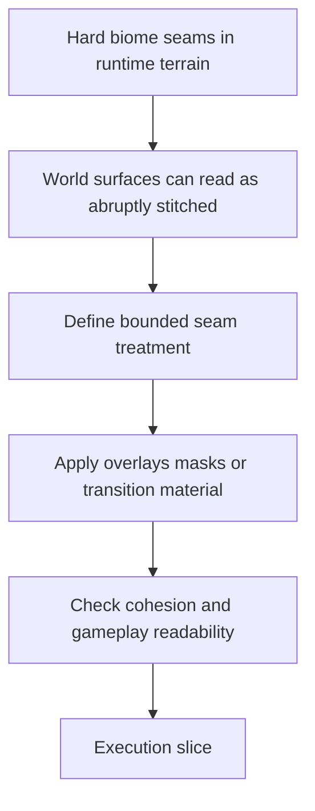

## req_098_define_a_bounded_biome_transition_visual_treatment_to_reduce_hard_map_seams - Define a bounded biome-transition visual treatment to reduce hard map seams
> From version: 0.6.1
> Schema version: 1.0
> Status: Ready
> Understanding: 98%
> Confidence: 95%
> Complexity: Medium
> Theme: UI
> Reminder: Update status/understanding/confidence and references when you edit this doc.

# Needs
- Reduce the visual harshness of current biome boundaries so the world reads as one authored landscape instead of four large surfaces abruptly stitched together.
- Define a first bounded visual-response wave for biome seams without turning the change into a full terrain rewrite, full procedural blending system, or global world-art overhaul.
- Keep gameplay readability intact: biome transitions should feel more organic without making traversal, pickups, hostiles, or combat telegraphs harder to read.
- Prefer seam treatments that look like contamination, fracture, ash spread, or energy bleed rather than like a generic Photoshop fade between two large textures.
- Keep the approach compatible with the current terrain runtime assets, the chunk/world-generation posture, and the existing runtime performance budgets.

# Context
The first graphical terrain wave materially improved the look of the world, but it also made one limitation more obvious:
- biome surfaces now have stronger texture identity
- biome-to-biome boundaries can therefore read as more abrupt
- the current result often looks like one biome texture stopping and another one starting with too little transition material in between

This is especially visible when:
- two biome surfaces meet along a broad straight seam
- the neighboring palettes or values differ sharply
- the player sees the boundary across a large part of the screen at once

This request exists to frame a bounded improvement wave for those transitions:
1. define what the first acceptable biome-seam treatment is
2. define whether the first wave should rely on seam overlays, irregular masks, transition props, or another bounded technique
3. define how transition width and edge irregularity should work
4. define which biome pairs or seam types need attention first
5. define how this should coexist with current terrain textures and world-generation rules
6. define how the result is reviewed so transitions feel less brutal without becoming noisy or muddy

Scope includes:
- defining a bounded visual treatment for reducing hard biome-to-biome seams
- defining acceptable first-line techniques such as irregular seam masks, contamination overlays, fracture overlays, transition strips, or lightweight hybrid props
- defining whether the first wave should be overlay-first rather than a full terrain blending system
- defining how transition width, edge irregularity, and local visual noise should be bounded
- defining which biome pairings should be prioritized first if the rollout must be phased
- defining how the treatment should preserve combat readability and not compete too aggressively with entities and pickups
- defining validation expectations for visual cohesion and readability in runtime scenes

Scope excludes:
- a full procedural terrain mixing engine for every tile combination
- repainting every biome texture from scratch before shipping a transition fix
- a global recolor of the world palette
- a cinematic post-processing system
- shell-only art polish unrelated to world-surface transitions

# Acceptance criteria
- AC1: The request defines a bounded first-wave posture for reducing hard biome seams without requiring a full terrain blending rewrite.
- AC2: The request defines which visual techniques are acceptable first-line candidates, such as irregular seam overlays, contamination masks, fracture treatment, transition strips, or lightweight hybrid props.
- AC3: The request defines how seam width, edge irregularity, and transition restraint should be bounded so the result feels organic without becoming noisy.
- AC4: The request defines how the seam treatment should preserve gameplay readability for entities, pickups, and combat telegraphs.
- AC5: The request defines which biome seams or biome pairings should be prioritized first if the rollout is phased.
- AC6: The request keeps scope bounded by excluding a full procedural terrain-mixing engine, full biome repaint, or heavy rendering/post-processing stack.
- AC7: The request preserves compatibility with the current terrain runtime asset pipeline and world-generation posture.
- AC8: The request defines how the result should be reviewed in real runtime scenes for both visual cohesion and practical readability.

# Dependencies and risks
- Dependency: the current terrain runtime assets from the first graphical wave remain the baseline surfaces to transition between.
- Dependency: current world/chunk generation rules remain the spatial source of biome adjacency unless a later slice introduces a bounded extension.
- Dependency: gameplay readability work from `req_097` remains relevant because seam treatments must not visually compete with entities and pickups.
- Risk: a seam overlay can look artificial if it is too uniform, too linear, or too soft.
- Risk: too much noise or too many transition props could reduce gameplay readability rather than improve world cohesion.
- Risk: attempting to solve every biome pair in one go could over-scope the wave.
- Risk: if the seam treatment is too decorative, it may clash with the current world style instead of making transitions feel more authored.

# AC Traceability
- AC1 -> bounded seam posture. Proof: request explicitly prefers a first-wave transition treatment over a full blending rewrite.
- AC2 -> acceptable techniques. Proof: request explicitly enumerates overlay/mask/transition-material options.
- AC3 -> bounded transition rules. Proof: request explicitly frames width and irregularity constraints.
- AC4 -> gameplay readability. Proof: request explicitly keeps entity/pickup/telegraph readability in scope.
- AC5 -> phased rollout. Proof: request explicitly asks for prioritized seam coverage.
- AC6 -> bounded scope. Proof: request explicitly excludes a terrain-engine rewrite or global re-art.
- AC7 -> pipeline compatibility. Proof: request explicitly keeps current terrain assets and generation posture in scope.
- AC8 -> runtime validation. Proof: request explicitly requires in-game visual review.

# Definition of Ready (DoR)
- [x] Problem statement is explicit and user impact is clear.
- [x] Scope boundaries (in/out) are explicit.
- [x] Acceptance criteria are testable.
- [x] Dependencies and known risks are listed.

# Clarifications
- The most pragmatic starting posture appears to be overlay-first rather than a full terrain mixing system.
- A reasonable first visual language would be contamination, fissure, ash spread, cooled lava veins, synthetic runoff, or biome bleed rather than a neutral fade.
- The first implementation slice should probably prioritize seam treatment shape and restraint before introducing too many bespoke biome-pair assets.
- Validation should check both desktop readability and the default live runtime view where large biome seams are visible across the screen.

# Companion docs
- Product brief(s): `prod_017_graphical_asset_direction_for_runtime_readability_and_shell_identity`
- Architecture decision(s): `adr_052_adopt_a_content_driven_graphical_asset_pipeline_for_runtime_and_shell_surfaces`
# AI Context
- Summary: Define a bounded first-wave visual treatment to reduce abrupt biome seams in the runtime world.
- Keywords: biome transitions, seam overlay, contamination, fracture, terrain cohesion, transition strip, readability
- Use when: Use when framing a focused world-surface polish wave for reducing abrupt biome boundaries.
- Skip when: Skip when the work is about entity sprites, shell theming, or a full terrain engine rewrite.

# References
- `logics/request/req_093_define_a_first_graphical_asset_integration_strategy_for_runtime_and_shell_surfaces.md`
- `logics/request/req_095_process_first_wave_image_generation_prompts_and_integrate_generated_assets_into_the_game.md`
- `logics/request/req_097_define_a_runtime_sprite_separation_posture_for_dark_on_dark_asset_readability.md`
- `logics/product/prod_017_graphical_asset_direction_for_runtime_readability_and_shell_identity.md`
- `logics/architecture/adr_052_adopt_a_content_driven_graphical_asset_pipeline_for_runtime_and_shell_surfaces.md`
- `games/emberwake/src/content/world/worldGeneration.ts`
- `games/emberwake/src/content/world/worldData.ts`
- `src/game/world/render/WorldScene.tsx`

# Backlog
- `item_350_define_biome_transition_seam_rendering_posture_and_asset_coverage`
- `item_352_define_biome_transition_validation_and_phased_runtime_rollout`
