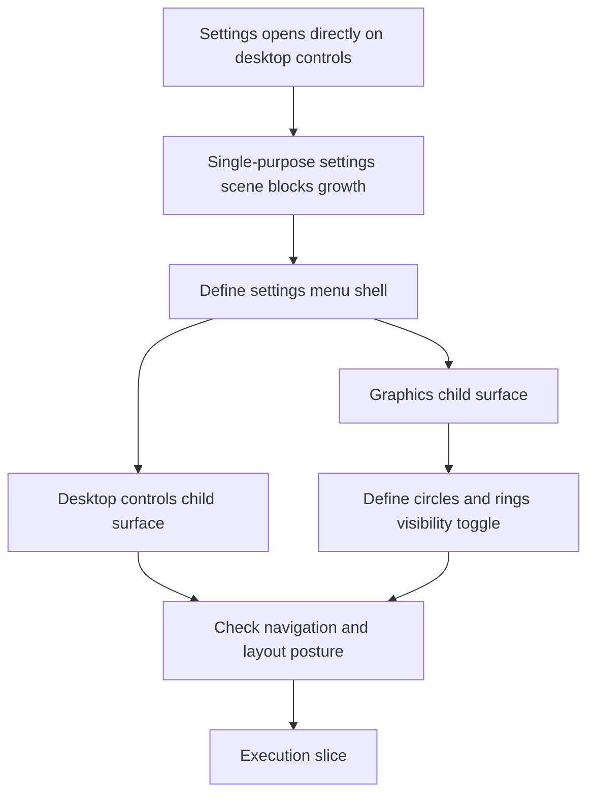

## req_099_define_a_settings_menu_with_desktop_controls_and_graphics_subscreens - Define a settings menu with desktop controls and graphics subscreens
> From version: 0.6.1
> Schema version: 1.0
> Status: Done
> Understanding: 98%
> Confidence: 99%
> Complexity: Medium
> Theme: UI
> Reminder: Update status/understanding/confidence and references when you edit this doc.

# Needs
- Reshape the current `Settings` scene into a small settings menu instead of opening directly on desktop-control calibration.
- Move the current `Input calibration > Desktop controls` surface into its own dedicated settings sub-screen.
- Add a new `Graphics` settings sub-screen alongside `Desktop controls`.
- Expose a bounded player-facing graphics toggle that enables or disables the circles/rings rendered around runtime entities.
- Keep the resulting settings navigation coherent with the existing shell menu, back actions, and large-screen vs mobile-shell posture.

# Context
The current `settings` scene is effectively a single-purpose calibration surface:
- on large layouts it opens directly on `Desktop controls`
- on mobile it shows a message explaining that desktop calibration is unavailable
- there is no category menu inside settings yet

That posture made sense while settings only contained one capability, but it is becoming limiting now that graphics-facing presentation options are needed too.

This request exists to reframe the shell information architecture:
1. `Settings` should become a settings menu, not a direct desktop-control editor
2. `Desktop controls` should remain available, but as a dedicated child surface
3. `Graphics` should become a new child surface inside settings
4. the runtime circles/rings currently rendered around entities should be controllable from `Graphics`

The circles/rings matter because they are no longer only a diagnostics artifact. They now participate in runtime presentation and readability for player, hostiles, and pickups. Operators may therefore want to disable them for a cleaner look, while the product still needs a bounded posture for their default state and exact coverage.

Scope includes:
- defining `Settings` as a category menu with at least `Desktop controls` and `Graphics`
- defining the dedicated `Desktop controls` sub-screen that hosts the current calibration UI
- defining the dedicated `Graphics` sub-screen
- defining a graphics toggle for entity circles/rings used in runtime presentation
- defining which runtime surfaces the toggle affects, such as player, hostiles, pickups, or all supported entity circles together
- defining the persistence posture for the graphics preference
- defining the back-navigation posture between settings menu, sub-screen, shell menu, and main menu
- defining how the settings menu should behave on mobile layouts where desktop controls are not directly usable

Scope excludes:
- a full graphics-options suite with quality presets, resolution scaling, shadow controls, or post-processing controls
- a redesign of mobile gameplay controls
- a rewrite of the shell scene system into many new top-level `AppSceneId` values unless later justified
- redefining the entire entity-presentation stack beyond the bounded circle/ring visibility option
- deeper debug/diagnostics panels unrelated to player-facing settings

# Acceptance criteria
- AC1: The request defines `Settings` as a category menu rather than as a direct desktop-controls calibration surface.
- AC2: The request defines a dedicated `Desktop controls` sub-screen that hosts the current input-calibration surface.
- AC3: The request defines a dedicated `Graphics` sub-screen inside settings.
- AC4: The request defines a bounded graphics option that enables or disables the circles/rings rendered around runtime entities.
- AC5: The request defines which entity categories are affected by the graphics toggle, or explicitly requires that this coverage be decided during implementation.
- AC6: The request defines how the new settings structure should behave on desktop and on mobile layouts.
- AC7: The request defines coherent back-navigation expectations between the settings menu, its sub-screens, and the existing shell scene flow.
- AC8: The request keeps scope bounded by excluding a broader graphics-options suite and unrelated shell rewrites.
- AC9: The request defines whether the graphics preference should persist across sessions.
- AC10: The request references the current settings shell and current entity-ring rendering surfaces so the execution slice starts from the real code paths.

# Dependencies and risks
- Dependency: the current `settings` scene and shell menu flow remain the entry point for the new settings menu.
- Dependency: the current `DesktopControlSettingsSection` remains the baseline content for the new `Desktop controls` sub-screen.
- Dependency: current entity circle/ring rendering in `EntityScene.tsx` remains the baseline visual surface that the graphics toggle will govern.
- Risk: introducing sub-screens inside settings can produce confusing escape/back behavior if menu-to-subscreen transitions are not explicitly defined.
- Risk: calling the option a debug toggle would be misleading if the circles are now part of runtime presentation rather than diagnostics only.
- Risk: mobile settings can become awkward if `Desktop controls` is listed without a clear availability posture.
- Risk: an over-broad graphics screen could quickly drift into a full options menu instead of the bounded first slice requested here.

# AC Traceability
- AC1 -> settings menu posture. Proof: request explicitly reframes settings as a category menu.
- AC2 -> desktop controls sub-screen. Proof: request explicitly moves the current calibration UI into its own child surface.
- AC3 -> graphics sub-screen. Proof: request explicitly adds `Graphics` as a sibling settings surface.
- AC4 -> entity circle toggle. Proof: request explicitly asks for a player-facing graphics toggle for runtime circles/rings.
- AC5 -> toggle coverage. Proof: request explicitly requires defining affected entity categories.
- AC6 -> layout posture. Proof: request explicitly includes desktop and mobile behavior in scope.
- AC7 -> navigation coherence. Proof: request explicitly includes back-navigation expectations.
- AC8 -> bounded scope. Proof: request explicitly excludes a full graphics-options suite and large shell rewrites.
- AC9 -> persistence posture. Proof: request explicitly asks to define whether the preference persists.
- AC10 -> codepath grounding. Proof: request explicitly references current settings and runtime entity-rendering surfaces.

# Definition of Ready (DoR)
- [x] Problem statement is explicit and user impact is clear.
- [x] Scope boundaries (in/out) are explicit.
- [x] Acceptance criteria are testable.
- [x] Dependencies and known risks are listed.

# Clarifications
- The request intentionally treats `Graphics` as a bounded first settings slice, not as the start of a full PC-style options matrix.
- The current circles/rings should be framed as runtime presentation controls, even if some of them originated from debug-oriented visual conventions.
- `Desktop controls` should remain in settings, but should stop owning the top-level identity of the `settings` scene.
- A reasonable first mobile posture is to keep `Graphics` available while defining whether `Desktop controls` is hidden, disabled, or replaced with explanatory copy.

# Companion docs
- Product brief(s): `prod_017_graphical_asset_direction_for_runtime_readability_and_shell_identity`
- Architecture decision(s): `adr_052_adopt_a_content_driven_graphical_asset_pipeline_for_runtime_and_shell_surfaces`

# AI Context
- Summary: Define a settings menu with desktop controls and graphics subscreens
- Keywords: settings, menu, graphics, desktop controls, shell navigation, entity circles, runtime presentation
- Use when: Use when framing a bounded settings-navigation and graphics-option slice inside the Emberwake shell.
- Skip when: Skip when the work is about gameplay input logic, deep renderer settings, or debug tooling unrelated to player-facing settings.

# Backlog
- `item_353_define_settings_menu_navigation_and_child_surface_structure`
- `item_354_define_graphics_settings_toggle_for_runtime_entity_circles_and_rings`
# References
- `src/app/components/AppMetaScenePanel.tsx`
- `src/app/components/AppMetaScenePanel.test.tsx`
- `src/app/components/DesktopControlSettingsSection.tsx`
- `src/app/components/SettingsSceneContent.tsx`
- `src/app/components/ShellMenu.tsx`
- `src/app/hooks/useAppScene.ts`
- `src/app/hooks/useShellPreferences.ts`
- `src/app/model/appScene.ts`
- `src/game/entities/render/EntityScene.tsx`
