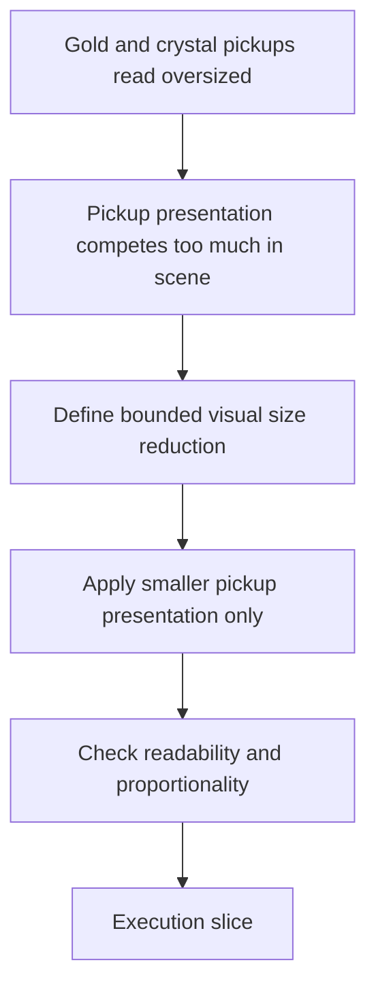

## req_100_reduce_gold_and_crystal_pickup_runtime_presentation_size_by_half - Reduce gold and crystal pickup runtime presentation size by half
> From version: 0.6.1
> Schema version: 1.0
> Status: Ready
> Understanding: 99%
> Confidence: 97%
> Complexity: Medium
> Theme: UI
> Reminder: Update status/understanding/confidence and references when you edit this doc.

# Needs
- Reduce the runtime visual size of `gold` and `crystal` pickups by 50 percent relative to their current presentation.
- Keep this change strictly on the presentation side unless implementation later proves that gameplay coupling must be revisited explicitly.
- Preserve pickup readability and category recognition after the size reduction.
- Avoid unintentionally shrinking other pickup families such as `cache`, `healing-kit`, `hourglass`, or `magnet`.

# Context
The first graphical pickup wave improved the look of pickups, but the current `gold` and `crystal` runtime presentation reads too large relative to the scene:
- they occupy too much visual space
- they compete more than needed with hostiles and the player silhouette
- they currently feel oversized compared with the role they serve in the run

This request exists to frame a bounded tuning wave:
1. reduce the visual presentation size of `gold` and `crystal`
2. make that reduction explicit as a `2x smaller` visual outcome
3. keep gameplay logic, pickup radius, economy value, and spawn logic out of scope unless a real coupling is discovered
4. preserve the current asset pipeline and pickup-specific readability treatment

The most important constraint is that "smaller" should mean runtime presentation size, not:
- reduced pickup collection radius
- reduced footprint or collision radius
- reduced reward value
- reduced spawn chance or economy output

Scope includes:
- defining the visual size reduction for `entity.pickup.gold.runtime` and `entity.pickup.crystal.runtime`
- defining whether the size change should be applied through pickup-specific runtime sizing rules, content metadata, or another bounded presentation mechanism
- defining how any outline, ring, or separation treatment scales with the new smaller pickup size
- defining how the smaller pickups are reviewed in real runtime scenes for readability and proportionality

Scope excludes:
- changing non-gold, non-crystal pickup families
- changing pickup gameplay radius or collection behavior
- changing gold value, crystal XP value, or spawn rates
- re-generating the pickup assets unless runtime sizing proves insufficient
- a full pickup-presentation rebalance across every pickup type

# Acceptance criteria
- AC1: The request defines a bounded visual size reduction of 50 percent for `gold` and `crystal` pickup presentation.
- AC2: The request makes clear that the requested reduction concerns runtime presentation size rather than pickup gameplay radius, footprint, reward value, or spawn logic.
- AC3: The request keeps scope limited to `gold` and `crystal` rather than broadening into a full pickup-size rebalance.
- AC4: The request defines that readability and category recognition must remain acceptable after the size change.
- AC5: The request defines how pickup-specific runtime separation treatment should behave once the pickup visuals are smaller.
- AC6: The request references the real code paths currently responsible for pickup presentation sizing.

# Dependencies and risks
- Dependency: current pickup presentation is driven through the runtime entity rendering path and current pickup asset ids.
- Dependency: current pickup readability treatment from the sprite separation work remains relevant once the visuals are smaller.
- Risk: a strict 50 percent reduction could make gold and crystal pickups too easy to miss if outline or ring treatment is not tuned with them.
- Risk: implementation could accidentally shrink gameplay footprint or pickup collection feel if presentation and gameplay size are not kept separate.
- Risk: solving this through global pickup rules rather than pickup-specific posture could unintentionally affect other pickup families.

# AC Traceability
- AC1 -> bounded visual reduction. Proof: request explicitly defines a 50 percent smaller runtime presentation target.
- AC2 -> presentation-only scope. Proof: request explicitly excludes gameplay radius, footprint, value, and spawn tuning.
- AC3 -> bounded pickup roster. Proof: request explicitly limits the change to `gold` and `crystal`.
- AC4 -> readability guardrail. Proof: request explicitly keeps recognition and readability in scope.
- AC5 -> separation treatment scaling. Proof: request explicitly includes outline/ring behavior with the smaller visuals.
- AC6 -> codepath grounding. Proof: request explicitly references current pickup asset and render surfaces.

# Definition of Ready (DoR)
- [x] Problem statement is explicit and user impact is clear.
- [x] Scope boundaries (in/out) are explicit.
- [x] Acceptance criteria are testable.
- [x] Dependencies and known risks are listed.

# Clarifications
- The request should be interpreted as "render them at half the current visual size" rather than "change all pickup scale constants globally."
- `gold` and `crystal` are the only targeted pickups in this wave because they are the most numerous and currently the most visually dominant among small rewards.
- If implementation reveals that current runtime sizing is derived from a shared pickup rule, the delivery slice should still keep the effective outcome bounded to these two pickups only.
- Review should happen in live runtime scenes with hostiles, terrain, and the current pickup-outline treatment visible.

# Companion docs
- Product brief(s): (none yet)
- Architecture decision(s): (none yet)

# AI Context
- Summary: Reduce the runtime visual size of gold and crystal pickups by half without changing pickup gameplay behavior.
- Keywords: pickup size, gold pickup, crystal pickup, runtime presentation, visual tuning, pickup readability
- Use when: Use when framing a bounded visual tuning slice for oversized reward pickups in Emberwake.
- Skip when: Skip when the work is about pickup economy, spawn rates, collision radius, or a full pickup rebalance.

# Backlog

- `item_355_reduce_gold_and_crystal_pickup_runtime_presentation_size_by_half`
# References
- `games/emberwake/src/content/entities/entityData.ts`
- `src/assets/assetCatalog.ts`
- `src/game/entities/render/EntityScene.tsx`
