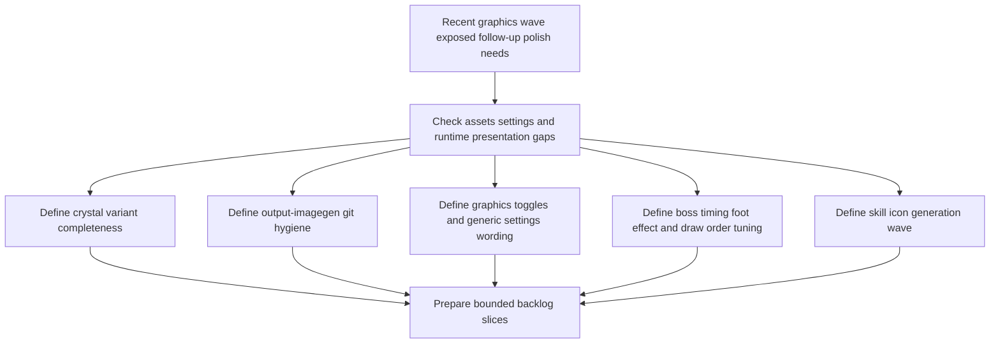

## req_101_define_a_follow_up_graphics_settings_and_runtime_presentation_polish_wave - Define a follow-up graphics, settings, and runtime presentation polish wave
> From version: 0.6.1
> Schema version: 1.0
> Status: Ready
> Understanding: 98%
> Confidence: 95%
> Complexity: High
> Theme: UI
> Reminder: Update status/understanding/confidence and references when you edit this doc.

# Needs
- Verify that the game visually supports the three different crystal types, and if the roster is incomplete or not readable enough, define whether missing variants should be generated or whether color-derived variants are acceptable.
- Stop versioning generated working outputs under `output/imagegen/` by adding that folder content to `.gitignore` and defining how already-tracked files should be de-versioned without deleting them from disk.
- Extend `Settings > Graphics` with a second bounded toggle that enables or disables the visual seam effect rendered between biomes.
- Make the `Settings` menu entries read more generically so the child screens can grow later without over-specific labels.
- Reduce boss cadence so bosses appear every 2 minutes instead of every 5 minutes.
- Add a bounded movement-cover effect around the player feet, such as cloud or circular ash motion, to hide the lack of visible legs and help sell movement.
- Ensure entity debug circles render behind sprite assets rather than in front of them.
- Make both the debug-circle option and the biome-seam effect option disabled by default.
- Start a new asset-production wave for skill icons using the same image-generation workflow already used for character and hostile assets.

# Context
The previous graphical waves improved the runtime presentation substantially, but they also exposed a new class of follow-up polish needs:
- some asset families still need completeness or clearer differentiation, such as crystal variants
- some generated-asset workflows now leave working outputs in version control when they should remain scratch/operator artifacts
- `Settings > Graphics` now exists, so additional bounded player-facing presentation toggles can live there
- some presentation layers still need ordering or polish adjustments, such as debug circles drawing in front of sprites
- some authored gameplay timings and presentation effects now need re-tuning for the stronger asset-driven look

This request intentionally groups those follow-ups because they all sit in the same broader graphical/shell/runtime polish space, but it is expected to split into smaller delivery slices before implementation.

The goal is to frame the next coherent wave around:
1. crystal-variant completeness and readability
2. generated-asset workflow hygiene for `output/imagegen`
3. graphics-settings expansion with bounded toggles and safer defaults
4. runtime presentation ordering and player-foot motion polish
5. boss timing tuning
6. skill-icon asset generation readiness

Scope includes:
- checking the current crystal asset roster and defining how the three crystal types should differ visually
- defining the repo hygiene posture for generated image outputs under `output/imagegen`
- defining a new biome-seam graphics toggle and its default state
- defining more generic settings-menu entry wording for future growth
- defining the boss cadence change from 5 minutes to 2 minutes
- defining a bounded player-foot motion-cover effect posture
- defining sprite-vs-debug-circle draw-order expectations
- defining the next skill-icon generation wave using the existing API-backed asset workflow

Scope excludes:
- a full redesign of the settings system beyond the bounded graphics/menu adjustments above
- a complete combat rebalance beyond the boss appearance cadence change
- a full player character re-authoring pass
- a complete pickup or terrain rewrite outside the explicitly named follow-ups
- a full skill-icon integration rollout unless later split into its own delivery slice

# Acceptance criteria
- AC1: The request defines how the three crystal types should be represented visually and what to do if one or more variants are currently missing or not readable enough.
- AC2: The request defines the repo hygiene posture for `output/imagegen`, including ignoring its working contents and de-versioning tracked artifacts without deleting them locally.
- AC3: The request defines a bounded `Graphics` option for enabling or disabling biome seam effects.
- AC4: The request defines that both the debug-circle option and the biome-seam option default to disabled.
- AC5: The request defines more generic settings-menu entry wording so child screens can later absorb more options without immediate renaming pressure.
- AC6: The request defines the boss spawn cadence change from 5 minutes to 2 minutes.
- AC7: The request defines a bounded movement-cover effect around the player feet to better hide the absence of visible legs.
- AC8: The request defines that debug circles must render behind entity sprites rather than in front of them.
- AC9: The request defines the next skill-icon asset generation wave using the existing API-backed generation workflow as the baseline posture.
- AC10: The request stays bounded by making clear that these needs must be split into coherent implementation slices before execution.

# Dependencies and risks
- Dependency: the current first-wave and directional asset workflow remains the baseline for crystal, player, and future skill-icon assets.
- Dependency: the current `Settings > Graphics` surface remains the entry point for any new bounded presentation toggles.
- Dependency: current biome seam rendering and current entity debug-circle rendering remain the baseline behaviors to tune rather than replace wholesale.
- Risk: mixing repo hygiene, gameplay cadence, settings UX, and visual polish in one direct execution wave would over-scope delivery unless split carefully.
- Risk: recoloring crystal variants might be cheaper than generation, but could also be visually insufficient if the silhouettes need stronger differentiation.
- Risk: defaulting more graphics helpers to off could reduce readability if the baseline assets are not strong enough on their own.
- Risk: a player-foot cover effect could become noisy or obscure combat readability if it is too bright, too large, or too animated.

# AC Traceability
- AC1 -> crystal roster completeness. Proof: request explicitly asks whether the three crystal types exist visually and what to do if they do not.
- AC2 -> generated-output hygiene. Proof: request explicitly asks for `output/imagegen` to be ignored and de-versioned without deletion.
- AC3 -> graphics seam toggle. Proof: request explicitly asks for seam-effect activation to be controllable from settings graphics.
- AC4 -> safer defaults. Proof: request explicitly asks for both debug-circle and seam toggles to default to disabled.
- AC5 -> generic settings wording. Proof: request explicitly asks that settings entries become less typed and more future-proof.
- AC6 -> boss cadence. Proof: request explicitly asks for bosses every 2 minutes instead of 5.
- AC7 -> player foot effect. Proof: request explicitly asks for a cloud/circle movement-cover effect around the player feet.
- AC8 -> draw order. Proof: request explicitly asks that debug circles render behind entity assets.
- AC9 -> skill icon asset wave. Proof: request explicitly asks for API-backed generation of skill icon assets.
- AC10 -> bounded delivery. Proof: request explicitly frames the need for later split rather than direct monolithic execution.

# Definition of Ready (DoR)
- [x] Problem statement is explicit and user impact is clear.
- [x] Scope boundaries (in/out) are explicit.
- [x] Acceptance criteria are testable.
- [x] Dependencies and known risks are listed.

# Clarifications
- The three crystal types should be checked against the current XP-tier roster already present in game content rather than against an unrelated visual taxonomy.
- The preferred crystal posture is color-derived differentiation first, with stronger generation only if recolor-level differentiation is not readable enough in runtime scenes.
- The preferred crystal differentiation should stay inside one visual family, using color, intensity, and a small aura or secondary-effect variation before considering fully different silhouettes.
- The `output/imagegen` change is about repository hygiene, not deletion of local operator work products, and the default target is to ignore the whole `output/imagegen/**` tree rather than keep lightweight artifacts versioned there.
- The new biome toggle should govern only the added seam-transition effect, not terrain ownership or biome-generation logic.
- The biome-seam toggle should remain visible in `Settings > Graphics` even though the effect defaults to off, so the effect remains discoverable and reviewable.
- The settings-menu wording should become more generic first at the parent menu level, while child surfaces can remain explicit until they absorb more options.
- A good default wording posture for the settings parent menu is category labels such as `Controls` and `Display`, rather than very specific labels tied to only one current option.
- Boss cadence should be interpreted as a strict global appearance rhythm of every 2 minutes unless implementation proves the existing system requires an equivalent but differently-expressed timing rule.
- The boss-timing default should include the first appearance at 2 minutes, then keep the regular 2-minute cadence.
- The player-foot cover effect should stay subtle, should be strongest while moving, and should not become a constant bright fog that competes with combat readability.
- The preferred art direction for the player-foot cover effect is ash-cloud motion with a few restrained circular traces, rather than a bright techno-energy ring treatment.
- The debug-circle follow-up should start with render-order correction first, placing the circles behind the sprite assets before any separate visual retuning is considered.
- The debug-circle-behind-sprites rule should apply consistently across covered runtime entity categories, including pickups when they use the same circle layer.
- Both the debug-circle option and the biome-seam option should default to disabled but remain persisted once the operator changes them.
- The future skill-icon wave should reuse the current image-generation posture rather than inventing a second asset pipeline, and it should target the full current skill roster rather than only a narrow first-wave subset.
- The full current skill roster should be interpreted broadly enough to include any fusion-facing icons that are already part of the visible player-facing skill surface, so the UI does not remain mixed between generated and placeholder icon families.
- This request should be split before execution because it spans repo hygiene, settings UX, runtime presentation, boss timing, and asset generation.

# Companion docs
- Product brief(s): `prod_017_graphical_asset_direction_for_runtime_readability_and_shell_identity`
- Architecture decision(s): `adr_052_adopt_a_content_driven_graphical_asset_pipeline_for_runtime_and_shell_surfaces`

# AI Context
- Summary: Define the next multi-slice polish wave across crystals, settings graphics, repo hygiene, boss cadence, player-foot presentation, draw order, and skill icon generation.
- Keywords: crystals, output imagegen, gitignore, settings graphics, biome seam toggle, debug circles, boss timing, player foot effect, skill icons
- Use when: Use when framing the next graphical and settings follow-up wave after the first asset and seam deliveries.
- Skip when: Skip when the work is already narrowly scoped to one of these slices and can be framed directly as backlog or task work.

# References
- `src/app/components/AppMetaScenePanel.tsx`
- `src/app/components/SettingsSceneContent.tsx`
- `src/app/hooks/useShellPreferences.ts`
- `src/game/entities/render/EntityScene.tsx`
- `src/game/entities/render/entityPresentation.ts`
- `src/game/world/render/WorldScene.tsx`
- `src/game/world/render/biomeSeamPresentation.ts`
- `games/emberwake/src/content/entities/entityData.ts`
- `games/emberwake/src/content/world/worldData.ts`
- `scripts/assets/generateFirstWaveAssets.mjs`
- `scripts/assets/promoteFirstWaveAssets.mjs`
- `scripts/assets/generateDirectionalEntityAssets.mjs`
- `output/imagegen/first-wave/selection.json`
- `output/imagegen/directional-entities/selection.json`

# Backlog
- `item_356_define_crystal_variant_completeness_and_reward_pickup_differentiation`
- `item_357_define_generated_image_output_repo_hygiene_and_deversioning_posture`
- `item_358_define_graphics_settings_expansion_defaults_and_generic_menu_wording`
- `item_359_define_runtime_presentation_polish_for_player_foot_cover_and_debug_circle_layering`
- `item_360_define_two_minute_boss_cadence_and_runtime_validation`
- `item_361_define_full_skill_icon_generation_workflow_and_asset_coverage`
- `item_362_define_skill_icon_promotion_integration_and_validation`
