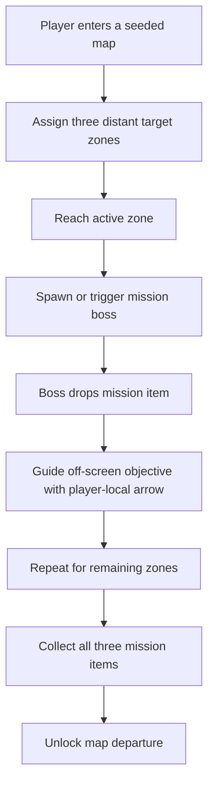

## req_102_define_a_primary_map_mission_loop_with_three_target_zones_bosses_and_key_items - Define a primary map mission loop with three target zones, bosses, and key items
> From version: 0.6.1+task071
> Schema version: 1.0
> Status: Ready
> Understanding: 100%
> Confidence: 98%
> Complexity: High
> Theme: Gameplay
> Reminder: Update status/understanding/confidence and references when you edit this doc.

# Needs
- Introduce a first-class notion of primary map mission or story objective.
- Require the player to travel across the map by visiting three target zones that are meaningfully far from one another.
- Require at least 10000 world units of spacing between each major-boss mission zone so the mission truly drives long-distance traversal.
- Trigger a major boss encounter when the player reaches each designated mission zone.
- Make each mission boss drop a specific mission item on defeat.
- Mark the map primary mission as complete only after the player has defeated all three bosses and collected all three dropped items.
- Gate map departure so the player can only leave the map after the primary mission is complete.
- Add an on-screen directional arrow around the player whenever the current mission zone, mission boss, or dropped mission item is off-screen.
- Reuse the same directional-arrow posture for mini-bosses when they are off-screen.
- Establish this as the baseline map-mission loop, while keeping future side quests explicitly out of scope for now.
- Define that each mission boss will need its own visual design and therefore its own generated asset in a later delivery slice.

# Context
The current runtime already supports seeded world generation, traversal, combat, pickups, bosses, and run progression. What it does not yet have is a clear authored mission structure that gives the player a directed reason to move through the map beyond pure survival and pressure management.

This request introduces the first baseline story or mission loop at the map level:
1. the player enters a map
2. the game designates three mission zones spread across the map
3. each time the player reaches the active zone, a major boss encounter starts
4. defeating that boss grants a mission-critical item
5. after all three bosses are defeated and all three items are collected, the map primary mission is complete
6. only then can the player leave the map

This mission loop should stay clearly distinct from the current survival-pressure cadence that already spawns a mini-boss every two minutes. Those periodic two-minute encounters remain mini-bosses. The three authored mission encounters introduced here are the true mission bosses and should be framed as a separate gameplay layer with stronger objective ownership.

The intent is not to build a full quest system immediately. The intent is to create a first durable mission backbone for each map so traversal, combat beats, and extraction conditions all align around a readable player objective.

This request should also establish that the three mission zones should not collapse into a tiny local cluster. They should be placed far enough apart to force meaningful movement across the map and to make the run feel spatially structured rather than locally repetitive.

The first mission wave also needs a bounded guidance layer. Because the target zones, bosses, and mission drops may be far outside the current camera view, the player needs a simple directional cue around the player avatar that points toward the active mission objective whenever it is off-screen. The same visual guidance pattern should also be reused for mini-bosses so off-screen elite threats remain discoverable without adding a full minimap or quest tracker first.

Scope includes:
- defining a per-map primary mission structure with three ordered or otherwise explicit target zones
- defining distance expectations so the three zones meaningfully distribute traversal across the map, including a minimum spacing contract between major-boss zones
- defining how a mission zone becomes active and how arrival is detected
- defining the boss encounter contract for each mission zone
- defining the boss-drop mission item contract
- defining how mission completion is detected after all three drops are secured
- defining that leaving the map is blocked until the primary mission is complete
- defining a bounded off-screen directional arrow for the active mission zone, mission boss, and dropped mission item
- defining the same off-screen directional-arrow posture for mini-bosses
- defining that each mission boss requires a bespoke generated asset rather than reusing a generic boss presentation
- defining the distinction between periodic mini-bosses and the three authored mission bosses

Scope excludes:
- side quests, optional events, or a broader quest journal system
- a full narrative-writing pass with dialogue, cutscenes, or branching story content
- a complete campaign map of many missions chained together
- detailed boss-mechanics authoring beyond the requirement that each zone culminates in a major boss beat
- implementation of the later asset-generation wave itself, beyond noting the dependency for bespoke boss visuals

# Acceptance criteria
- AC1: The request defines a primary map mission structure made of three designated target zones inside a single map run.
- AC2: The request defines that the three target zones must be far enough apart to force meaningful traversal across the map rather than remaining in one local cluster, with a minimum spacing of 10000 world units between each major-boss zone.
- AC3: The request defines that reaching each designated mission zone triggers a major boss encounter for that zone.
- AC4: The request defines that each mission boss drops a mission-specific item on defeat.
- AC5: The request defines that the map primary mission is complete only after the player has both defeated all three mission bosses and collected all three dropped mission items.
- AC6: The request defines that the player cannot leave the map before the primary mission is complete, or explicitly requires the exact exit-gating posture to be implemented from this rule.
- AC7: The request defines a bounded directional arrow around the player that points toward the active mission zone, active mission boss, or dropped mission item whenever that target is off-screen.
- AC8: The request defines that the same directional-arrow posture should also be used for off-screen mini-bosses.
- AC9: The request defines that the current two-minute boss cadence remains a mini-boss cadence and is distinct from the three authored mission bosses introduced by this mission system.
- AC10: The request defines that each mission boss should have its own visual identity and should later receive its own generated asset rather than sharing one generic boss presentation.
- AC11: The request stays bounded by establishing this as the baseline map mission loop while explicitly leaving side quests, broader narrative systems, and campaign chaining out of scope for now.

# Dependencies and risks
- Dependency: seeded world generation remains the spatial foundation for placing mission zones on each map.
- Dependency: current boss-scale hostile presentation and combat systems remain the likely baseline for mission boss encounters.
- Dependency: the existing two-minute mini-boss cadence remains the baseline ambient pressure beat and should not be conflated with authored mission-boss progression.
- Dependency: pickup and mission-item ownership will need a bounded extension rather than a full inventory-system rewrite.
- Dependency: the current shell and runtime HUD layers remain the likely host surface for a player-local off-screen guidance arrow.
- Risk: if the three target zones are not spatially constrained well enough, the mission can collapse into a shallow local loop and fail its traversal goal.
- Risk: if map exit gating is introduced without a clear player-facing mission state, the player can feel trapped rather than directed.
- Risk: tying all three beats to bosses without careful pacing could make the mission loop feel repetitive unless zone identity, boss identity, or reward identity differ enough.
- Risk: if the off-screen guidance arrow is too noisy, it can clutter combat readability or overwhelm the player with competing directions when both mission and mini-boss guidance are active.
- Risk: the request spans traversal structure, boss spawning, mission state, and extraction gating, so it should split before execution rather than being delivered as one monolithic change.

# Open questions
- Should the three zones be completed in a strict order or can multiple target zones be revealed at once?
  Recommended default: use one active target zone at a time so the primary mission stays legible in the first wave.
- Should the mission boss appear immediately on zone arrival or only after a secondary local trigger?
  Recommended default: trigger the mission boss immediately on zone arrival, with only a short telegraphed intro if needed.
- Should the mission items be purely objective tokens or also grant bounded gameplay value when picked up?
  Recommended default: treat them first as objective-critical items; any extra gameplay bonus should remain optional and bounded.
- Should mission drops require an explicit interaction to collect?
  Recommended default: collect them automatically on contact so mission progression cannot fail on an unnecessary interaction step.
- If a mission boss is defeated but the mission item remains uncollected off-screen, should the arrow point to the item instead of the cleared boss zone?
  Recommended default: yes, the dropped mission item should become the highest-priority mission guidance target until it is collected.
- When both a mission objective and a mini-boss are off-screen, which target owns the arrow?
  Recommended default: mission objective guidance wins; mini-boss guidance is secondary and should only surface when no higher-priority mission target is off-screen.
- Should the player be able to leave early and forfeit progress, or should departure be hard-locked until completion?
  Recommended default: hard-lock map departure until the three-item primary mission is complete, because that is the stated product goal for this first mission model.

# Definition of Ready (DoR)
- [x] Problem statement is explicit and user impact is clear.
- [x] Scope boundaries (in/out) are explicit.
- [x] Acceptance criteria are testable.
- [x] Dependencies and known risks are listed.

# Clarifications
- The mission model introduced here is the default primary mission of a map, not a secondary layer on top of a pre-existing quest system.
- The three target zones should be distant enough to make the player move meaningfully across the map, but the exact algorithm for zone selection can be defined later.
- The spacing contract for the first wave is explicit: each major-boss mission zone should be at least 10000 world units away from the others.
- A reasonable first-wave posture is to keep one active mission target visible at a time rather than exposing all three simultaneously.
- A reasonable first-wave posture is to trigger the mission boss as soon as the player enters the active mission zone, rather than layering another objective trigger inside the zone.
- The map should only become leaveable once all three bosses are defeated and all three mission items are collected.
- Mission drops should be collected automatically on contact rather than requiring a separate interaction prompt.
- Each mission boss should be treated as having its own authored visual identity so future asset-generation work can target three distinct boss assets rather than a single shared boss family.
- The mission-guidance arrow should only appear when the relevant target is off-screen, so it behaves as a bounded locator rather than as a permanent HUD compass.
- When a mission boss has already been defeated but its mission item remains uncollected, the dropped mission item should become the primary guidance target.
- When both mission guidance and mini-boss guidance are eligible, mission guidance should take precedence and mini-boss guidance should remain secondary.
- The same off-screen arrow posture should also cover mini-bosses, so important combat beats outside the camera remain readable without introducing a full minimap first.
- The hostile encounters that appear on the existing two-minute cadence should continue to be treated as mini-bosses; they are not the same thing as the three mission bosses tied to objective zones.
- Side quests are intentionally out of scope in this request and should be framed as later follow-up work after the base map mission loop exists.

# Companion docs
- Product brief(s): (none yet)
- Architecture decision(s): (none yet)
- Request(s): (none yet)

# AI Context
- Summary: Define a baseline map mission loop where the player travels to three distant target zones, defeats three mission bosses, collects three items, and only then can leave the map, while keeping the existing two-minute encounters as mini-bosses.
- Keywords: mission, story, map, zone, mission boss, mini-boss, item, extraction, progression, traversal, off-screen arrow
- Use when: Use when framing the first mission-structured map loop for Emberwake.
- Skip when: Skip when the work is only about side quests, narrative writing, or cosmetic boss assets without mission-state changes.

# References
- `games/emberwake/src/content/world/worldGeneration.ts`
- `games/emberwake/src/content/world/worldData.ts`
- `games/emberwake/src/runtime/entitySimulation.ts`
- `games/emberwake/src/runtime/hostilePressure.ts`
- `src/game/world/render/WorldScene.tsx`
- `src/game/entities/render/EntityScene.tsx`
- `src/game/render/RuntimeSurface.tsx`
- `src/app/AppShell.tsx`

# Backlog
- `item_363_define_primary_map_mission_zone_selection_and_boss_encounter_structure`
- `item_364_define_primary_map_mission_item_collection_and_map_exit_unlock`
- `item_365_define_offscreen_mission_and_miniboss_guidance_arrow_posture`
