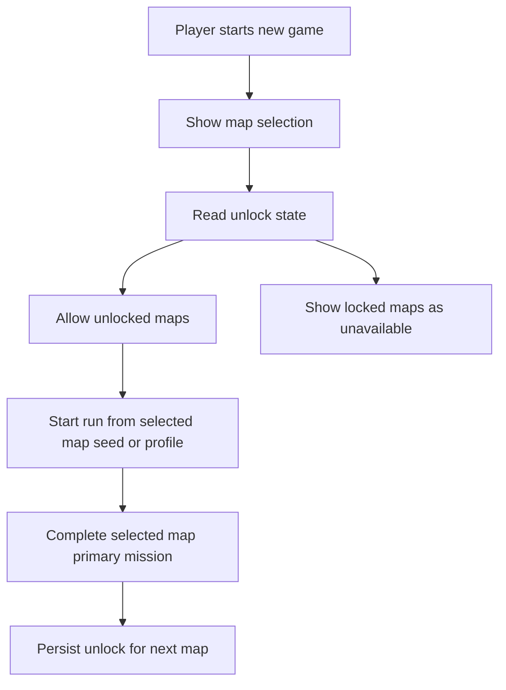

## req_103_define_new_game_map_selection_and_mission_gated_map_unlock_progression - Define new-game map selection and mission-gated map unlock progression
> From version: 0.6.1
> Schema version: 1.0
> Status: Ready
> Understanding: 98%
> Confidence: 96%
> Complexity: High
> Theme: Progression
> Reminder: Update status/understanding/confidence and references when you edit this doc.

# Needs
- Add a map-selection step when the player starts a new game.
- Present the available maps as distinct start choices rather than always dropping immediately into one default seed.
- Treat each available map as a different starting seed or equivalent seeded run origin.
- Gate later maps behind progression so not all maps are available immediately.
- Make the first map available by default.
- Unlock the second map only after the player has completed the primary mission of the first map.
- Establish this as the first map-unlock progression posture so more maps can be added later under the same rule family.

# Context
The runtime is already seed-driven, and the shell already has a `new game` flow. What is missing is a player-facing selection layer that lets the player choose among available maps and a progression gate that turns mission completion into unlocked content.

This request introduces that first progression loop at the campaign-shell level:
1. when the player starts a new game, they should pick from available maps
2. each map corresponds to a distinct seed or seeded starting profile
3. only maps the player has unlocked should be selectable
4. map one is unlocked by default
5. map two remains locked until the primary mission of map one is completed

The immediate product goal is not to build a full meta-progression tree. It is to connect the new primary map mission system to a first meaningful unlock gate so the game can grow into a map-by-map progression arc.

This request should also keep the shell posture bounded:
- it should define the availability or locked-state presentation of maps in the new-game flow
- it should define what progression fact is persisted to remember unlock state
- it should not automatically widen into a complete campaign UI or save-slot overhaul

Scope includes:
- defining a map-selection step in the new-game flow
- defining the relationship between a map choice and a seed or seeded map profile
- defining which maps are available vs locked in the new-game screen
- defining that the first map is unlocked by default
- defining that the second map unlocks after completion of the first map's primary mission
- defining that this posture should scale to future maps rather than remain a hard-coded one-off
- defining the persistence expectation for mission-complete unlock facts

Scope excludes:
- a full campaign-overworld screen or chapter-select presentation
- a full save-slot redesign
- nonlinear unlock trees, branching world maps, or meta-currency map purchases
- a requirement to ship many maps immediately beyond the first bounded unlock posture
- deeper narrative progression systems beyond the map-unlock gate itself

# Acceptance criteria
- AC1: The request defines a map-selection step inside the new-game flow rather than always starting from one implicit map.
- AC2: The request defines that each selectable map corresponds to a distinct seed or equivalent seeded map profile.
- AC3: The request defines that maps can appear as unlocked or locked in the new-game flow.
- AC4: The request defines that the first map is available by default.
- AC5: The request defines that the second map unlocks only after the first map's primary mission has been completed.
- AC6: The request defines a persistence posture for unlock state so map availability survives beyond the immediate run session.
- AC7: The request defines this progression gate as expandable to future maps rather than as a one-off rule that cannot scale.
- AC8: The request keeps scope bounded by excluding a full campaign-overworld redesign, save-slot overhaul, or branching progression tree.

# Dependencies and risks
- Dependency: the primary map mission loop must exist or be clearly owned elsewhere because map unlocking depends on mission completion.
- Dependency: the current `new game` shell entry remains the launch point for map selection rather than creating an unrelated parallel start flow.
- Dependency: runtime session seed handling remains the baseline mechanism for making maps start differently.
- Risk: if map identity is only a raw seed string, the player-facing selection may feel too technical unless map labels and locked-state presentation are authored cleanly.
- Risk: if unlock persistence is not explicit, players may lose progression or see inconsistent map availability across sessions.
- Risk: coupling map unlocks to mission completion before the mission system exists operationally will require careful split ordering in backlog and task planning.

# Open questions
- Should map selection expose both authored map identity and raw seed variation, or only authored map choices?
  Recommended default: expose authored map choices to players and keep raw seed details internal unless there is a separate debug or advanced mode.
- Should locked maps remain visible but disabled, or be hidden entirely?
  Recommended default: keep locked maps visible but disabled so the progression target remains legible.
- Should a "map" be modeled as a raw seed or as an authored map profile that owns at least one seed and player-facing metadata?
  Recommended default: treat a map as an authored map profile that encapsulates seed behavior rather than exposing a raw seed string directly to players.
- Should unlock progression be stored only in run state or in persistent meta progression?
  Recommended default: persist map unlock facts in meta progression so future new-game flows can immediately expose newly unlocked maps.
- Once map two is unlocked, should the player be able to choose it directly on any future new game?
  Recommended default: yes, unlocked maps should remain selectable on subsequent new-game starts.
- Should the first new-game map-selection screen stay minimal or also include rich previews and difficulty panels immediately?
  Recommended default: keep the first wave simple, with map name, lock state, and at most a short authored description.
- Should only map two be gated initially, or should the system be framed from day one as a generic unlock ladder?
  Recommended default: implement the first concrete gate as map one -> map two while structuring data so later maps can follow the same pattern.

# Definition of Ready (DoR)
- [x] Problem statement is explicit and user impact is clear.
- [x] Scope boundaries (in/out) are explicit.
- [x] Acceptance criteria are testable.
- [x] Dependencies and known risks are listed.

# Clarifications
- The new-game flow should gain a bounded map-selection step rather than becoming a full meta-progression hub.
- A map choice should be player-facing and authored, even if the implementation underneath is a seed or seeded profile.
- The preferred contract is an authored map profile that owns player-facing identity plus one or more seed-related implementation details, rather than exposing raw seed strings in the shell.
- The first map should be available immediately without any prior progression requirement.
- The second map should be locked until the first map's primary mission has been completed.
- A good first-wave posture is to show locked maps visibly but as unavailable, so the player can understand future unlock targets.
- The progression fact that unlocks maps should be persisted as part of meta progression rather than only in one volatile runtime session.
- Once a map is unlocked, it should remain selectable on future new-game flows rather than acting as a one-time temporary unlock.
- The first-wave new-game map-selection surface should stay simple and avoid widening immediately into a richer campaign map, difficulty dashboard, or save-slot redesign.
- This request depends on the primary-map-mission request and should later reference it explicitly in backlog and task planning.

# Companion docs
- Product brief(s): (none yet)
- Architecture decision(s): (none yet)
- Request(s): `req_102_define_a_primary_map_mission_loop_with_three_target_zones_bosses_and_key_items`

# AI Context
- Summary: Define a new-game map-selection step with progression-gated map unlocks driven by primary mission completion.
- Keywords: map selection, new game, progression, unlock, seed, mission gate, meta progression
- Use when: Use when framing player-facing map choice and mission-based unlock progression in Emberwake.
- Skip when: Skip when the work is only about one map's runtime mission logic or about unrelated shell menus.

# References
- `src/app/AppShell.tsx`
- `src/app/model/appScene.ts`
- `src/app/model/metaProgression.ts`
- `src/shared/lib/runtimeSessionStorage.ts`
- `games/emberwake/src/runtime/emberwakeSession.ts`
- `games/emberwake/src/content/world/worldGeneration.ts`

# Backlog
