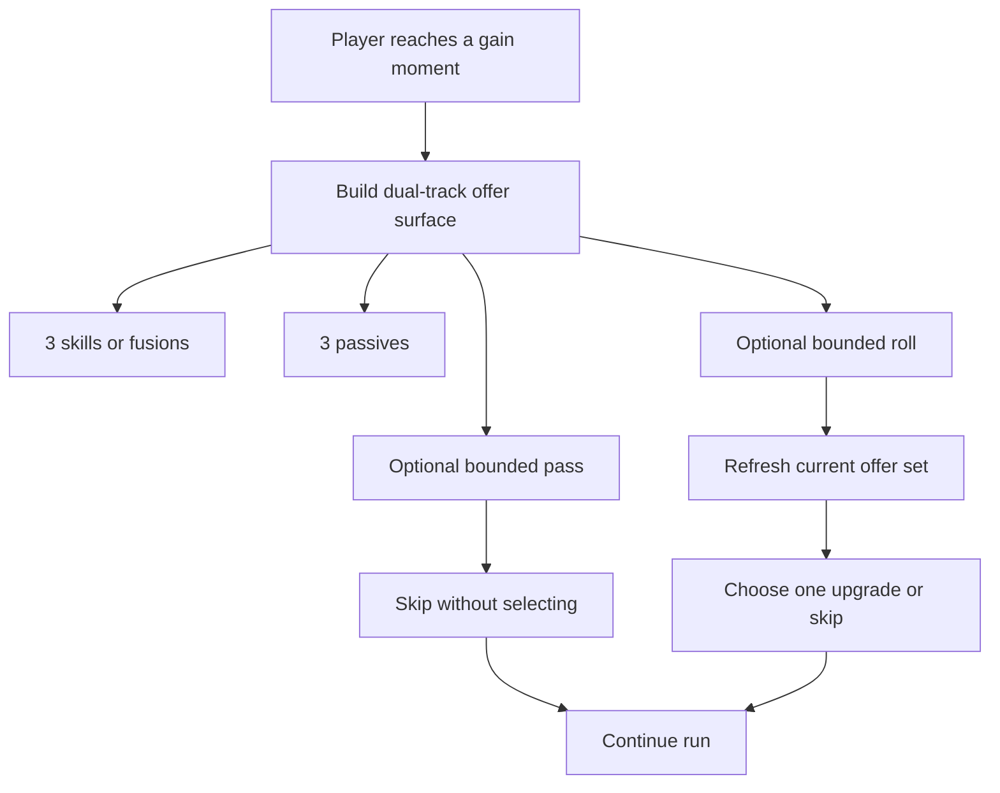

## req_104_define_a_dual_track_level_up_choice_model_with_reroll_and_pass_meta_limits - Define a dual-track level-up choice model with reroll and pass meta limits
> From version: 0.6.1+task071
> Schema version: 1.0
> Status: Ready
> Understanding: 100%
> Confidence: 98%
> Complexity: High
> Theme: Progression
> Reminder: Update status/understanding/confidence and references when you edit this doc.

# Needs
- Evolve the current level-up reward model so the player can choose from two parallel offer tracks instead of one mixed pool.
- Present 3 `skills or fusions` offers and 3 `passive` offers at each relevant gain moment.
- Keep the resulting choice model compatible with the current active-slot, passive-slot, and curated-fusion build structure rather than reopening the whole build architecture.
- Add a bounded `roll` mechanic that refreshes the current offers.
- Add a bounded `pass` mechanic that lets the player skip the current gain moment without taking one of the offered upgrades.
- Define maximum `roll` and `pass` counts as player-facing limits that can later be increased through the shop.
- Treat those limits as meta progression or shop-owned unlockables rather than as ad hoc per-run debug values.

# Context
The build loop already has authored active skills, passive items, curated fusions, and level-up choices. What is still missing is a more expressive and player-friendly gain surface that:
1. separates offensive or build-defining picks from passive picks
2. reduces the frustration of seeing weak or mistimed choices
3. introduces a first bounded agency layer through rerolls and skips
4. creates a natural bridge to future shop progression

This request introduces that next progression posture:
- each gain moment should present 3 `skills or fusions` offers
- and 3 `passives` offers
- while also letting the player use a limited number of `rolls` and `passes`

The intended first-wave selection model is:
- 6 visible offers in total
- but only one selected reward per gain moment
- not one reward from each track

The goal is not to build an endlessly flexible drafting system. The goal is to make level-up decisions feel more strategic and less hostage to one narrow mixed offer set, while still preserving the authored Emberwake build identity.

The request also introduces a first explicit link between run progression and shop progression:
- `roll` count and `pass` count should have bounded starting values
- those maxima should be improvable later through the shop

Scope includes:
- defining a dual-track level-up or gain-offer surface with 3 `skills/fusions` and 3 `passives`
- defining how fusion offers participate in the `skills/fusions` track
- defining the bounded `roll` mechanic and what exactly it refreshes
- defining the bounded `pass` mechanic and what exactly it skips
- defining starting limits for `roll` and `pass`
- defining the future shop linkage for increasing those limits
- defining how the system should behave when slots are full, pools are exhausted, or a track has fewer valid candidates
- defining how this model remains compatible with the existing build-slot and curated-fusion posture

Scope excludes:
- a full shop implementation
- a complete redesign of all meta progression systems
- a fully freeform drafting system with many simultaneous offer categories
- a total rebalance of the skill and passive roster beyond what this new offer model necessitates
- a commitment that every gain moment must always surface perfect 3-and-3 offers even when the authored pools are nearly exhausted

# Acceptance criteria
- AC1: The request defines a dual-track gain or level-up surface that presents 3 `skills or fusions` offers and 3 `passive` offers.
- AC2: The request defines that the player selects exactly one reward total from the 6 visible offers, rather than one reward from each track.
- AC3: The request defines how curated fusion offers participate in the `skills or fusions` track rather than leaving fusion eligibility ambiguous.
- AC4: The request defines a bounded `roll` mechanic and makes explicit whether it refreshes both tracks together or another clearly-bounded offer scope.
- AC5: The request defines a bounded `pass` mechanic and makes explicit what happens when the player skips the current gain moment.
- AC6: The request defines starting maximum counts for `roll` and `pass` and frames them as later improvable through the shop.
- AC7: The request defines how the offer model behaves when valid candidate pools are constrained, slot ownership blocks some offers, or one track cannot fill all 3 entries cleanly.
- AC8: The request keeps compatibility with the current active-slot, passive-slot, and curated-fusion build posture instead of requiring a full build-system redesign.
- AC9: The request defines that the first-wave posture targets level-up gain moments specifically rather than automatically widening to every future reward surface.
- AC10: The request stays bounded by excluding full shop implementation and broad meta-progression redesign while still establishing the shop-facing upgrade seam for `roll` and `pass`.

# Dependencies and risks
- Dependency: the current build system and level-up offer generation remain the baseline ownership seam for this change.
- Dependency: the current curated fusion posture remains the baseline rule for when a fusion can appear in offers.
- Dependency: future shop systems must eventually own the unlock or upgrade path for increasing reroll and pass maxima.
- Risk: showing 6 visible offers per gain moment can make the level-up surface feel heavier or slower if the UI is not kept readable.
- Risk: if `roll` and `pass` are too generous, the authored roster can lose its tension and build identity.
- Risk: if `roll` and `pass` are too scarce, the feature can feel cosmetic rather than meaningful.
- Risk: splitting skills or fusions from passives may expose gaps in the current authored pool size or slot-blocking rules.
- Risk: the request spans runtime progression logic, UI offer presentation, and future shop hooks, so it should be split before implementation.

# Open questions
- Should the player choose one reward total from the 6 visible offers, or one reward from each track?
  Recommended default: one reward total from the 6 visible offers so progression speed and balance remain bounded.
- Should `roll` refresh both tracks at once or only the currently highlighted track?
  Recommended default: reroll both tracks together so the mechanic stays simple and predictable in the first wave.
- Should `pass` preserve the same offers for later or consume the gain moment entirely?
  Recommended default: `pass` should consume the current gain moment entirely and move the run forward without granting an upgrade.
- Should `pass` be available on every gain moment as long as charges remain?
  Recommended default: yes, keep it simple and consistently available while charges remain.
- Should `roll` and `pass` limits start at zero and be entirely shop-unlocked, or should there be a small baseline from the start?
  Recommended default: give the player a small baseline count for both, then let the shop increase those maxima later.
- What should the first small baseline count be?
  Recommended default: start with `1 roll` and `1 pass` per run.
- Should `pass` provide any compensation such as gold, heal, or XP?
  Recommended default: no; keep `pass` as a pure skip so its meaning stays strategic rather than economic.
- Should a reroll be allowed to reproduce exactly the same offer set immediately?
  Recommended default: avoid immediate identical full-set reproposals whenever the authored pool makes that possible.
- Should the dual-track UI always reserve 3-and-3 slots even when one track has fewer valid candidates?
  Recommended default: keep the layout stable, but allow reduced or fallback entries when the valid authored pool cannot fully populate a track.
- Should the first wave apply to all future reward surfaces or only to level-up?
  Recommended default: scope the first wave to level-up gain moments only.

# Definition of Ready (DoR)
- [x] Problem statement is explicit and user impact is clear.
- [x] Scope boundaries (in/out) are explicit.
- [x] Acceptance criteria are testable.
- [x] Dependencies and known risks are listed.

# Clarifications
- The preferred first-wave posture is to show one stable level-up surface with two bounded offer tracks rather than many separate gain screens.
- The player should choose only one reward total from the combined 6 visible offers, not one reward from each side.
- The `skills or fusions` track should own both ordinary active-build progression and fusion payoffs, so the player does not have to inspect a third unrelated category.
- Fusion offers should share the same track as skill offers and should not reserve dedicated guaranteed slots.
- When valid, fusion offers should have a gentle surfacing priority rather than a guarantee.
- A good first default is for `roll` to refresh the whole current offer set, not just one side.
- A good first default is to avoid immediate identical reroll outcomes whenever the authored candidate pool is large enough to support that.
- A good first default is for `pass` to skip the whole gain moment rather than storing it for later.
- A good first default is for `pass` to remain a pure skip without gold, heal, or XP compensation.
- `roll` and `pass` should start with small, authored baseline counts, then later be increased through shop progression.
- A good first baseline is `1 roll` and `1 pass` per run.
- The shop seam introduced here is about increasing maxima for `roll` and `pass`, not about shipping the whole shop in the same slice.
- The implementation should remain compatible with the current curated build identity and should not widen automatically into a fully random roguelite drafting overhaul.
- If active slots are already full, the `skills or fusions` track should surface only valid upgrades and eligible fusions rather than brand-new unusable active skills.
- The first implementation target should stay on level-up gain moments and not automatically widen to every reward or chest surface.

# Companion docs
- Product brief(s): `prod_008_active_passive_fusion_direction_for_emberwake`, `prod_009_level_up_slots_and_run_progression_model_for_emberwake`, `prod_010_first_playable_techno_shinobi_build_content_and_progression_defaults`
- Architecture decision(s): `adr_039_structure_the_first_survivor_build_loop_around_separate_active_and_passive_slots`, `adr_040_use_curated_active_passive_fusions_as_the_foundational_build_payoff_layer`
- Request(s): `req_058_define_a_foundational_survivor_build_system_for_weapons_passives_fusions_and_run_progression`, `req_083_define_a_missing_fusion_completion_wave_for_the_remaining_first_playable_active_passive_pairings`

# AI Context
- Summary: Define a dual-track level-up model with 3 skill or fusion offers, 3 passive offers, plus bounded reroll and pass charges that can later be upgraded in the shop.
- Keywords: level up, offers, skills, passives, fusions, reroll, roll, pass, shop, meta progression
- Use when: Use when framing the next run-progression and offer-selection evolution for Emberwake.
- Skip when: Skip when the work is only about adding new skills, a full shop system, or unrelated shell settings.

# References
- `games/emberwake/src/runtime/buildSystem.ts`
- `games/emberwake/src/runtime/buildSystem.test.ts`
- `games/emberwake/src/runtime/emberwakeGameModule.ts`
- `src/app/AppShell.tsx`
- `src/app/model/metaProgression.ts`
- `src/game/render/CombatSkillFeedbackScene.tsx`
- `logics/request/req_058_define_a_foundational_survivor_build_system_for_weapons_passives_fusions_and_run_progression.md`
- `logics/request/req_083_define_a_missing_fusion_completion_wave_for_the_remaining_first_playable_active_passive_pairings.md`

# Backlog
- `item_368_define_dual_track_level_up_offer_generation_for_skill_fusion_and_passive_choices`
- `item_369_define_reroll_and_pass_charge_ownership_for_level_up_choices`
- `item_370_define_dual_track_level_up_surface_and_validation`
