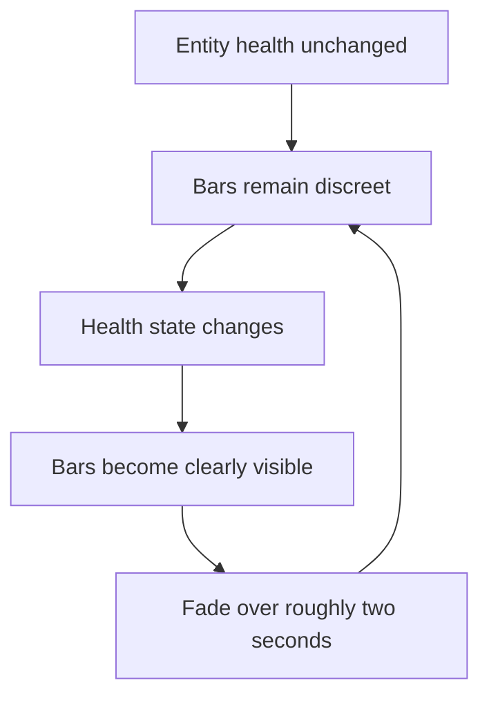

## req_105_define_a_state_reactive_entity_bar_visibility_posture_with_two_second_fade - Define a state-reactive entity bar visibility posture with two-second fade
> From version: 0.6.1+task071
> Schema version: 1.0
> Status: Ready
> Understanding: 100%
> Confidence: 99%
> Complexity: Medium
> Theme: Runtime
> Reminder: Update status/understanding/confidence and references when you edit this doc.

# Needs
- Improve the readability posture of the progression or status bars rendered above runtime entities.
- Keep those bars relatively discreet when nothing important is changing.
- Make the bars become clearly visible immediately when the entity health state changes.
- Fade that heightened visibility after roughly 2 seconds rather than keeping the bars fully emphasized permanently.
- Keep the result compatible with the current runtime presentation layer and current entity-bar rendering ownership in the entity scene.

# Context
The current bars above entities exist and technically work, but they are visually weak in the stable state. The practical outcome is:
- while health is stable, the bars are hard to notice
- when health changes, the player actually needs them
- but the current presentation does not explicitly react to that state change with a clear visibility spike

This request defines a bounded readability improvement:
1. bars can stay quieter in their resting posture
2. a health-state change should immediately bring them into strong visibility
3. that stronger visibility should then fade out after 2 seconds

The intent is not to rebuild the entire HUD or to add a full status-history layer. It is only to make entity bars behave more like reactive combat readability aids.

Scope includes:
- defining a state-reactive visibility posture for bars rendered above runtime entities
- defining what counts as the relevant state change for visibility emphasis, starting with health change
- defining the stronger visible state immediately after a health change
- defining the fade-out posture over approximately 2 seconds
- defining whether the rule applies to player, hostiles, or all currently bar-owning entity categories
- defining how this interacts with the existing default resting alpha and current bar drawing logic

Scope excludes:
- a full HUD redesign
- damage-number redesign
- adding many new bar types or status widgets
- permanently high-visibility bars for all entities at all times
- a broad animation system rewrite just for bar visibility

# Acceptance criteria
- AC1: The request defines a state-reactive visibility posture for entity bars rendered above runtime entities.
- AC2: The request defines that a health-state change immediately increases bar visibility.
- AC3: The request defines that the heightened visibility fades after approximately 2 seconds.
- AC4: The request defines the resting posture of the bars when no relevant state change is active, rather than leaving them permanently fully emphasized.
- AC5: The request defines which entity categories the behavior applies to, or explicitly requires that this be decided during implementation from current bar ownership.
- AC6: The request stays bounded to reactive visibility and fade behavior rather than widening into a full HUD or combat-feedback redesign.

# Dependencies and risks
- Dependency: current bar rendering remains owned by `CombatEntityBars` inside `EntityScene.tsx`.
- Dependency: current entity combat state already exposes enough health information to detect meaningful change without inventing a second combat model.
- Risk: if the resting state is made too faint, the bars may still feel absent when players try to proactively read combat.
- Risk: if the visible spike is too strong or too frequent, the bars can become noisy in dense combat.
- Risk: if every tiny health delta retriggers visibility too aggressively, bars may never settle in high-pressure scenes.

# Open questions
- Should only health changes trigger the visibility spike, or should charge-bar changes do it too?
  Recommended default: start with health changes only.
- Should the player and hostiles share the same timing and alpha posture?
  Recommended default: yes in the first wave, unless runtime review shows the player needs a slightly stronger baseline.
- Should the bars fully disappear after fade, or return to a quieter resting visibility?
  Recommended default: return to a quieter resting visibility rather than disappearing completely.

# Definition of Ready (DoR)
- [x] Problem statement is explicit and user impact is clear.
- [x] Scope boundaries (in/out) are explicit.
- [x] Acceptance criteria are testable.
- [x] Dependencies and known risks are listed.

# Clarifications
- The current issue is specifically that the bars are not visible enough until a meaningful state change would make them valuable.
- The desired result is a reactive visibility spike on health change, followed by a fade of about 2 seconds.
- A good first posture is to keep the bars present but subdued at rest, then noticeably brighter during the post-change window.
- The first wave should stay focused on runtime bars already rendered above entities rather than expanding to other HUD systems.

# Companion docs
- Product brief(s): (none yet)
- Architecture decision(s): (none yet)
- Request(s): (none yet)

# AI Context
- Summary: Define a reactive visibility model for entity bars so health changes make them clearly visible, then they fade after two seconds.
- Keywords: entity bars, health, fade, runtime, readability, visibility, combat
- Use when: Use when framing a bounded combat-readability improvement for the bars above runtime entities.
- Skip when: Skip when the work is about full HUD redesign, damage numbers, or unrelated shell UI.

# References
- `src/game/entities/render/EntityScene.tsx`
- `src/game/entities/model/entitySimulation.ts`

# Backlog
- `item_371_define_state_reactive_runtime_entity_bar_visibility_and_fade_behavior`
