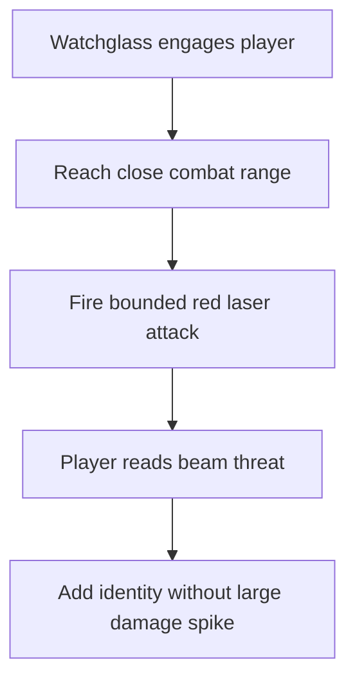

## req_106_define_a_bounded_close_range_red_laser_attack_for_watchglass - Define a bounded close-range red laser attack for watchglass
> From version: 0.6.1+task071
> Schema version: 1.0
> Status: Done
> Understanding: 100%
> Confidence: 98%
> Complexity: Medium
> Theme: Gameplay
> Reminder: Update status/understanding/confidence and references when you edit this doc.

# Needs
- Give the `watchglass` hostile a more distinctive combat identity than simple pursuit and contact pressure.
- Introduce a red laser attack for `watchglass`.
- Keep that laser as a close-range attack used when `watchglass` is near the player rather than as a long-range sniper beam.
- Keep the laser damage relatively low so the hostile becomes more readable and expressive without creating an immediate balance spike.
- Make the laser visually clear enough that the player can understand the threat quickly.

# Context
`watchglass` already exists as a higher-order hostile family in the pressure roster, but its current behavior is still fundamentally a pursuit-based hostile with contact damage. That makes it mechanically functional, but it does not yet fully sell the silhouette or role implied by the `watchglass` identity.

This request introduces a bounded first combat differentiator:
1. when `watchglass` gets close enough to the player
2. it can fire a red laser attack
3. the laser should not hit overly hard
4. the goal is to add role identity and readability, not to turn `watchglass` into a full-screen beam specialist immediately

The intent is to make `watchglass` feel more authored without widening the change into a full hostile-behavior rewrite or a broad enemy-combat-system overhaul.

Scope includes:
- defining a close-range red laser attack posture for `watchglass`
- defining the rough range posture for when the laser should be usable
- defining that the resulting damage remains relatively low
- defining the expected visual readability posture of the laser
- defining whether the same behavior applies only to `watchglass` or also later to `watchglass-prime`
- defining the bounded combat identity change without reopening the rest of the hostile roster

Scope excludes:
- a full ranged-beam AI framework for every hostile
- a full hostile-behavior taxonomy rewrite
- turning `watchglass` into a pure long-range artillery enemy
- a broad VFX pipeline rewrite
- a broad rebalance of all hostile contact damage values

# Acceptance criteria
- AC1: The request defines a close-range laser attack posture for `watchglass`.
- AC2: The request defines that the laser is visually red.
- AC3: The request defines that the laser is used when `watchglass` is near the player rather than as an extreme long-range attack.
- AC4: The request defines that the laser damage remains relatively low compared with a major burst threat.
- AC5: The request defines a bounded readability expectation for the laser so the attack is visually understandable in runtime play.
- AC6: The request defines whether the first implementation applies only to `watchglass` or also to `watchglass-prime`, or explicitly leaves that decision to implementation.
- AC7: The request stays bounded and does not widen automatically into a full hostile-ranged-combat overhaul.

# Dependencies and risks
- Dependency: `watchglass` and `watchglass-prime` already exist as authored hostile profiles in the current hostile pressure roster.
- Dependency: current hostile combat resolution and combat-skill feedback layers remain the likely seams for implementing a first-pass laser attack and its presentation.
- Risk: if the beam is too subtle, the new attack will not add meaningful identity.
- Risk: if the beam is too strong, `watchglass` can become disproportionately punishing in dense spawns.
- Risk: if the attack range is not bounded well, the behavior can drift into annoying off-screen pressure rather than readable close-range identity.

# Open questions
- Should the first pass apply only to `watchglass`, or should `watchglass-prime` inherit a stronger version automatically?
  Recommended default: start with `watchglass` first and decide later whether `watchglass-prime` should inherit or intensify it.
- Should the laser be instant-hit or briefly telegraphed?
  Recommended default: use a short readable telegraph before the damage resolves.
- Should the laser fully replace contact pressure at close range, or sit alongside it?
  Recommended default: keep the first pass bounded and let the laser augment the identity without deleting existing contact-pressure posture unless balancing later shows that duplication is too punishing.

# Definition of Ready (DoR)
- [x] Problem statement is explicit and user impact is clear.
- [x] Scope boundaries (in/out) are explicit.
- [x] Acceptance criteria are testable.
- [x] Dependencies and known risks are listed.

# Clarifications
- The laser should be treated as a close-range identity move, not as a map-wide sniper beam.
- The laser should be red and immediately readable against the current runtime presentation.
- A good first-wave posture is a short telegraphed beam with modest damage, so the move reads clearly without becoming oppressive.
- The first implementation should stay bounded to the `watchglass` family rather than reopening every hostile behavior.

# Companion docs
- Product brief(s): (none yet)
- Architecture decision(s): `adr_049_structure_time_scaled_enemy_pressure_around_authored_population_opening_composition_tiers_and_mini_boss_beats`
- Request(s): (none yet)

# AI Context
- Summary: Define a close-range, low-damage red laser attack that gives watchglass a more distinctive hostile identity.
- Keywords: watchglass, laser, red beam, hostile, close range, low damage, readability
- Use when: Use when framing a bounded hostile-behavior upgrade for watchglass.
- Skip when: Skip when the work is about broad hostile AI redesign or unrelated graphics-only changes.

# References
- `games/emberwake/src/runtime/hostilePressure.ts`
- `games/emberwake/src/runtime/entitySimulation.ts`
- `games/emberwake/src/runtime/entitySimulationCombat.ts`
- `src/game/render/CombatSkillFeedbackScene.tsx`
- `src/game/entities/model/entitySimulation.test.ts`

# Backlog
- `item_372_define_watchglass_close_range_laser_gameplay_and_trigger_posture`
- `item_373_define_watchglass_red_laser_feedback_and_runtime_validation`
