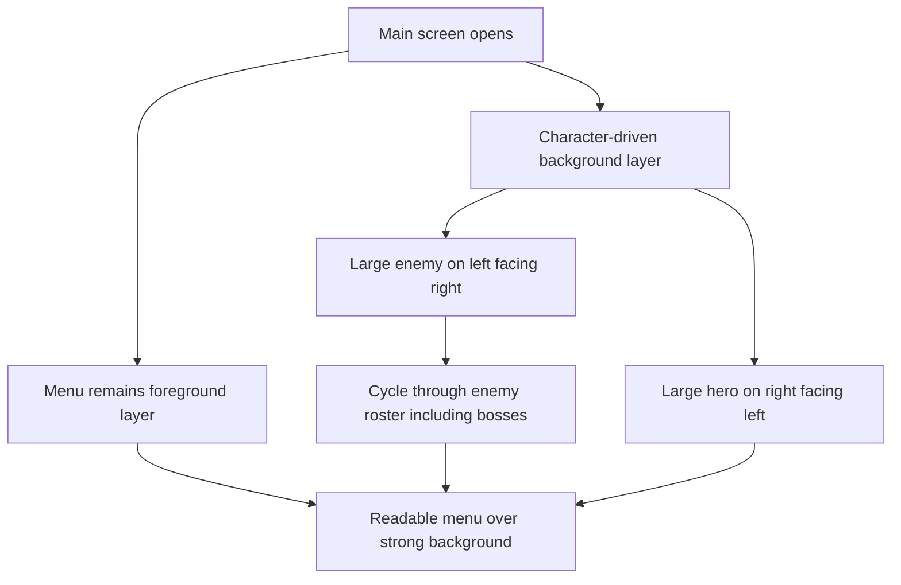

## req_107_define_a_main_screen_background_presentation_using_runtime_character_and_enemy_assets - Define a main screen background presentation using runtime character and enemy assets
> From version: 0.6.1
> Schema version: 1.0
> Status: Done
> Understanding: 98%
> Confidence: 96%
> Complexity: Medium
> Theme: UI
> Reminder: Update status/understanding/confidence and references when you edit this doc.

# Needs
- Rework the main screen so the currently opened menu sits on top of a strong character-driven background presentation.
- Use the generated runtime entity assets rather than abstract shell decoration for that main-screen background.
- Place the hero large on the right side of the screen, facing left.
- Place a large enemy on the left side of the screen, facing right.
- Cycle the left-side enemy presentation across the available enemy roster, including bosses.
- Make the characters feel like the real background of the main screen rather than like small decorative inserts beside the menu.

# Context
The project now has a stronger runtime asset library for the hero and hostile families, but the main screen still behaves more like a shell panel with decorative atmosphere than like a front-door scene with strong character presence.

This request introduces a more assertive main-screen visual structure:
1. the menu remains the interactive foreground layer
2. behind it, the hero and an enemy occupy the page at large scale
3. the hero anchors the right side and faces toward the menu center
4. the enemy anchors the left side and cycles across the hostile roster, bosses included
5. the result should read as a full-screen background composition, not as a sidebar illustration or a card insert

The goal is not to turn the shell into a cinematic cutscene. The goal is to make the main screen feel authored and alive by reusing the current character and hostile asset work directly in the menu backdrop.

Scope includes:
- defining a background-presentation posture for the `main-menu` screen using runtime entity assets
- defining the hero placement on the right side, facing left
- defining the enemy placement on the left side, facing right
- defining a cycling posture for the enemy side that includes bosses
- defining how large the background characters should read relative to the foreground menu
- defining layering expectations so the menu remains readable and interactive while the asset pair still owns the background
- defining whether the same composition remains unique to the main screen or should later influence other shell scenes

Scope excludes:
- a full shell redesign across every scene
- a cinematic title sequence
- full animation pipelines for the background characters
- replacing the foreground menu structure itself
- a requirement that every shell screen use runtime character backgrounds

# Acceptance criteria
- AC1: The request defines a main-screen background posture that uses the runtime character or entity assets rather than only abstract shell decoration.
- AC2: The request defines that the hero appears on the right side of the main screen and faces left.
- AC3: The request defines that the enemy presentation appears on the left side of the main screen and faces right.
- AC4: The request defines that the left-side enemy cycles through the enemy roster and explicitly includes bosses.
- AC5: The request defines that the characters should read at large scale behind the menu so they feel like the page background rather than small inserts.
- AC6: The request defines layering expectations so the menu remains usable and legible on top of the background presentation.
- AC7: The request stays bounded to the main screen rather than widening into a shell-wide visual rewrite.

# Dependencies and risks
- Dependency: the current generated hero and hostile runtime assets remain the source material for the background composition.
- Dependency: `AppMetaScenePanel` and current main-menu shell layout remain the likely ownership seam for this change.
- Dependency: current shell CSS and hero-band styling remain the baseline surfaces to extend rather than replace wholesale.
- Risk: if the assets are too bright or too detailed behind the menu, they can hurt readability of the foreground controls.
- Risk: if the assets are scaled too timidly, the result will look like decoration rather than a true background composition.
- Risk: if the cycle cadence is too fast or too flashy, the main screen can feel noisy instead of authored.
- Risk: including bosses in the enemy cycle can create uneven silhouette dominance unless the visual treatment is normalized.

# Open questions
- Should the enemy cycle advance automatically on a timer or only on screen re-entry?
  Recommended default: use a slow automatic cycle so the main screen feels alive without becoming noisy.
- What cadence should that automatic cycle use?
  Recommended default: rotate slowly, around every 8 to 12 seconds, with a soft transition rather than a hard cut.
- Should the background characters remain static, or receive a subtle float/parallax treatment?
  Recommended default: keep the first pass mostly static with only restrained shell motion if needed.
- Should the left-side cycle include every hostile equally, or use a curated roster of visually stronger silhouettes?
  Recommended default: use a curated roster of strong silhouettes rather than every tiny hostile equally.
- Should bosses appear as often as normal hostiles in the cycle?
  Recommended default: include bosses, but surface them more rarely so they keep a premium feel.
- Should this background treatment apply only to `main-menu`, or also to adjacent shell scenes opened from it?
  Recommended default: keep it strictly on the `main-menu` screen in the first wave.
- How should menu readability be protected against very strong background silhouettes?
  Recommended default: keep the characters large and visible, but use restrained central taming such as a soft veil or gradient so foreground controls remain readable.
- Should every boss be treated equally in the cycle, or should some oversized bosses be normalized visually for shell use?
  Recommended default: include bosses, but normalize presentation scale so the composition remains balanced.

# Definition of Ready (DoR)
- [x] Problem statement is explicit and user impact is clear.
- [x] Scope boundaries (in/out) are explicit.
- [x] Acceptance criteria are testable.
- [x] Dependencies and known risks are listed.

# Clarifications
- The main screen should keep the menu as the foreground interaction layer.
- The background should be character-led, with one hero on the right and one enemy on the left.
- The hero should face left and the enemy should face right so the composition closes toward the center.
- The left-side cycle should include bosses, not only standard hostiles.
- The target effect is a true page background presence, not a small decorative hero band.
- The first wave should stay visually strong but restrained enough that the menu remains easy to read and use.
- The left-side enemy cycle should use a curated set of strong hostile silhouettes rather than every hostile equally.
- Bosses should be included in that cycle, but should appear less often than standard hostiles.
- The cycle should advance automatically and slowly, roughly every 8 to 12 seconds, with soft transitions.
- The first wave should stay on the strict `main-menu` screen rather than expanding immediately to neighboring shell scenes.
- A restrained central veil or gradient is acceptable to preserve menu readability as long as the two character masses still read as the true background.

# Companion docs
- Product brief(s): `prod_017_graphical_asset_direction_for_runtime_readability_and_shell_identity`
- Architecture decision(s): `adr_052_adopt_a_content_driven_graphical_asset_pipeline_for_runtime_and_shell_surfaces`
- Request(s): `req_055_rework_all_shell_menus_with_a_techno_shinobi_visual_direction`

# AI Context
- Summary: Define a character-driven main screen background with a large hero on the right, a cycling enemy on the left, and the menu layered above them.
- Keywords: main menu, main screen, background, hero, enemy, bosses, shell, AppMetaScenePanel
- Use when: Use when framing a stronger visual background treatment for the main screen using the existing runtime asset roster.
- Skip when: Skip when the work is only about runtime combat presentation or about full shell redesign beyond the main screen.

# References
- `src/app/components/AppMetaScenePanel.tsx`
- `src/app/styles/app.css`
- `src/assets/entities/runtime/entity.player.primary.runtime.png`
- `src/assets/entities/runtime/entity.hostile.anchor.runtime.png`
- `src/assets/entities/runtime/entity.hostile.drifter.runtime.png`
- `src/assets/entities/runtime/entity.hostile.rammer.runtime.png`
- `src/assets/entities/runtime/entity.hostile.sentinel.runtime.png`
- `src/assets/entities/runtime/entity.hostile.watcher.runtime.png`

# Backlog
- `item_374_define_main_menu_background_character_composition_and_asset_roster`
- `item_375_define_main_menu_background_layering_motion_and_readability_treatment`
