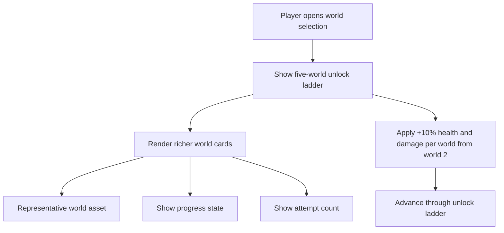

## req_108_define_a_five_world_unlock_ladder_with_world_scaling_and_richer_world_selection_cards - Define a five-world unlock ladder with world scaling and richer world-selection cards
> From version: 0.6.1
> Schema version: 1.0
> Status: Ready
> Understanding: 98%
> Confidence: 96%
> Complexity: High
> Theme: Progression
> Reminder: Update status/understanding/confidence and references when you edit this doc.

# Needs
- Expand the future map-selection posture into a concrete five-world progression ladder.
- Define five authored world identities with stable player-facing names.
- Gate those five worlds behind unlock progression rather than exposing them all immediately.
- Increase hostile health and hostile damage by 10% per world starting from world 2.
- Make world selection feel richer and more attractive by giving each world card a representative asset.
- Show progression information on each world card.
- Show the number of attempts made on each world.

# Context
The current codebase already has terrain identities, seed-driven runtime generation, and a bounded request for mission-gated world unlocking. What it does not yet have is a concrete authored world roster with clear names, an explicit scaling ladder, and a player-facing world-selection presentation strong enough to feel like a real progression screen.

This request introduces that next concrete framing:
1. Emberwake should have 5 worlds to unlock
2. each world should have a distinct authored name
3. from world 2 onward, hostile difficulty should scale upward per world
4. the world-selection surface should show more than just availability; it should feel like a curated destination picker
5. each world card should expose an image or representative asset, progression status, and attempt count

The intent is not to ship a full campaign metagame in one step. The intent is to make the world ladder concrete enough that future backlog work can implement:
- unlock order
- scaling
- world-card presentation
- persistent per-world progress tracking

Suggested first authored world roster:
1. `Ashwake Verge`
2. `Emberplain Reach`
3. `Glowfen Basin`
4. `Obsidian Vault`
5. `Cinderfall Crown`

These names are intended as strong defaults for the first five-world ladder. They can still evolve later if product direction shifts, but the request should not remain blocked on placeholder naming.

Scope includes:
- defining a five-world progression ladder
- defining the first authored names of those five worlds
- defining unlock posture across the five-world ladder
- defining hostile scaling of `+10% max health` and `+10% damage` per world starting from world 2
- defining a richer world-selection card presentation with representative art or asset
- defining which progression facts should appear on the world cards
- defining that attempt count should be tracked and surfaced per world

Scope excludes:
- a full campaign story bible
- a full chapter map or overworld traversal system
- final implementation of every world-specific biome rule or mission modifier
- a broad rebalance of every hostile family beyond the explicit per-world health and damage ladder
- a requirement that every world already have totally unique generation tech in the same slice

# Acceptance criteria
- AC1: The request defines a five-world progression ladder rather than leaving world count open-ended.
- AC2: The request defines authored player-facing names for those five worlds.
- AC3: The request defines that hostile max health and hostile damage each increase by 10% per world starting from world 2.
- AC4: The request defines a richer world-selection posture where each world is represented by a dedicated card or equivalent presented surface.
- AC5: The request defines that each world card should include a representative asset.
- AC6: The request defines that each world card should include a visible progression indicator.
- AC7: The request defines that each world card should include the number of attempts made on that world.
- AC8: The request keeps scope bounded by framing this as a world-ladder and world-selection progression slice rather than a full campaign meta overhaul.

# Dependencies and risks
- Dependency: the world-selection and mission-gated unlock direction already framed in `req_103` remains the baseline progression seam.
- Dependency: meta progression must eventually persist world unlocks, attempt counts, and completion facts.
- Dependency: the project will need a representative asset strategy for worlds, whether through terrain art, world-card art, or another bounded shell visual.
- Risk: a simple flat `+10%/+10%` ladder may be easy to understand but could feel blunt if other systems do not scale in parallel.
- Risk: if the world cards carry too much information, the selection screen can become dense and harder to scan.
- Risk: naming the five worlds now creates product momentum but may require later refinement if the world fantasy deepens.
- Risk: if the representative world assets are weak or inconsistent, the richer selection surface may look noisier rather than more premium.

# Open questions
- Should the five worlds unlock strictly one after another?
  Recommended default: yes, a strict linear first ladder is clearer than branching in the first wave.
- Should the `+10%/+10%` scaling be cumulative from the first world baseline?
  Recommended default: yes; world 2 is `+10%`, world 3 is `+20%`, world 4 is `+30%`, world 5 is `+40%` over world 1 baseline.
- What progression indicator should world cards show first?
  Recommended default: show at least `locked/unlocked/completed` and optionally mission completion state if available.
- Should attempt count include failed and successful attempts together?
  Recommended default: yes, total attempts is the simplest and most legible first metric.
- Should representative world assets be full illustrations or bounded card art derived from current terrain/world identity?
  Recommended default: use bounded world-card representative art, not full cinematic illustrations, so the feature stays shippable.

# Definition of Ready (DoR)
- [x] Problem statement is explicit and user impact is clear.
- [x] Scope boundaries (in/out) are explicit.
- [x] Acceptance criteria are testable.
- [x] Dependencies and known risks are listed.

# Clarifications
- The first five-world ladder should use these default names unless a later product decision replaces them:
  - `Ashwake Verge`
  - `Emberplain Reach`
  - `Glowfen Basin`
  - `Obsidian Vault`
  - `Cinderfall Crown`
- The hostile scaling rule is intended as a simple world-difficulty baseline, not as a full replacement for authored encounter tuning.
- The first world remains the baseline with no additional world-based health or damage bonus.
- From world 2 onward, both hostile health and hostile damage scale by 10% per world tier over that baseline.
- The selection surface should feel premium enough to be attractive, but should stay readable and avoid becoming a full lore codex screen.
- A good first card posture is: representative asset, world name, lock state or completion state, and total attempts.

# Companion docs
- Product brief(s): (none yet)
- Architecture decision(s): (none yet)
- Request(s): `req_103_define_new_game_map_selection_and_mission_gated_map_unlock_progression`

# AI Context
- Summary: Define a concrete five-world unlock ladder with authored names, simple per-world hostile scaling, and richer world-selection cards.
- Keywords: worlds, map selection, unlock ladder, attempts, progression, difficulty scaling, world cards, assets
- Use when: Use when framing the first fully-authored world roster and world-card progression surface for Emberwake.
- Skip when: Skip when the work is only about one mission, one biome, or a full campaign-overworld redesign.

# References
- `logics/request/req_103_define_new_game_map_selection_and_mission_gated_map_unlock_progression.md`
- `games/emberwake/src/content/world/worldData.ts`
- `games/emberwake/src/runtime/emberwakeSession.ts`
- `src/app/model/metaProgression.ts`
- `src/app/AppShell.tsx`
- `src/app/components/AppMetaScenePanel.tsx`

# Backlog
- `item_376_define_five_authored_world_profiles_and_world_based_hostile_scaling`
- `item_377_define_per_world_progress_tracking_and_attempt_count_persistence`
- `item_378_define_richer_world_selection_cards_with_representative_assets_progress_and_attempts`
