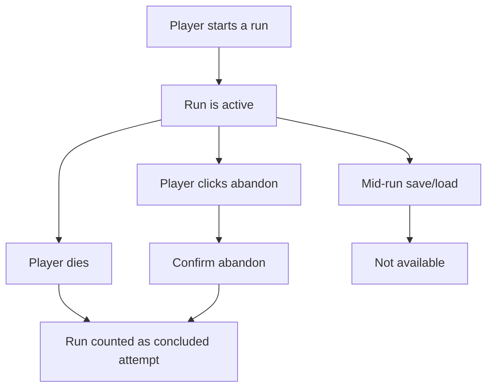

## req_109_define_a_run_commit_posture_with_in_run_abandon_and_no_mid_run_save_load - Define a run-commit posture with in-run abandon and no mid-run save/load
> From version: 0.6.1+task071
> Schema version: 1.0
> Status: Ready
> Understanding: 100%
> Confidence: 98%
> Complexity: Medium
> Theme: Progression
> Reminder: Update status/understanding/confidence and references when you edit this doc.

# Needs
- Add an explicit `Abandon` action while a run is in progress.
- Define what happens when the player abandons a run.
- Remove the ability to save a run and load it later.
- Make a started run count only when it is finished through death or explicit abandon.
- Keep the player-facing progression and attempt accounting coherent with that run-commit posture.

# Context
The current product direction is moving toward authored map missions, world unlock progression, and attempt tracking. In that model, allowing free-form mid-run save/load weakens the meaning of a run and creates ambiguity around attempts, mission completion, abandonment, and progression accounting.

This request introduces a stricter run posture:
1. once a run starts, the player is expected to carry it through
2. the run ends only through a terminal outcome such as death or explicit abandon
3. save/load of an in-progress run should no longer be available
4. abandonment must be supported intentionally through an in-run button and a defined outcome

The intent is not to remove all persistence from the game. The intent is to remove mid-run save/load as a player-facing escape hatch while keeping meta progression, attempt tracking, and mission accounting understandable.

Scope includes:
- defining an in-run `Abandon` button and its action
- defining the player-facing confirmation posture for abandoning a run
- defining that in-progress runs can no longer be saved and later loaded
- defining which run-ending outcomes count as a concluded attempt
- defining how abandon should be counted relative to death and completion
- defining the baseline shell/UI consequences of removing save/load actions

Scope excludes:
- a full save-system refactor unrelated to runs
- removing meta progression persistence
- deciding every future analytics event in the same slice
- redesigning the whole pause or meta menu beyond what is required to support abandon and remove save/load

# Acceptance criteria
- AC1: The request defines an in-run `Abandon` action that the player can trigger while a run is active.
- AC2: The request defines the associated abandon outcome, including that abandon is treated as a run-ending state.
- AC3: The request defines that mid-run save is no longer available.
- AC4: The request defines that mid-run load is no longer available.
- AC5: The request defines that a run is counted once it ends through death or abandon.
- AC6: The request keeps meta progression persistence in scope only insofar as it must still record concluded runs correctly.
- AC7: The request keeps scope bounded to run-state posture and shell affordances rather than reopening all persistence architecture.

# Dependencies and risks
- Dependency: the shell must expose an in-run surface where `Abandon` can live without confusing it with broader settings or navigation actions.
- Dependency: mission progress and world attempt accounting will need a clear rule for how abandon impacts attempts and incomplete mission progress.
- Dependency: future world-selection and mission systems should consume the same concluded-run facts.
- Risk: removing save/load may feel harsher if runs become long without enough player-facing clarity.
- Risk: if abandon lacks confirmation, accidental input could produce frustrating losses.
- Risk: if death and abandon are counted inconsistently, progression stats will become confusing.
- Risk: hidden or residual save/load code paths could leave the product in a mixed posture.

# Open questions
- Should abandon require explicit confirmation?
  Recommended default: yes, a confirmation step is safer and consistent with run-ending intent.
- Should abandon count exactly like death for attempts?
  Recommended default: yes for attempt counting; both conclude the run, even if downstream analytics later distinguish them.
- Should abandoning grant any special consolation reward?
  Recommended default: no; abandon should be a clean exit, not a value-farming path.
- Should save/load be removed only from the UI, or also disabled at the behavior level?
  Recommended default: both; the product posture should be enforced, not merely hidden.
- Should a completed run still be eligible for normal meta progression persistence?
  Recommended default: yes; the change is about mid-run continuation, not about removing completed-run progression.

# Definition of Ready (DoR)
- [x] Problem statement is explicit and user impact is clear.
- [x] Scope boundaries (in/out) are explicit.
- [x] Acceptance criteria are testable.
- [x] Dependencies and known risks are listed.

# Clarifications
- The target posture is `start a run -> finish it by completing it, dying, or abandoning it`.
- This request intentionally removes player-facing save/load for active runs.
- The term `counted` means the run should become part of attempt/progression accounting once it reaches a terminal state.
- Abandon is intended as a first-class terminal action, not as a hidden debug escape.
- This request does not imply removing persistent meta progression or permanent unlock tracking.

# Companion docs
- Product brief(s): (none yet)
- Architecture decision(s): (none yet)
- Request(s): `req_102_define_a_primary_map_mission_loop_with_three_target_zones_bosses_and_key_items`, `req_103_define_new_game_map_selection_and_mission_gated_map_unlock_progression`

# AI Context
- Summary: Define a run-commit posture where active runs cannot be saved/loaded mid-run and can instead be ended explicitly through an abandon action.
- Keywords: run, abandon, save, load, persistence, attempts, progression, shell, mission
- Use when: Use when the game should treat runs as committed sessions that end only through terminal outcomes such as death, completion, or abandon.
- Skip when: Skip when the task is only about settings persistence, meta unlock storage, or a broader persistence architecture redesign.

# References
- `src/app/AppShell.tsx`
- `src/app/components/AppMetaScenePanel.tsx`
- `src/app/model/metaProgression.ts`
- `games/emberwake/src/runtime/emberwakeSession.ts`
- `logics/request/req_102_define_a_primary_map_mission_loop_with_three_target_zones_bosses_and_key_items.md`
- `logics/request/req_103_define_new_game_map_selection_and_mission_gated_map_unlock_progression.md`

# Backlog
- `item_379_define_in_run_abandon_surface_confirmation_and_terminal_outcome`
- `item_380_define_no_mid_run_save_load_enforcement_and_attempt_accounting`
