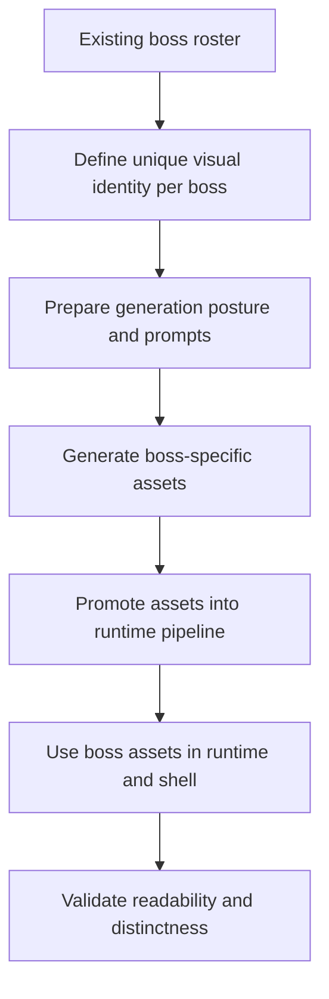

## req_110_define_unique_generated_runtime_assets_for_every_boss_type - Define unique generated runtime assets for every boss type
> From version: 0.6.1+b927df6
> Schema version: 1.0
> Status: Done
> Understanding: 100%
> Confidence: 99%
> Complexity: Medium
> Theme: Graphics
> Reminder: Update status/understanding/confidence and references when you edit this doc.

# Needs
- Stop reusing the same hostile base assets for boss-tier encounters.
- Give every boss type its own generated runtime asset so bosses read as authored encounter peaks instead of tinted or scaled hostiles.
- Cover both the timed mini-boss layer and the mission-boss layer.
- Keep the current drop-in asset pipeline and generated-image workflow as the delivery path.
- Ensure the new unique boss assets also surface correctly in shell views such as the bestiary and the main-menu enemy roster when bosses are included there.

# Context
The current runtime differentiates boss encounters mostly through combat tuning, tint, and scale. That is enough to make bosses function mechanically, but it is not enough to make them feel visually distinct.

Today the boss roster is effectively:
1. `watchglass-prime` as the timed mini-boss
2. `mission-boss-sentinel`
3. `mission-boss-watchglass`
4. `mission-boss-rammer`

Those boss entities currently reuse base hostile assets:
- `watchglass-prime` reuses the watcher family
- `mission-boss-sentinel` reuses the sentinel family
- `mission-boss-watchglass` reuses the watcher family
- `mission-boss-rammer` reuses the rammer family

This request introduces a bounded boss-asset wave:
1. define the exact boss asset roster
2. define a unique visual identity and prompt posture for each boss
3. generate and curate boss-specific assets
4. promote them into the runtime pipeline
5. integrate them in runtime and shell surfaces where boss identity matters

The goal is not to redesign every hostile family. The goal is to ensure that every boss-type encounter has a clearly unique authored silhouette and presentation layer.

Scope includes:
- defining the exact list of boss types that require unique generated runtime assets
- covering both the timed mini-boss layer and the mission-boss layer
- defining boss-specific prompts or production posture
- generating and promoting boss-specific runtime assets
- integrating those assets into runtime resolution instead of reusing only base hostile assets
- validating boss appearance in runtime, bestiary, and boss-inclusive shell cycles where relevant

Scope excludes:
- a full hostile-family redesign
- animation pipelines for bosses
- adding new boss mechanics unrelated to visuals
- changing the boss roster itself in the same slice

# Acceptance criteria
- AC1: The request defines the exact boss roster that must receive unique generated runtime assets.
- AC2: The request explicitly covers `watchglass-prime`, `mission-boss-sentinel`, `mission-boss-watchglass`, and `mission-boss-rammer`.
- AC3: The request defines that boss-tier entities should no longer rely only on tint and scale over base hostile assets to express identity.
- AC4: The request defines a bounded generation and promotion workflow for boss-specific assets using the current asset pipeline.
- AC5: The request defines that the promoted assets must be integrated into runtime presentation for the relevant boss entities.
- AC6: The request defines that boss identity should also be reflected in shell surfaces where bosses appear, such as the bestiary and boss-inclusive menu/background rosters.
- AC7: The request stays bounded to boss asset identity rather than reopening the full hostile art direction.

# Dependencies and risks
- Dependency: the current generated-image workflow and drop-in asset contract remain the preferred delivery path.
- Dependency: boss entity ownership in `entitySimulation.ts`, `hostilePressure.ts`, and shell archive surfaces remains the likely integration seam.
- Dependency: current base hostile families still inform the visual lineage of the bosses, even when the bosses become uniquely authored.
- Risk: if the bosses are made too close to their base hostile families, the visual gain will remain weak.
- Risk: if the bosses are made too divergent, they may feel disconnected from the hostile ecosystem.
- Risk: bestiary or main-menu reuse may accidentally keep older base assets unless the mapping is made explicit.

# Open questions
- Should every boss asset be fully unique, or can some boss share a family base while still having a clearly unique silhouette?
  Recommended default: every boss should ship with its own promoted runtime asset file, even if the prompt preserves some family lineage.
- Should `watchglass-prime` be treated as a full boss-asset target even though it is a timed mini-boss?
  Recommended default: yes, because it is currently the recurring boss-tier pressure beat.
- Should boss assets get directional variants now?
  Recommended default: no; stay aligned with the current left/right posture unless a later boss-direction wave is requested.
- Should the bestiary show boss entries using their exact boss assets when known?
  Recommended default: yes, because the shell should reinforce that the boss roster is visually distinct.

# Definition of Ready (DoR)
- [x] Problem statement is explicit and user impact is clear.
- [x] Scope boundaries (in/out) are explicit.
- [x] Acceptance criteria are testable.
- [x] Dependencies and known risks are listed.

# Clarifications
- The boss roster to cover in this wave is: `watchglass-prime`, `mission-boss-sentinel`, `mission-boss-watchglass`, and `mission-boss-rammer`.
- This request is about boss identity, not about a generalized hostile refresh.
- The generated assets should be promoted as real runtime assets, not left only as scratch outputs.
- Shell surfaces that intentionally feature bosses should consume the unique boss assets rather than silently falling back to the base hostile art.

# Companion docs
- Product brief(s): `prod_017_graphical_asset_direction_for_runtime_readability_and_shell_identity`
- Architecture decision(s): `adr_052_adopt_a_content_driven_graphical_asset_pipeline_for_runtime_and_shell_surfaces`
- Request(s): `req_102_define_a_primary_map_mission_loop_with_three_target_zones_bosses_and_key_items`, `req_107_define_a_main_screen_background_presentation_using_runtime_character_and_enemy_assets`

# AI Context
- Summary: Define a dedicated wave for unique generated runtime assets for every current boss type, including mission bosses and the recurring mini-boss.
- Keywords: boss assets, mini-boss, mission boss, watchglass-prime, sentinel, rammer, bestiary, runtime art
- Use when: Use when the project should stop expressing bosses only through tinted/scaled base hostile assets.
- Skip when: Skip when the task is only about hostile balance, boss mechanics, or a full hostile family redesign.

# References
- `games/emberwake/src/runtime/hostilePressure.ts`
- `games/emberwake/src/runtime/entitySimulation.ts`
- `games/emberwake/src/runtime/missionLoop.ts`
- `src/app/components/CodexArchiveScene.tsx`
- `src/app/components/AppMetaScenePanel.tsx`
- `src/assets/entities/runtime/entity.hostile.watcher.runtime.png`
- `src/assets/entities/runtime/entity.hostile.sentinel.runtime.png`
- `src/assets/entities/runtime/entity.hostile.rammer.runtime.png`

# Backlog
- `item_381_define_exact_boss_asset_roster_and_unique_visual_identity_posture`
- `item_382_define_unique_boss_asset_generation_and_promotion_workflow`
- `item_383_define_unique_boss_asset_runtime_shell_integration_and_validation`

# Outcome
- Unique boss runtime assets now exist for `watchglass-prime`, `mission-boss-sentinel`, `mission-boss-watchglass`, and `mission-boss-rammer`.
- Runtime boss entities consume boss-specific visual kinds instead of reading only as tinted or scaled base-hostile variants.
- Shell surfaces now reference the boss-specific assets in the bestiary and in the boss-inclusive main-menu enemy roster.
