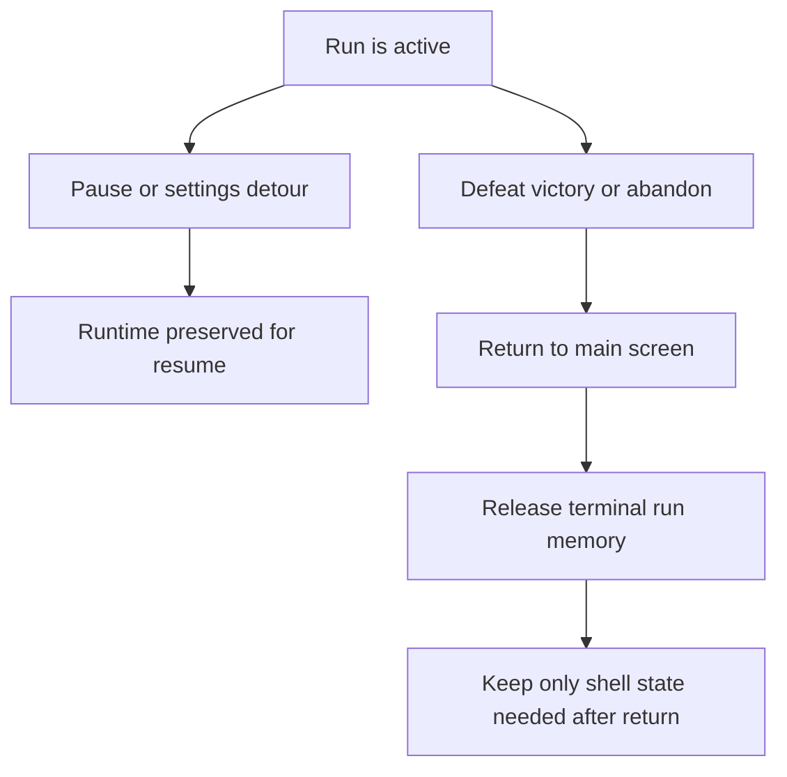

## req_111_define_a_terminal_run_memory_cleanup_posture_when_returning_to_main_screen - Define a terminal-run memory cleanup posture when returning to main screen
> From version: 0.6.1+cad3c04
> Schema version: 1.0
> Status: Draft
> Understanding: 98%
> Confidence: 96%
> Complexity: Medium
> Theme: Performance
> Reminder: Update status/understanding/confidence and references when you edit this doc.

# Needs
- Avoid keeping unnecessary runtime memory alive once a run is terminal and the player returns to the main screen.
- Clean up runtime-heavy state after outcomes such as abandon, victory, defeat, or any other return-to-main-screen path that no longer needs live re-entry.
- Distinguish between flows that still need to preserve the runtime for resume and flows that are truly terminal.
- Reduce the risk of stale retained state, renderer resources, runtime caches, or entity/simulation data surviving longer than needed after a run is over.

# Context
The project now has a stronger shell layer, run outcomes, abandon support, world progression, and richer generated assets. As the runtime grows, keeping memory alive after a run is already finished becomes more expensive and harder to reason about.

Today there are at least two different posture families:
1. temporary shell detours where the runtime must remain resumable
2. terminal transitions where the run is done and the player returns to the main screen without any need to resume the old runtime

This request targets the second family. When the player:
- abandons a run
- wins a run and returns to the main screen
- loses a run and returns to the main screen
- or otherwise leaves the run through a terminal path that no longer needs the active simulation

the product should be able to release runtime memory aggressively enough that the shell does not keep carrying old run state for no gameplay reason.

The goal is not to build a full general-purpose memory manager. The goal is to define a bounded cleanup posture for terminal run exits so Emberwake does not preserve renderer/runtime/simulation resources longer than necessary.

Scope includes:
- defining which return-to-main-screen flows are terminal and should trigger cleanup
- defining which runtime layers should be eligible for teardown or reset in those flows
- defining that resumable shell detours should remain excluded from the same cleanup posture
- defining the expected memory-ownership boundary between main screen shell state and old run state
- defining validation expectations for confirming that terminal run exits release memory materially better than before

Scope excludes:
- a full renderer architecture rewrite
- general GC tuning unrelated to terminal run exit
- changing resumable pause/settings flows into non-resumable flows
- low-level browser engine guarantees that are outside app ownership

# Acceptance criteria
- AC1: The request defines which return-to-main-screen flows are terminal and should trigger memory cleanup.
- AC2: The request explicitly includes abandon, victory-to-main-screen, and defeat-to-main-screen as cleanup candidates unless implementation evidence later justifies a narrower subset.
- AC3: The request defines that resumable shell detours such as pause/settings should not use the same cleanup posture.
- AC4: The request defines that terminal run cleanup should target runtime-owned memory rather than wiping unrelated shell/meta progression state.
- AC5: The request defines a bounded validation posture for checking whether terminal run exits release memory better than before.
- AC6: The request stays bounded to terminal-run cleanup posture rather than opening a full platform-wide memory-management redesign.

# Dependencies and risks
- Dependency: `AppShell`, runtime session ownership, and renderer lifecycle seams are the likely orchestration layer for cleanup.
- Dependency: the runtime already distinguishes resumable shell flows from terminal outcomes, so cleanup must align with that separation.
- Dependency: any generated assets or runtime textures must be released in a way that does not break the shell after return to main screen.
- Risk: over-aggressive cleanup can break valid resume flows if terminal and non-terminal exits are not separated cleanly.
- Risk: partial cleanup can leave behind the worst retainers while giving a false impression of correctness.
- Risk: if cleanup resets too much shared state, meta progression or shell UX can regress even though runtime memory improves.

# Open questions
- Should cleanup happen immediately on terminal return, or only after the main screen is fully mounted?
  Recommended default: clean up immediately after the terminal handoff is confirmed, while preserving only what the main screen still needs.
- Should the request target only JS-side state first, or also renderer/texture resources where the app owns them?
  Recommended default: target both application state and owned renderer/runtime resources, but stay within app-owned boundaries.
- Should cleanup be performed for every visit to main screen?
  Recommended default: no; only for terminal exits where the runtime is no longer resumable.
- Should memory cleanup also clear transient shell overlays derived from the finished run?
  Recommended default: yes, if those overlays are no longer needed once the player is back at the main screen.

# Definition of Ready (DoR)
- [x] Problem statement is explicit and user impact is clear.
- [x] Scope boundaries (in/out) are explicit.
- [x] Acceptance criteria are testable.
- [x] Dependencies and known risks are listed.

# Clarifications
- The request is specifically about returning to the main screen after a run is already terminal.
- The target posture is not `clean everything on every scene change`; it is `clean runtime-heavy state when the run is over and no resume is needed`.
- Pause/settings detours should remain resumable and therefore should not be treated as cleanup-equivalent to defeat/victory/abandon exits.
- The cleanup should preserve shell and meta progression state that remains relevant after the return to main screen.

# Companion docs
- Product brief(s): (none yet)
- Architecture decision(s): (none yet)
- Request(s): `req_109_define_a_run_commit_posture_with_in_run_abandon_and_no_mid_run_save_load`

# AI Context
- Summary: Define a bounded memory-cleanup posture for terminal run exits that return to the main screen without needing runtime resume.
- Keywords: memory cleanup, main screen, abandon, victory, defeat, runtime teardown, shell, performance
- Use when: Use when the project should aggressively release run memory after terminal returns to main screen.
- Skip when: Skip when the work is only about pause/resume preservation or a general engine-memory redesign.

# References
- `src/app/AppShell.tsx`
- `src/app/model/appScene.ts`
- `src/app/components/ActiveRuntimeShellContent.tsx`
- `src/shared/lib/runtimeSessionStorage.ts`
- `src/shared/config/runtimePerformanceBudget.json`

# Backlog
- (none yet)
