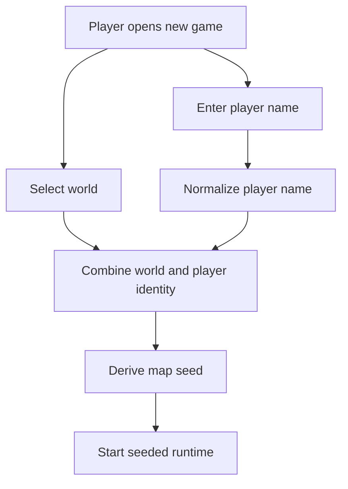

## req_112_define_the_map_seed_as_a_function_of_player_name_and_selected_world - Define the map seed as a function of player name and selected world
> From version: 0.6.1+cad3c04
> Schema version: 1.0
> Status: Draft
> Understanding: 98%
> Confidence: 96%
> Complexity: Medium
> Theme: Progression
> Reminder: Update status/understanding/confidence and references when you edit this doc.

# Needs
- Make the generated map seed depend on both the player name and the selected world.
- Ensure that world identity and player identity both influence the seeded runtime origin.
- Avoid treating the world seed as an opaque internal constant detached from the character the player starts with.
- Keep the rule deterministic enough that the same player name on the same world leads to the same seeded start posture unless a later rule explicitly changes that contract.

# Context
The project already has a new-game world-selection flow and seeded runtime generation. What remains underspecified is how the run seed is actually chosen once the player has entered a character name and selected a world.

This request introduces a clearer seed posture:
1. the player chooses a world
2. the player enters a character name
3. the map seed is derived from those two inputs together
4. the resulting world generation therefore belongs to both the selected world identity and the selected character identity

The intent is not to expose raw seed strings to the player. The intent is to make the seed derivation rule coherent and authored:
- different worlds should not collapse into the same map origin
- different player names on the same world should not necessarily produce the same seeded map
- the same player name on the same selected world should remain stable if the product wants deterministic replayability

This request should stay bounded to the seed contract itself. It should not reopen the whole world-progression or campaign framing.

Scope includes:
- defining that the selected world participates in map-seed derivation
- defining that the player name participates in map-seed derivation
- defining the expected deterministic behavior when the same inputs are reused
- defining any normalization posture needed for the player name before seed derivation
- defining the ownership seam where the derived seed is created before the runtime starts

Scope excludes:
- exposing raw seeds in the shell UI
- a debug seed editor
- changing world unlock rules or mission progression in the same slice
- a broader procedural-generation rewrite beyond the seed-input contract

# Acceptance criteria
- AC1: The request defines that the selected world contributes to map-seed derivation.
- AC2: The request defines that the player name contributes to map-seed derivation.
- AC3: The request defines the expected deterministic posture when the same normalized player name and same selected world are reused.
- AC4: The request defines a normalization posture for the player name before seed derivation, or explicitly requires one to be chosen during execution.
- AC5: The request defines the ownership seam where the derived seed should be produced before the runtime session starts.
- AC6: The request stays bounded to seed derivation posture rather than broadening into campaign progression or procedural-generation redesign.

# Dependencies and risks
- Dependency: the current new-game flow already captures player name and selected world, so both inputs are available before session creation.
- Dependency: runtime session bootstrap remains the likely seam for producing and storing the derived seed.
- Dependency: world-profile identity should remain stable enough that seed derivation does not drift unintentionally when labels change.
- Risk: if player-name normalization is not explicit, visually similar names can produce surprising seed mismatches.
- Risk: if the seed rule changes after release, players may see different maps for the same historical name/world pairing unless migration posture is documented later.
- Risk: tying seeds to player name may reduce incidental randomness unless the product consciously wants deterministic replayability for identical inputs.

# Open questions
- Should the same normalized player name on the same world always produce the same map seed?
  Recommended default: yes, keep it deterministic so the contract is easy to understand and debug.
- Should player-name normalization trim spacing and case before deriving the seed?
  Recommended default: yes, use the same normalized character-name value already accepted by the new-game flow.
- Should world contribution use the world-profile id rather than the display label?
  Recommended default: yes, use the stable world-profile id so presentation renames do not silently change seeds.
- Should there still be any hidden salt or rotation per app version?
  Recommended default: no in the first wave; keep the contract simple unless a later procedural-design need requires versioned salt.

# Definition of Ready (DoR)
- [x] Problem statement is explicit and user impact is clear.
- [x] Scope boundaries (in/out) are explicit.
- [x] Acceptance criteria are testable.
- [x] Dependencies and known risks are listed.

# Clarifications
- The target contract is `derivedSeed = f(normalizedPlayerName, selectedWorldProfileId)`.
- The same normalized player name and the same selected world should deterministically reproduce the same derived seed in the first wave.
- The selected world should contribute through its stable identity, not only through display copy.
- The player name should contribute through the normalized value accepted by the new-game flow, not raw unvalidated input.
- This request does not require exposing the seed to players.

# Companion docs
- Product brief(s): (none yet)
- Architecture decision(s): (none yet)
- Request(s): `req_103_define_new_game_map_selection_and_mission_gated_map_unlock_progression`, `req_108_define_a_five_world_unlock_ladder_with_world_scaling_and_richer_world_selection_cards`

# AI Context
- Summary: Define a deterministic map-seed posture where both normalized player name and selected world contribute to the derived seed.
- Keywords: seed, player name, world, deterministic generation, new game, runtime session
- Use when: Use when framing how Emberwake should derive a map seed from the player-facing new-game inputs.
- Skip when: Skip when the work is only about world unlock UI or unrelated procedural-generation internals.

# References
- `src/app/AppShell.tsx`
- `src/app/model/characterName.ts`
- `src/shared/model/worldProfiles.ts`
- `src/shared/lib/runtimeSessionStorage.ts`
- `games/emberwake/src/runtime/emberwakeSession.ts`

# Backlog
- (none yet)
