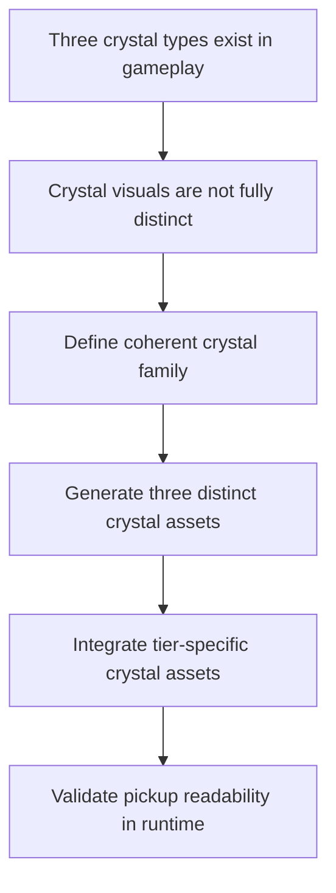

## req_113_define_three_distinct_generated_assets_for_the_three_crystal_types - Define three distinct generated assets for the three crystal types
> From version: 0.6.1+c2d57bc
> Schema version: 1.0
> Status: Done
> Understanding: 99%
> Confidence: 97%
> Complexity: Medium
> Theme: Graphics
> Reminder: Update status/understanding/confidence and references when you edit this doc.

# Needs
- Generate and integrate three distinct crystal assets rather than relying on one shared crystal visual.
- Make the three crystal types read as clearly different pickup tiers in runtime scenes.
- Keep the three crystals inside one coherent family while still making each type visually distinguishable at gameplay scale.
- Use the current generated-image asset pipeline rather than creating a separate crystal workflow.

# Context
The project already introduced a stronger generated-asset posture for entities and pickups, and there is already framing around crystal variant completeness. What remains missing is a concrete requirement that the three crystal types should each have their own generated asset, not just a shared crystal image with minimal derivation.

This request introduces that stronger posture:
1. Emberwake has three crystal types to represent
2. each crystal type should receive its own distinct generated asset
3. those assets should remain part of the same crystal family
4. the runtime should present them clearly enough that pickup tier is legible without relying only on numeric reward interpretation

The goal is not to redesign the whole pickup roster. The goal is to complete the crystal family so the three crystal types feel intentionally authored rather than partially placeholder.

Scope includes:
- defining the three crystal types that need distinct generated assets
- defining the visual-family relationship across those three assets
- defining the generation posture for those crystal variants
- defining integration expectations so runtime presentation consumes the distinct crystal assets
- defining validation expectations for readability at gameplay scale

Scope excludes:
- a full pickup-family redesign across every pickup category
- changing crystal XP values or economy rules
- changing pickup collection radius or collision behavior
- a broader terrain or reward-system rebalance

# Acceptance criteria
- AC1: The request defines that the three crystal types should each receive a distinct generated asset.
- AC2: The request defines that those three assets should remain part of one coherent crystal visual family rather than three unrelated pickup looks.
- AC3: The request defines integration expectations so runtime presentation can distinguish the three crystal types visually.
- AC4: The request defines readability validation expectations at gameplay scale rather than only asset-gallery review.
- AC5: The request stays bounded to the crystal family rather than broadening into a full pickup-art overhaul.

# Dependencies and risks
- Dependency: the current generated-image pipeline remains the intended path for creating crystal variants.
- Dependency: current pickup presentation ownership in runtime remains the likely integration seam for distinct crystal assets.
- Dependency: any existing crystal-tier content or reward taxonomy must be reused rather than reinvented.
- Risk: if the three variants differ only very subtly, the feature will technically exist but remain unreadable in play.
- Risk: if the three variants diverge too much, the pickup family will feel inconsistent.
- Risk: if integration stays partially shared, runtime may still collapse back to one crystal asset despite the generation effort.

# Open questions
- Should the three crystal assets differ by silhouette as well as color?
  Recommended default: yes, at least slightly; do not rely only on recolor if gameplay-scale readability stays weak.
- Should the smallest crystal remain the cleanest silhouette while larger tiers gain extra facets or aura?
  Recommended default: yes, build complexity upward with tier while preserving family identity.
- Should this request also require shell/codex use of the three variants?
  Recommended default: no; prioritize runtime pickup readability first unless shell coverage is explicitly requested later.

# Definition of Ready (DoR)
- [x] Problem statement is explicit and user impact is clear.
- [x] Scope boundaries (in/out) are explicit.
- [x] Acceptance criteria are testable.
- [x] Dependencies and known risks are listed.

# Clarifications
- The target is not one crystal asset with runtime recolor only; the target is three distinct generated crystal assets.
- The three variants should still read as one family through shape language, material treatment, and palette logic.
- Differentiation should remain readable at normal gameplay zoom, not only in exported asset previews.
- This request is about visual identity and runtime readability, not economy tuning.

# Companion docs
- Product brief(s): `prod_017_graphical_asset_direction_for_runtime_readability_and_shell_identity`
- Architecture decision(s): `adr_052_adopt_a_content_driven_graphical_asset_pipeline_for_runtime_and_shell_surfaces`
- Request(s): `req_101_define_a_follow_up_graphics_settings_and_runtime_presentation_polish_wave`, `req_100_reduce_gold_and_crystal_pickup_runtime_presentation_size_by_half`

# AI Context
- Summary: Define a bounded wave to generate and integrate three distinct runtime assets for the three crystal pickup types.
- Keywords: crystals, pickup assets, generated assets, runtime readability, tiered pickups
- Use when: Use when Emberwake should complete the crystal-family visuals with a distinct asset per crystal type.
- Skip when: Skip when the work is only about crystal sizing, XP values, or broader pickup redesign.

# References
- `src/game/entities/render/entityPresentation.ts`
- `src/game/entities/render/EntityScene.tsx`
- `games/emberwake/src/content/entities/entityData.ts`
- `src/assets/assetCatalog.ts`
- `scripts/assets/generateFirstWaveAssets.mjs`
- `scripts/assets/promoteFirstWaveAssets.mjs`

# Backlog
- `item_388_define_three_crystal_asset_roster_and_family_differentiation_posture`
- `item_389_define_three_crystal_asset_generation_promotion_and_runtime_integration`
