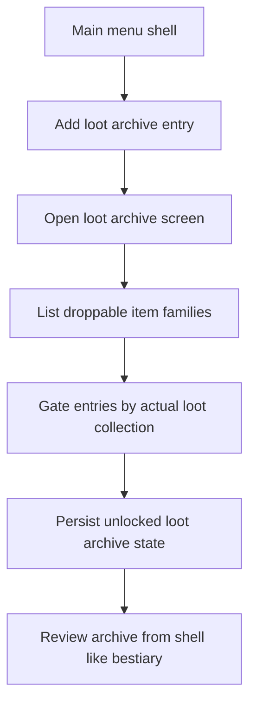

## req_114_define_a_loot_archive_screen_with_loot_gated_drop_discovery - Define a loot archive screen with loot-gated drop discovery
> From version: 0.6.1+e144248
> Schema version: 1.0
> Status: Draft
> Understanding: 98%
> Confidence: 96%
> Complexity: Medium
> Theme: UI
> Reminder: Update status/understanding/confidence and references when you edit this doc.

# Needs
- Add a new main menu entry that opens a shell screen dedicated to droppable loot.
- Let players consult a bounded archive of lootable items such as gifts, mission items, gold, and crystals.
- Gate archive visibility behind actual looting so entries only unlock once the player has collected them in a run.
- Keep this new surface aligned with the existing bestiary/codex posture rather than inventing a separate inventory UI.

# Context
Emberwake already exposes archive-style shell surfaces for combat-facing knowledge, notably the bestiary and the skill archive. What is still missing is an equivalent archive for world drops and collectible rewards.

This request introduces that missing layer:
1. the main menu gains a new entry for a loot archive surface
2. the surface lists droppable item families already present in gameplay
3. entries remain hidden or redacted until the player has actually looted them
4. the presentation stays close to the bestiary style so the shell feels coherent

The target is not an inventory, stash, or economy management screen. The target is a discovery archive for dropable field items that the player can consult from the shell.

Scope includes:
- defining a new main menu route toward a loot archive screen
- defining the first loot archive roster around currently relevant droppable items
- defining loot-gated discovery and unlocked/unknown archive states
- defining a bestiary-like shell presentation for those entries
- defining the progression seam needed to remember which loot entries were already collected

Scope excludes:
- a full player inventory or stash system
- item equip/loadout management
- shop purchasing flows
- reward economy rebalance
- redesigning the existing bestiary or grimoire beyond the minimal reuse needed for consistency

# Acceptance criteria
- AC1: The request defines a new main menu entry that opens a dedicated loot archive shell screen.
- AC2: The request defines the first loot archive roster around droppable game items such as gifts, mission items, gold, and crystals.
- AC3: The request defines that loot archive entries only unlock after the player has actually looted the corresponding item.
- AC4: The request defines a presentation posture deliberately aligned with the bestiary/codex family rather than a separate inventory UI.
- AC5: The request defines the progression seam needed to persist unlocked loot discovery between runs.
- AC6: The request stays bounded to a shell archive of droppable items and does not broaden into a general inventory, stash, or economy system.

# Dependencies and risks
- Dependency: the existing shell scene architecture remains the intended integration seam for a new archive surface.
- Dependency: the current bestiary/grimoire presentation pattern remains the baseline visual language for the new screen.
- Dependency: droppable item families and their runtime identifiers must be reused from gameplay content rather than reauthored ad hoc for the shell.
- Dependency: meta progression or an equivalent persistent shell-owned state remains the likely home for loot discovery tracking.
- Risk: if the loot roster is underspecified, the archive may ship with mismatched item names or categories relative to gameplay drops.
- Risk: if discovery is not tied to actual loot events, the archive will feel arbitrary instead of earned.
- Risk: if the screen drifts toward inventory semantics, it will create scope creep around counts, ownership, and item usage that this request does not intend to solve.

# Open questions
- Should the first roster include only currently active droppable items, or also reserve slots for later drop families?
  Recommended default: only currently droppable items plus explicitly active mission items; do not prefill speculative future slots.
- Should unknown loot entries remain fully hidden or appear as redacted silhouettes?
  Recommended default: show redacted cards to preserve the archive/discovery feel, consistent with bestiary behavior.
- Should the archive display lightweight category grouping such as rewards, mission items, and utilities?
  Recommended default: yes, if that grouping can be derived cleanly from current runtime taxonomy without inventing a large item ontology.

# Definition of Ready (DoR)
- [x] Problem statement is explicit and user impact is clear.
- [x] Scope boundaries (in/out) are explicit.
- [x] Acceptance criteria are testable.
- [x] Dependencies and known risks are listed.

# Clarifications
- This screen is a codex-style archive, not a bag, stash, or inventory.
- Unlocking is based on the player having looted an item at least once, not merely seeing it on the map.
- The first roster should cover the user-requested drop families: gifts, mission items, gold, and crystals, and may include other already-droppable pickup families only if they are already established in gameplay.
- The intended feel is "bestiary for drops" rather than "shop catalog" or "reward ledger."

# Companion docs
- Product brief(s): `prod_017_graphical_asset_direction_for_runtime_readability_and_shell_identity`
- Architecture decision(s): `adr_052_adopt_a_content_driven_graphical_asset_pipeline_for_runtime_and_shell_surfaces`
- Request(s): `req_107_define_a_main_screen_background_presentation_using_runtime_character_and_enemy_assets`, `req_109_define_a_run_commit_posture_with_in_run_abandon_and_no_mid_run_save_load`, `req_113_define_three_distinct_generated_assets_for_the_three_crystal_types`

# AI Context
- Summary: Define a new main menu loot archive screen that lists droppable items and unlocks entries only after the player has looted them.
- Keywords: loot archive, shell menu, bestiary style, droppable items, discovery, gifts, mission items, gold, crystals
- Use when: Use when Emberwake should add a codex-like shell surface for field loot discovery and persistence.
- Skip when: Skip when the work is about player inventory management, shop flows, or reward economy tuning.

# References
- `src/app/model/appScene.ts`
- `src/app/components/AppMetaScenePanel.tsx`
- `src/app/components/CodexArchiveScene.tsx`
- `src/app/model/metaProgression.ts`
- `games/emberwake/src/content/entities/entityData.ts`
- `games/emberwake/src/runtime/entitySimulation.ts`
- `src/app/components/ActiveRuntimeShellContent.tsx`

# Backlog
- (none yet)
