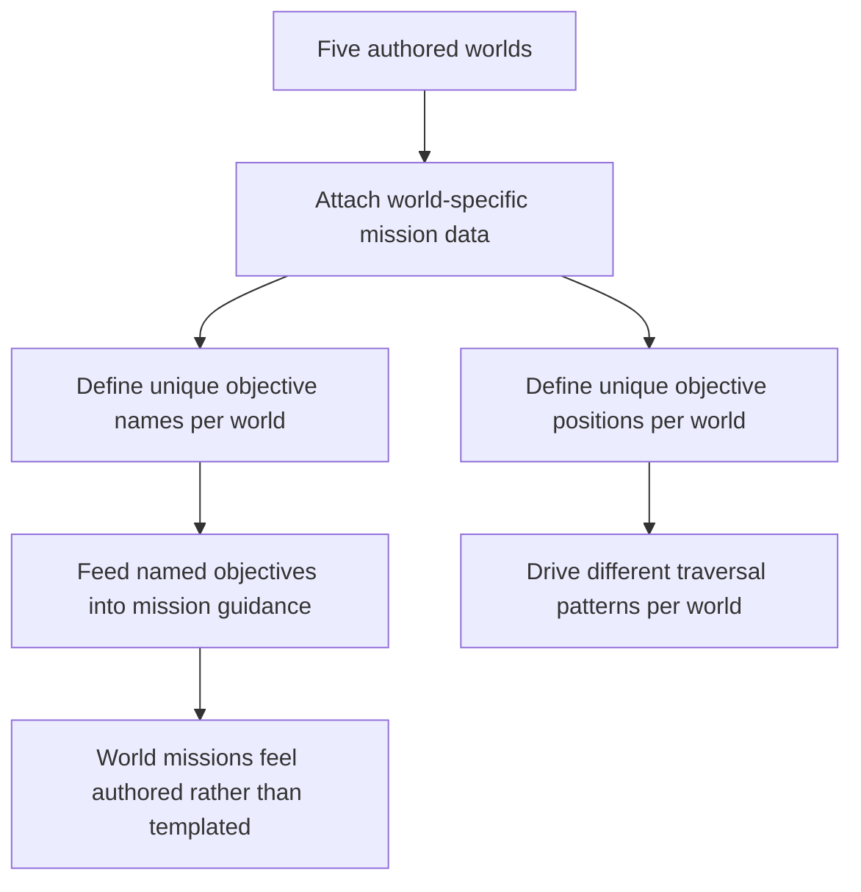

## req_115_define_unique_per_world_primary_mission_objectives_with_distinct_names_and_positions - Define unique per-world primary mission objectives with distinct names and positions
> From version: 0.6.1+c2d57bc
> Schema version: 1.0
> Status: Draft
> Understanding: 99%
> Confidence: 97%
> Complexity: Medium
> Theme: Gameplay
> Reminder: Update status/understanding/confidence and references when you edit this doc.

# Needs
- Ensure each world has its own authored primary mission objectives rather than reusing one generic three-zone objective set everywhere.
- Give each mission objective a distinct player-facing name so the mission layer feels world-specific.
- Give each world its own distinct mission-objective positions so objective traversal differs from one world to another.
- Keep the baseline three-stage mission structure, but vary objective identity and spatial placement per world.

# Context
Emberwake now has a baseline primary mission loop and a five-world progression ladder. What is still missing is per-world objective identity. If every world uses the same target names and effectively the same objective layout, the mission layer will feel templated even if the worlds themselves are distinct.

This request introduces a more authored per-world posture:
1. each world keeps a primary mission made of multiple objectives
2. those objectives receive world-specific names
3. those objectives are positioned differently per world
4. the resulting traversal and mission flavor should feel distinct from one world to the next

The target is not to replace the existing mission loop. The target is to deepen it by making each world own a recognizable objective set rather than simply applying one generic mission scaffold to five different world cards.

Scope includes:
- defining that each world profile owns its own primary mission objective roster
- defining that each mission objective has a player-facing name
- defining that objective positions are distinct per world rather than globally reused
- defining that the guidance and mission systems consume world-specific objective data
- defining the minimum authored identity needed so world missions feel different without requiring full quest-writing

Scope excludes:
- side quests or optional mission branches
- dialogue, cutscenes, or lore text for every objective
- a total rewrite of the three-zone primary mission structure
- a requirement that each world already has fully unique boss mechanics in the same slice
- a full narrative campaign graph

# Acceptance criteria
- AC1: The request defines that each world should own its own primary mission objective set rather than sharing one fully generic objective roster.
- AC2: The request defines that mission objectives should have distinct player-facing names per world.
- AC3: The request defines that mission-objective positions should differ from one world to another.
- AC4: The request defines that the existing mission/guidance layer should consume world-specific objective data rather than hard-coded global objective metadata.
- AC5: The request stays bounded by deepening per-world mission identity without broadening into a full side-quest or narrative campaign system.

# Dependencies and risks
- Dependency: the current primary mission loop from `req_102` remains the baseline structure for objective sequencing, bosses, and completion.
- Dependency: the authored five-world ladder from `req_108` remains the baseline home for world-specific variation.
- Dependency: world profile data or equivalent authored world metadata remains the likely seam for storing objective names and positions.
- Risk: if only names change but spatial placement remains effectively the same, the missions will still feel repetitive.
- Risk: if positions change but naming stays too generic, the authored differentiation will remain weak.
- Risk: if the request overreaches into bespoke scripting per world, it will stop being a bounded progression of the current mission system.

# Open questions
- Should every world still keep three primary mission objectives?
  Recommended default: yes, keep the same high-level structure first and vary identity and placement before changing mission length.
- Should objective names be purely functional or slightly atmospheric?
  Recommended default: slightly atmospheric but still readable, so they help world identity without becoming opaque lore phrases.
- Should objective positions be fully authored coordinates or bounded seeded placements per world profile?
  Recommended default: allow world-specific authored placement rules or anchors, not necessarily one fixed coordinate set per seed.

# Definition of Ready (DoR)
- [x] Problem statement is explicit and user impact is clear.
- [x] Scope boundaries (in/out) are explicit.
- [x] Acceptance criteria are testable.
- [x] Dependencies and known risks are listed.

# Clarifications
- The goal is not “different wording on the same mission.” The goal is distinct objective identity and distinct spatial placement per world.
- A bounded first step is to keep the three-objective mission structure while making each world own its own named objective trio.
- Objective uniqueness should affect both what the player reads and where the player travels.
- This request is about world-level authored mission identity, not about introducing optional mission branches or secondary objectives.

# Companion docs
- Product brief(s): (none yet)
- Architecture decision(s): (none yet)
- Request(s): `req_102_define_a_primary_map_mission_loop_with_three_target_zones_bosses_and_key_items`, `req_103_define_new_game_map_selection_and_mission_gated_map_unlock_progression`, `req_108_define_a_five_world_unlock_ladder_with_world_scaling_and_richer_world_selection_cards`

# AI Context
- Summary: Define a per-world mission-objective posture so each world has its own named primary objectives and distinct objective placement.
- Keywords: worlds, missions, objectives, objective names, objective positions, world profiles, traversal
- Use when: Use when Emberwake should make world missions feel distinct without replacing the current three-stage mission structure.
- Skip when: Skip when the work is only about boss art, side quests, or generic world scaling.

# References
- `logics/request/req_102_define_a_primary_map_mission_loop_with_three_target_zones_bosses_and_key_items.md`
- `logics/request/req_108_define_a_five_world_unlock_ladder_with_world_scaling_and_richer_world_selection_cards.md`
- `games/emberwake/src/runtime/entitySimulation.ts`
- `games/emberwake/src/content/world/worldData.ts`
- `src/shared/model/worldProfiles.ts`
- `src/app/components/AppMetaScenePanel.tsx`

# Backlog
- `item_392_define_per_world_primary_mission_objective_roster_and_naming`
- `item_393_define_per_world_mission_objective_placement_and_guidance_integration`
