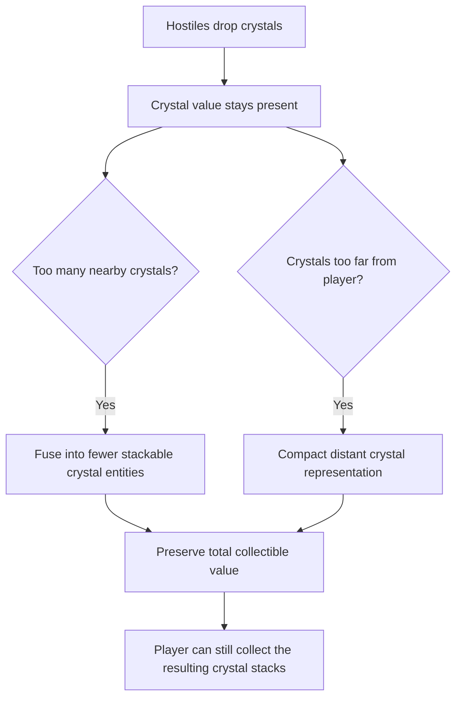

## req_116_define_a_crystal_persistence_and_compaction_posture_for_far_and_dense_runtime_pickups - Define a crystal persistence and compaction posture for far and dense runtime pickups
> From version: 0.6.1+c2d57bc
> Schema version: 1.0
> Status: Draft
> Understanding: 98%
> Confidence: 96%
> Complexity: Medium
> Theme: Gameplay
> Reminder: Update status/understanding/confidence and references when you edit this doc.

# Needs
- Ensure XP crystals do not disappear unexpectedly from the map while they should still exist as collectible rewards.
- Define a bounded compaction/merge posture so crystals can fuse when they are too far away or too numerous on the map.
- Preserve player trust that crystal drops remain collectible even when runtime performance or pickup density requires aggregation.
- Keep crystal preservation and fusion bounded to runtime pickup management rather than turning it into a broader loot-system rewrite.

# Context
Emberwake already spawns crystal drops from defeated hostiles and already contains some bounded stack/merge behavior for stackable pickups. What still needs to be made explicit is the gameplay posture behind that behavior: crystals should not appear to vanish arbitrarily, and when the map becomes too populated or some crystals remain far from the player, the system should prefer persistent fusion/compaction over silent loss.

This request introduces that explicit posture:
1. crystal rewards should remain represented in the world until collected or intentionally compacted
2. if crystals are too numerous or too far away, they should be fused into fewer entities instead of being dropped from runtime in a way that feels like disappearance
3. the resulting compacted crystals should still preserve collectible value
4. the whole system should remain bounded, readable, and performant

The goal is not to redesign crystal economy or attraction from scratch. The goal is to define the rule that crystal value must persist, and that compaction should be the preferred answer when runtime needs to reduce crystal count or spread.

Scope includes:
- defining that crystal rewards should persist as collectible value until resolved by collection or bounded fusion
- defining when far-away crystals may be compacted rather than kept as many separate entities
- defining when overly dense crystal populations may be fused into fewer stackable entities
- defining that crystal fusion must preserve collectible reward value
- defining runtime validation expectations so crystal persistence can be trusted during long or chaotic sessions

Scope excludes:
- changing crystal XP values
- redesigning magnet attraction or pickup radius behavior wholesale
- a general rewrite of all pickup families
- a full loot-stream simulation for every drop type
- changing mission-item persistence rules unless explicitly needed later

# Acceptance criteria
- AC1: The request defines that crystal rewards should not disappear silently while they still represent collectible value.
- AC2: The request defines a bounded fusion/compaction posture for crystals when the map contains too many of them at once.
- AC3: The request defines a bounded fusion/compaction posture for crystals that remain far away from the player.
- AC4: The request defines that any crystal fusion or compaction must preserve collectible value rather than deleting reward value.
- AC5: The request defines validation expectations to ensure long-session crystal behavior remains trustworthy in runtime.
- AC6: The request stays bounded to crystal persistence and compaction rather than broadening into a full pickup-system rewrite.

# Dependencies and risks
- Dependency: the current runtime pickup spawn and merge seams remain the intended integration point for crystal persistence behavior.
- Dependency: stackable pickup support already present for crystals and gold remains the likely baseline for crystal fusion.
- Dependency: crystal attraction and collection behavior should continue to work on compacted crystal stacks.
- Risk: if compaction becomes too aggressive, players may feel crystals are teleporting or being hidden instead of preserved.
- Risk: if distant-crystal persistence is too lax, long runs may accumulate too many live pickup entities and harm runtime performance.
- Risk: if value preservation is not exact, crystal collection will become untrustworthy and feel unfair.

# Open questions
- Should crystal compaction prefer merging into the nearest existing crystal stack or a newly chosen anchor stack?
  Recommended default: prefer stable anchor-based merging so compacted stacks remain spatially readable rather than jumping around every frame.
- Should distant-crystal compaction be immediate or gradual?
  Recommended default: bounded and gradual enough to avoid obvious popping, but still decisive enough to keep runtime pickup counts under control.
- Should the same persistence posture be extended later to gold or other utility pickups?
  Recommended default: maybe later, but this request should prioritize crystals first because they are the highest-volume reward stream.

# Definition of Ready (DoR)
- [x] Problem statement is explicit and user impact is clear.
- [x] Scope boundaries (in/out) are explicit.
- [x] Acceptance criteria are testable.
- [x] Dependencies and known risks are listed.

# Clarifications
- “Do not disappear” means “do not silently lose collectible crystal value,” not “keep every original crystal entity forever.”
- Fusion/compaction is an acceptable and intended behavior as long as the resulting collectible value remains intact and understandable.
- The first responsibility is player trust: crystal drops should still feel present and recoverable even when runtime condenses them.
- This request is about persistence and bounded aggregation, not about crystal art or XP rebalance.

# Companion docs
- Product brief(s): (none yet)
- Architecture decision(s): (none yet)
- Request(s): `req_081_define_a_crystal_magnet_pickup_and_attraction_first_xp_crystal_collection_posture`, `req_100_reduce_gold_and_crystal_pickup_runtime_presentation_size_by_half`, `req_113_define_three_distinct_generated_assets_for_the_three_crystal_types`

# AI Context
- Summary: Define a bounded runtime posture where crystal rewards remain collectible and are fused/compacted instead of silently disappearing when too far away or too numerous.
- Keywords: crystals, pickup persistence, crystal merge, crystal stack, runtime compaction, reward trust
- Use when: Use when Emberwake should guarantee crystal reward persistence while controlling pickup density and distance in runtime.
- Skip when: Skip when the work is about crystal art only, pickup size only, or a broad loot-system redesign.

# References
- `games/emberwake/src/runtime/entitySimulation.ts`
- `games/emberwake/src/runtime/entitySimulationCombat.ts`
- `games/emberwake/src/runtime/pickupContract.ts`
- `games/emberwake/src/config/gameplayTuning.ts`
- `src/game/entities/render/EntityScene.tsx`

# Backlog
- `item_394_define_crystal_persistence_and_value_preservation_rules`
- `item_395_define_far_dense_crystal_compaction_tuning_and_runtime_validation`
